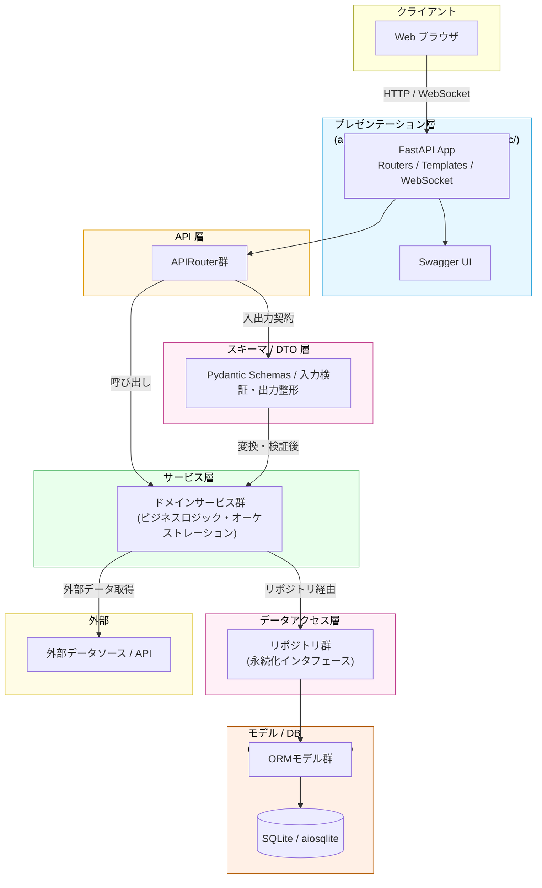

# システムアーキテクチャ概要

## プロジェクト概要

**目的**: 日本株投資判断を支援するシステム。Yahoo Finance APIでJPX上場銘柄(4,000+)の株価データを自動取得・蓄積し、分析・スクリーニング・バックテスト機能を提供。

**技術スタック**:
- バックエンド: FastAPI + SQLAlchemy + SQLite（async対応）
- フロントエンド: Jinja2テンプレート + Bootstrap + Lightweight Charts
- 認証: JWT（パスワード: bcrypt）
- スケジューラ: APScheduler

---

## レイヤー構成（詳細は [architecture_diagram.md](./architecture_diagram.md) 参照）

| レイヤー                 | ディレクトリ                                   | 責任                                 |
| ------------------------ | ---------------------------------------------- | ------------------------------------ |
| **プレゼンテーション層** | `app/main.py`, `app/templates/`, `app/static/` | UI/HTTP/WebSocket                    |
| **API層**                | `app/api/`                                     | RESTful エンドポイント、Pydantic検証 |
| **スキーマ/DTO層**       | `app/schemas/`                                 | 入出力契約（Pydantic）、OpenAPI      |
| **サービス層**           | `app/services/`                                | ビジネスロジック、外部API連携        |
| **データアクセス層**     | `app/repositories/`                            | Repository Pattern、DB操作           |
| **ORM/DB層**             | `app/models/`, `alembic/`                      | SQLAlchemy Models、スキーマ管理      |

**依存方向**: Presentation → API → Schemas → Services → Repositories → Models → DB

---

## 主要機能（概要）

- データ取得・バッチ処理: JPX銘柄の複数時間軸データを収集し永続化するパイプライン
- 銘柄マスタ管理: 銘柄メタ情報の同期・管理
- API 層: RESTful エンドポイント（OpenAPI/Swagger 自動生成）を通じたデータ提供
- 認証・ユーザー機能: JWT ベースの認証・ユーザー管理の基盤
- 分析機能: スクリーニング、チャート表示、バックテスト（設計で想定）
- 運用機能: バッチ実行履歴、ヘルスチェック、ジョブ管理

---

## 設計思想

- **責務の明確化**: プレゼンテーション / API / スキーマ / サービス / リポジトリ / モデルの各層で責務を分離し一方向の依存を保つ。
- **契約第一（Contract-First）**: Pydantic スキーマを API 契約の中心に置き、OpenAPI を設計と開発の基準にする。
- **非同期設計**: 外部 API 呼び出しや大量データ処理は async/await による並列実行で効率化する。
- **DB 抽象化**: Repository Pattern により DB 実装を隠蔽し、テストしやすくする。
- **DTO と ORM の分離**: `schemas`（DTO）は API 境界に限定し、`models`（ORM）は永続化に限定する。
- **シンプル & 段階的拡張**: 最小限で動くことを優先し、必要に応じて機能と設計を拡張する。


## アーキテクチャ図



**各層の詳細は [architecture_diagram.md](./architecture_diagram.md) を参照してください。**

---

## ディレクトリ構成

```
app/
├── api/              # APIルーター群（エンドポイント定義）
├── services/         # ビジネスロジック層
├── repositories/     # データアクセス層
├── models/           # ORM定義
├── schemas/          # Pydanticスキーマ（DTO）
├── exceptions/       # カスタム例外
├── utils/            # ユーティリティ
├── templates/        # HTMLテンプレート
├── static/           # CSS/JS/画像
└── main.py           # FastAPIアプリメイン
```

---

## 技術選定の理由

| 技術                   | 理由                                                                    |
| ---------------------- | ----------------------------------------------------------------------- |
| **FastAPI**            | 非同期ネイティブ、型安全性（Pydantic）、自動ドキュメント生成（OpenAPI） |
| **SQLAlchemy**         | ORM、async対応、DB抽象化による拡張性                                    |
| **SQLite**             | シンプル、デプロイが容易、小〜中規模向け                                |
| **Lightweight Charts** | 軽量、金融チャート特化、TradingView製                                   |
| **Pydantic**           | 実行時型検証、自動バリデーション、OpenAPI自動生成                       |

---

## 設計原則

1. **4層構造による責任分離**: 各層が独立した責務を持ち、テスト・保守が容易
2. **非同期処理**: async/awaitで大量データ並列処理に対応
3. **Repository Pattern**: DB実装詳細を隠蔽し、テスト時にモックに差し替え可能
4. **DTO（Schemas）と ORM（Models） の分離**: API と DB の変更が独立
5. **段階的拡張**: 必要な機能から実装し、設計は都度見直す

---

## 関連ドキュメント

- [API リファレンス](../api/api_reference.md)
- [データベース設計](./database_design.md)
- [開発ガイド](../develop-guide/README.md)

---

**最終更新**: 2026-03-06
