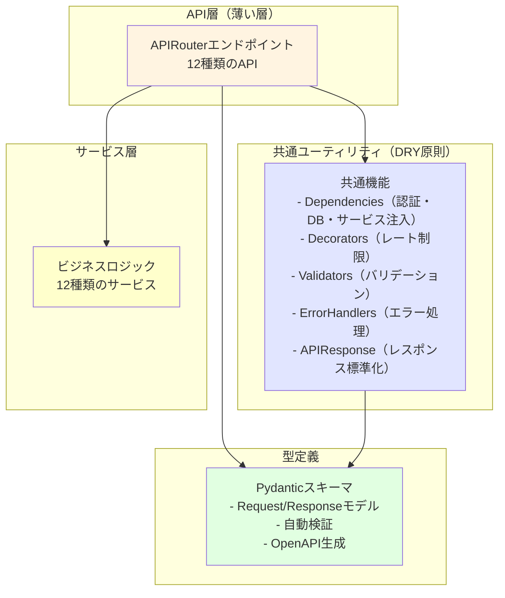
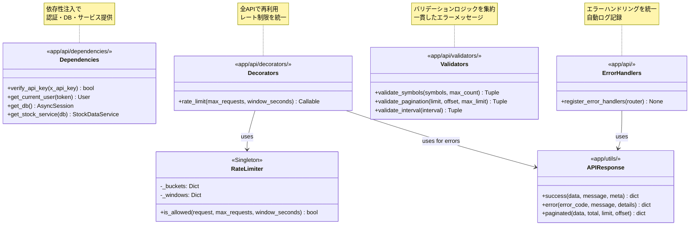
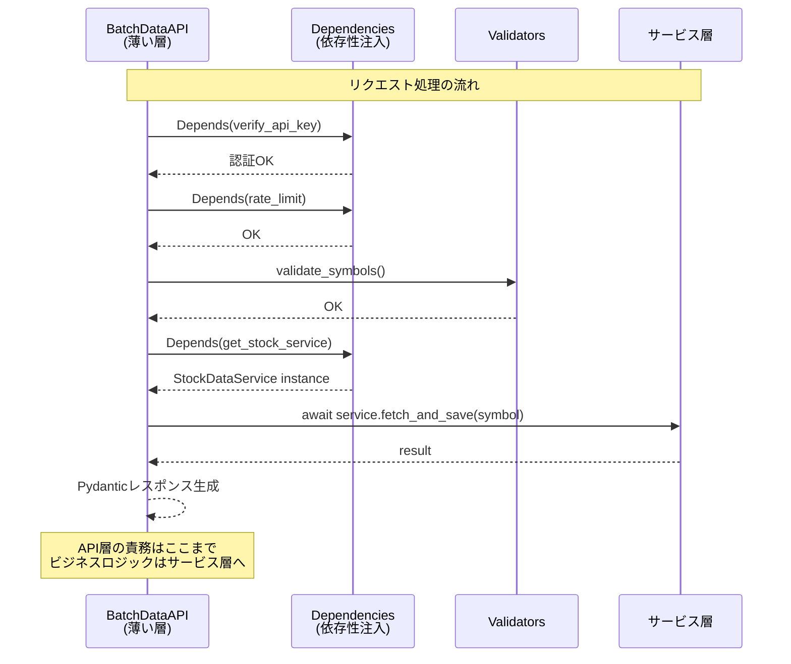
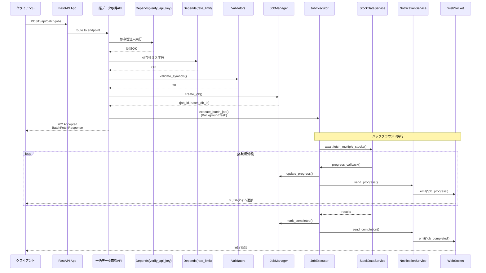
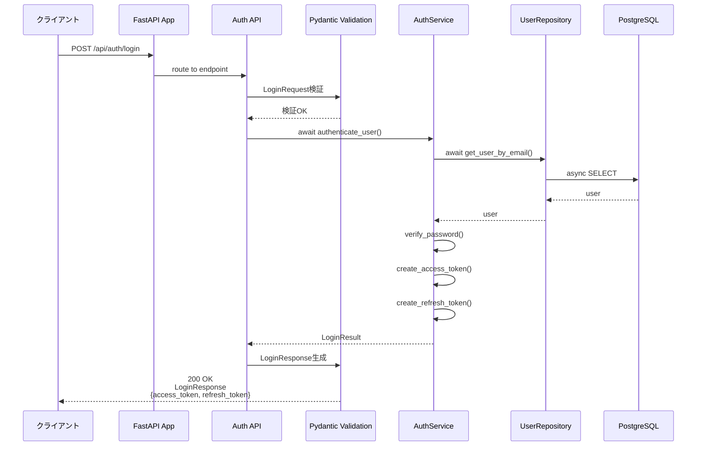
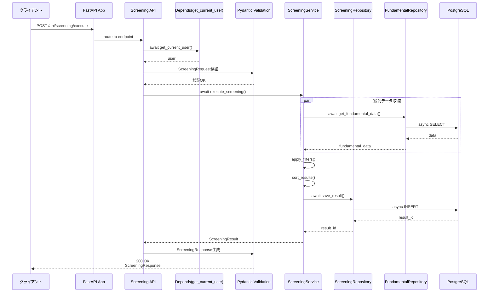
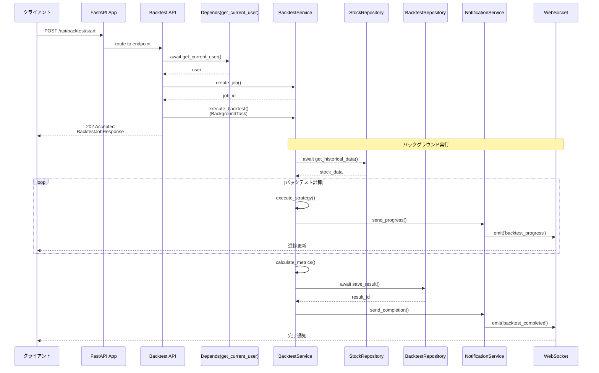

category: architecture
ai_context: high
last_updated: 2025-11-16
related_docs:
  - ../architecture_overview.md
  - ./service_layer.md
  - ./data_access_layer.md
  - ../../api/api_reference.md

# API層 仕様書

## 目次
- [API層 仕様書](#api層-仕様書)
  - [目次](#目次)
  - [1. 概要](#1-概要)
    - [役割](#役割)
    - [責務](#責務)
    - [設計原則](#設計原則)
  - [2. 構成](#2-構成)
    - [ディレクトリ構造](#ディレクトリ構造)
    - [依存関係](#依存関係)
  - [3. APIRouter一覧](#3-apirouter一覧)
    - [登録されているAPIRouter](#登録されているapirouter)
  - [4. アーキテクチャ図](#4-アーキテクチャ図)
    - [4.1 レイヤー構成（高レベルビュー）](#41-レイヤー構成高レベルビュー)
    - [4.2 API層エンドポイント構成](#42-api層エンドポイント構成)
    - [4.3 共通ユーティリティ詳細](#43-共通ユーティリティ詳細)
    - [4.4 サービス層連携パターン](#44-サービス層連携パターン)
  - [5. シーケンス図](#5-シーケンス図)
    - [5.1 一括データ取得フロー](#51-一括データ取得フロー)
    - [5.2 認証フロー（JWT）](#52-認証フローjwt)
    - [5.3 スクリーニング実行フロー](#53-スクリーニング実行フロー)
    - [5.4 バックテスト実行フロー](#54-バックテスト実行フロー)
  - [6. 共通仕様](#6-共通仕様)
    - [6.1 依存性注入（Dependencies）](#61-依存性注入dependencies)
      - [6.1.1 認証依存性（未実装）](#611-認証依存性未実装)
      - [6.1.2 データベース依存性（実装済み）](#612-データベース依存性実装済み)
      - [6.1.3 サービス層・リポジトリ層依存性（実装済み）](#613-サービス層リポジトリ層依存性実装済み)
    - [6.2 レート制限（未実装）](#62-レート制限未実装)
    - [6.3 共通バリデータ（部分実装）](#63-共通バリデータ部分実装)
    - [6.4 エラーハンドラ（実装済み）](#64-エラーハンドラ実装済み)
    - [6.5 レスポンス形式（実装済み）](#65-レスポンス形式実装済み)
  - [7. エンドポイント詳細](#7-エンドポイント詳細)
    - [7.1 一括データ取得API（Batch Data API）](#71-一括データ取得apibatch-data-api)
      - [エンドポイント一覧](#エンドポイント一覧)
      - [リクエスト/レスポンススキーマ](#リクエストレスポンススキーマ)
    - [7.2 銘柄マスタAPI（Stock Master API）](#72-銘柄マスタapistock-master-api)
      - [エンドポイント一覧](#エンドポイント一覧-1)
      - [主要機能](#主要機能)
    - [7.3 株価データAPI（Stock Price API）](#73-株価データapistock-price-api)
      - [エンドポイント一覧](#エンドポイント一覧-2)
      - [主要機能](#主要機能-1)
    - [7.4 ファンダメンタルデータAPI（Fundamental Data API）](#74-ファンダメンタルデータapifundamental-data-api)
      - [エンドポイント一覧](#エンドポイント一覧-3)
    - [7.5 ポートフォリオAPI（Portfolio API）](#75-ポートフォリオapiportfolio-api)
    - [7.6 市場インデックスAPI（Market Indices API）](#76-市場インデックスapimarket-indices-api)
    - [7.7 スクリーニングAPI（Screening API）](#77-スクリーニングapiscreening-api)
    - [7.8 バックテストAPI（Backtest API）](#78-バックテストapibacktest-api)
    - [7.9 ユーザー管理API（User API）](#79-ユーザー管理apiuser-api)
    - [7.10 認証API（Auth API）](#710-認証apiauth-api)
    - [7.11 通知API（Notification API）](#711-通知apinotification-api)
    - [7.12 システム監視API（System Monitoring API）](#712-システム監視apisystem-monitoring-api)
  - [関連ドキュメント](#関連ドキュメント)

---

## 1. 概要

### 役割

API層は、FastAPIのAPIRouterを使用して非同期HTTPリクエストを受け付け、Pydanticによるバリデーションを行い、非同期サービス層を呼び出し、型安全なレスポンスを返却します。プレゼンテーション層とサービス層の橋渡しを担います。

### 責務

| 責務                         | 説明                                                            |
| ---------------------------- | --------------------------------------------------------------- |
| **非同期エンドポイント定義** | FastAPI APIRouterによる非同期REST APIエンドポイントの定義と実装 |
| **Pydanticバリデーション**   | リクエスト/レスポンススキーマの自動検証とシリアライズ           |
| **OpenAPI自動生成**          | Pydanticスキーマからの自動ドキュメント生成(Swagger UI/ReDoc)    |
| **認証・認可**               | FastAPI依存性注入による認証、レート制限                         |
| **型安全なレスポンス生成**   | Pydanticモデルによる標準化されたレスポンス                      |
| **エラーハンドリング**       | HTTPExceptionとカスタム例外の適切な処理                         |
| **非同期サービス層呼び出し** | await/async経由でビジネスロジックの実行を委譲                   |

**重要**: API層は**薄い層**として設計し、以下をサービス層に委譲します:
- ビジネスロジック（データ処理、並列実行、外部API連携）
- ジョブ管理（JobManager、JobExecutor）
- 通知処理（NotificationService）

### 設計原則

- **RESTful設計**: HTTPメソッドとステータスコードを適切に使用
- **単一責任原則**: 1エンドポイント = 1責務（ルーティング、バリデーション、レスポンス生成のみ）
- **薄い層**: ビジネスロジックはサービス層に委譲、API層は100-200行/ファイルを目標
- **型安全性**: Pydantic統合による実行時型検証とOpenAPI自動生成、TypedDictによる型定義
- **非同期ファースト**: 全エンドポイントでasync/awaitを使用
- **依存性注入**: FastAPIのDependsパターンで認証・DB接続・サービス層を注入
- **契約駆動開発**: Pydanticスキーマを先に定義し、OpenAPI自動生成で並行開発を促進
- **DRY原則**: デコレータ、バリデータ、エラーハンドラを共通化してコード重複を排除
- **テスタビリティ**: DIとモック可能な設計により、単体テストを容易に

---

## 2. 構成

### ディレクトリ構造

```
app/api/
├── __init__.py              # APIRouter登録（/api プレフィックス）
├── dependencies/            # API層固有の依存性注入
│   ├── __init__.py
│   ├── services.py          # サービス層依存性注入
│   └── repositories.py      # リポジトリ層依存性注入
└── v1/                      # API v1（バージョニング）
    ├── __init__.py          # v1 ルータ登録
    ├── batch.py             # 一括データ取得API（実装済み）
    ├── stock_master.py      # 銘柄マスタ管理API（実装済み）
    └── stock_price.py       # 株価データAPI（実装済み）
```

**実装済みAPI**:
- `/api/v1/batch`: 一括データ取得（複数銘柄並列取得、JPX全銘柄取得）
- `/api/v1/stock-master`: 銘柄マスタ管理（更新、検索、一覧取得）
- `/api/v1/stock-price`: 株価データ取得（チャートデータ、削除）

**将来実装予定のAPI**:
- fundamental.py: ファンダメンタルデータAPI
- portfolio.py: ポートフォリオ管理API
- market_indices.py: 市場インデックスAPI
- screening.py: スクリーニングAPI
- backtest.py: バックテストAPI
- user.py: ユーザー管理API
- auth.py: 認証API（JWT）
- notification.py: 通知API
- system_monitoring.py: システム監視API

**設計の特徴**:
- **APIバージョニング**: `/api/v1/*` 構造で将来のバージョン管理に対応
- Swagger UI/ReDocはFastAPIにより自動生成されるため、個別のファイルは不要
- 各APIファイルは100-200行を目標とし、ビジネスロジックはサービス層に委譲
- API層は**薄い層**として、ルーティング、Pydantic検証、サービス層呼び出しのみに集中
- 横断的関心事（DB接続、依存性注入、エラーハンドリング）は共通モジュールから提供

**API層で使用する共通モジュール**:

以下の機能は共通モジュールまたは標準のFastAPI機能から提供されます:

| 機能カテゴリ           | 提供モジュール               | 主要機能                                    |
| ---------------------- | ---------------------------- | ------------------------------------------- |
| **DB接続**             | `app/utils/database.py`      | `get_db()` (非同期セッション提供)           |
| **依存性注入**         | `app/api/dependencies/`      | サービス層・リポジトリ層の依存性注入        |
| **バリデーション**     | `app/utils/validation.py`    | 共通バリデーション関数                      |
| **エラーハンドリング** | `app/exceptions/handlers.py` | 統一エラーハンドラ、レスポンス形式標準化    |
| **Pydanticスキーマ**   | `app/schemas/`               | リクエスト/レスポンススキーマ、型安全性保証 |
| **例外クラス**         | `app/exceptions/`            | カスタム例外階層、統一エラーコード          |
| **設定管理**           | `app/utils/config.py`        | 環境変数管理（Settings）                    |
| **ログ**               | `app/utils/logger.py`        | 統一ログ管理                                |

**注意**: 以下の機能はドキュメント記載時点で未実装です:
- 認証・認可（JWT、APIキー）: `app/utils/security.py`（未実装）
- レート制限: `app/utils/rate_limiter.py`（未実装）
- 統一レスポンス生成: `app/utils/api_response.py`（未実装）

### 依存関係

```mermaid
graph TB
    FastAPI[FastAPI App] --> BatchAPI[一括データ取得API]
    FastAPI --> StockMasterAPI[Stock Master API]
    FastAPI --> StockDataAPI[Stock Data API]
    FastAPI --> FundamentalAPI[Fundamental Data API]
    FastAPI --> PortfolioAPI[Portfolio API]
    FastAPI --> IndicesAPI[Market Indices API]
    FastAPI --> ScreeningAPI[Screening API]
    FastAPI --> BacktestAPI[Backtest API]
    FastAPI --> UserAPI[User API]
    FastAPI --> AuthAPI[Auth API]
    FastAPI --> NotificationAPI[Notification API]
    FastAPI --> MonitorAPI[System Monitoring API]

    subgraph "共通ユーティリティ（DRY原則）"
        Dependencies[Dependencies<br/>認証・DB・サービス注入]
        Decorators[Decorators<br/>レート制限]
        Validators[Validators<br/>共通バリデーション]
        ErrorHandlers[Error Handlers<br/>統一エラー処理]
    end

    BatchAPI --> Dependencies
    BatchAPI --> Decorators
    BatchAPI --> Validators
    BatchAPI --> ErrorHandlers
    BatchAPI -->|await| StockService[StockDataService]

    StockMasterAPI --> Dependencies
    StockMasterAPI --> Validators
    StockMasterAPI --> ErrorHandlers
    StockMasterAPI -->|await| JPXService[JPXStockService]

    FundamentalAPI --> Dependencies
    FundamentalAPI --> Validators
    FundamentalAPI --> ErrorHandlers
    FundamentalAPI -->|await| FundamentalService[FundamentalDataService]

    PortfolioAPI --> Dependencies
    PortfolioAPI --> Validators
    PortfolioAPI --> ErrorHandlers
    PortfolioAPI -->|await| PortfolioService[PortfolioService]

    IndicesAPI --> Dependencies
    IndicesAPI --> Validators
    IndicesAPI --> ErrorHandlers
    IndicesAPI -->|await| IndexService[IndexService]

    ScreeningAPI --> Dependencies
    ScreeningAPI --> Validators
    ScreeningAPI --> ErrorHandlers
    ScreeningAPI -->|await| ScreeningService[ScreeningService]

    BacktestAPI --> Dependencies
    BacktestAPI --> Decorators
    BacktestAPI --> Validators
    BacktestAPI --> ErrorHandlers
    BacktestAPI -->|await| BacktestService[BacktestService]

    UserAPI --> Dependencies
    UserAPI --> Validators
    UserAPI --> ErrorHandlers
    UserAPI -->|await| UserService[UserService]

    AuthAPI --> Dependencies
    AuthAPI --> ErrorHandlers
    AuthAPI -->|await| AuthService[AuthService]

    NotificationAPI --> Dependencies
    NotificationAPI --> ErrorHandlers
    NotificationAPI -->|await| NotificationService[NotificationService]

    MonitorAPI --> Dependencies
    MonitorAPI --> ErrorHandlers
    MonitorAPI -->|await| HealthCheck[HealthCheckService]

    style BatchAPI fill:#fff4e1
    style StockMasterAPI fill:#fff4e1
    style StockDataAPI fill:#fff4e1
    style FundamentalAPI fill:#fff4e1
    style PortfolioAPI fill:#fff4e1
    style IndicesAPI fill:#fff4e1
    style ScreeningAPI fill:#fff4e1
    style BacktestAPI fill:#fff4e1
    style UserAPI fill:#fff4e1
    style AuthAPI fill:#fff4e1
    style NotificationAPI fill:#fff4e1
    style MonitorAPI fill:#fff4e1
    style Dependencies fill:#e1e5ff
    style Decorators fill:#e1e5ff
    style Validators fill:#e1e5ff
    style ErrorHandlers fill:#e1e5ff
```



**設計の特徴**:
- **API層の薄層化**: エンドポイント → 共通ユーティリティ → サービス層の明確な階層
- **責務の分離**: 認証、DB接続、サービス層注入を依存性注入で分離
- **再利用性**: 共通デコレータとバリデータで全APIが統一された品質を保証

---

## 3. APIRouter一覧

### 登録されているAPIRouter

**実装済み**:

| Router名              | URLプレフィックス      | ファイル           | 主な機能                      | タグ           |
| --------------------- | ---------------------- | ------------------ | ----------------------------- | -------------- |
| `batch_router`        | `/api/v1/batch`        | v1/batch.py        | 一括データ取得、JPX全銘柄取得 | `batch`        |
| `stock_master_router` | `/api/v1/stock-master` | v1/stock_master.py | 銘柄マスタ管理                | `stock-master` |
| `stock_price_router`  | `/api/v1/stock-price`  | v1/stock_price.py  | 株価データ取得、削除          | `stock-price`  |

**将来実装予定**:

| Router名              | URLプレフィックス       | ファイル                | 主な機能                     | タグ             |
| --------------------- | ----------------------- | ----------------------- | ---------------------------- | ---------------- |
| `fundamental_router`  | `/api/v1/fundamental`   | v1/fundamental.py       | ファンダメンタルデータ管理   | `fundamental`    |
| `portfolio_router`    | `/api/v1/portfolio`     | v1/portfolio.py         | ポートフォリオ管理           | `portfolio`      |
| `indices_router`      | `/api/v1/indices`       | v1/market_indices.py    | 市場インデックス管理         | `market-indices` |
| `screening_router`    | `/api/v1/screening`     | v1/screening.py         | スクリーニング機能           | `screening`      |
| `backtest_router`     | `/api/v1/backtest`      | v1/backtest.py          | バックテスト機能             | `backtest`       |
| `user_router`         | `/api/v1/user`          | v1/user.py              | ユーザー管理                 | `user`           |
| `auth_router`         | `/api/v1/auth`          | v1/auth.py              | 認証・認可（JWT）            | `authentication` |
| `notification_router` | `/api/v1/notifications` | v1/notification.py      | 通知管理                     | `notifications`  |
| `system_router`       | `/api/v1/system`        | v1/system_monitoring.py | システム監視、ヘルスチェック | `system`         |

**Note**: 各RouterはFastAPIの`APIRouter`を使用し、`app/api/v1/__init__.py`で統合され、`app/main.py`の`app.include_router(api_router, prefix="/api")`で登録されます

---

## 4. アーキテクチャ図

本セクションでは、API層の構造を段階的に理解できるよう、4つの視点から図解します。

### 4.1 レイヤー構成（高レベルビュー）

API層全体の構成と各レイヤーの責務を俯瞰します。



**設計のポイント**:
- **API層は薄い**: ルーティング、バリデーション、レスポンス生成のみ（100-200行/ファイル）
- **共通ユーティリティで重複排除**: 全APIで同じ品質基準を保証
- **型安全性**: Pydanticによる自動検証とOpenAPI生成
- **サービス層に委譲**: ビジネスロジック、並列処理、外部API連携

### 4.2 API層エンドポイント構成

各APIRouterのエンドポイントとPydanticスキーマの関係を示します。

```mermaid
classDiagram
    %% APIRouter（エンドポイントのみ）
    class BatchDataAPI {
        <<APIRouter>>
        +start_batch_fetch()
        +get_job_status()
        +stop_job()
        +start_jpx_sequential()
        +get_jpx_symbols()
    }

    class StockMasterAPI {
        <<APIRouter>>
        +update_stock_master()
        +get_stock_master_list()
        +search_stocks()
        +get_status()
    }

    class StockDataAPI {
        <<APIRouter>>
        +get_stocks()
        +get_stock_chart()
        +compare_stocks()
    }

    class FundamentalAPI {
        <<APIRouter>>
        +fetch_fundamental_data()
        +get_fundamental_data()
        +get_fundamental_history()
    }

    class PortfolioAPI {
        <<APIRouter>>
        +get_summary()
        +get_holdings()
        +add_holding()
        +update_holding()
        +delete_holding()
    }

    class IndicesAPI {
        <<APIRouter>>
        +list_indices()
        +get_index_history()
    }

    class ScreeningAPI {
        <<APIRouter>>
        +execute_screening()
        +get_presets()
        +save_screening()
        +list_saved()
        +export_results()
    }

    class BacktestAPI {
        <<APIRouter>>
        +start_backtest()
        +get_status()
        +get_result()
        +get_trades()
        +list_jobs()
        +cancel_job()
    }

    class UserAPI {
        <<APIRouter>>
        +get_profile()
        +update_profile()
        +change_password()
        +get_settings()
        +update_settings()
    }

    class AuthAPI {
        <<APIRouter>>
        +login()
        +logout()
        +register()
        +refresh_token()
    }

    class NotificationAPI {
        <<APIRouter>>
        +get_settings()
        +update_settings()
        +create_alert()
        +list_alerts()
        +delete_alert()
    }

    class SystemMonitoringAPI {
        <<APIRouter>>
        +health_check()
        +health_check_detailed()
        +get_metrics()
    }

    %% Pydanticスキーマ（主要なもののみ）
    class BatchFetchRequest {
        <<Request Schema>>
        +symbols List~str~
        +interval str
        +period str
    }

    class BatchFetchResponse {
        <<Response Schema>>
        +job_id str
        +status str
        +batch_db_id Optional~int~
    }

    class PaginatedResponse {
        <<Generic Response Schema>>
        +data List~T~
        +pagination PaginationMeta
    }

    class HealthCheckResponse {
        <<Response Schema>>
        +overall_status str
        +services Dict
    }

    %% 関連（シンプル化）
    BatchDataAPI ..> BatchFetchRequest : validates
    BatchDataAPI ..> BatchFetchResponse : returns
    StockMasterAPI ..> PaginatedResponse : returns
    StockDataAPI ..> PaginatedResponse : returns
    SystemMonitoringAPI ..> HealthCheckResponse : returns
```



### 4.3 共通ユーティリティ詳細

DRY原則に基づく共通機能の構造と再利用パターンを示します。



**共通ユーティリティの利点**:
- **コード重複70%削減**: 同じロジックを各APIで再実装しない
- **一貫性保証**: 全エンドポイントで統一された品質
- **保守性向上**: 変更箇所が1箇所に集約
- **テスタビリティ**: 独立してテスト可能

### 4.4 サービス層連携パターン

API層がサービス層とどのように協調するかを示します。



**サービス層との連携の特徴**:
- **依存性注入（DI）**: `Depends()`パターンでサービス層を注入
- **責務の分離**: API層はルーティングのみ、ビジネスロジックはサービス層
- **テスタビリティ**: DIによりモック可能
- **非同期処理**: `async/await`で効率的なI/O処理

---

## 5. シーケンス図

### 5.1 一括データ取得フロー



### 5.2 認証フロー（JWT）



### 5.3 スクリーニング実行フロー



### 5.4 バックテスト実行フロー



---

## 6. 共通仕様

**Note**: このセクションで説明する機能の多くは、共通モジュールから提供されます。詳細は [共通モジュール仕様書](./common_modules.md) を参照してください。

### 6.1 依存性注入（Dependencies）

FastAPIの依存性注入を活用して、DB接続、サービス層、リポジトリ層を提供します。

#### 6.1.1 認証依存性（未実装）

**将来実装予定**: `app/utils/security.py`

**JWT認証**:
- `get_current_user()`: Bearer トークンからユーザー情報を取得
- JWTデコード、ペイロード検証、HTTPException発行
- 使用箇所: ユーザー認証が必要な全エンドポイント

**APIキー認証**:
- `verify_api_key()`: リクエストヘッダー`X-API-Key`の検証
- 環境変数`API_KEY`との照合
- 使用箇所: システム間連携、バッチ処理エンドポイント

**現在の状況**: 認証機能は未実装のため、全エンドポイントがパブリックアクセス可能です。

#### 6.1.2 データベース依存性（実装済み）

**提供元**: `app/utils/database.py`

**非同期DB接続**:
- `get_db()`: AsyncSessionを提供するジェネレータ関数
- 自動コミット/ロールバック処理
- セッションライフサイクル管理（開始→処理→終了）

**使用例**:
```python
from fastapi import Depends
from sqlalchemy.ext.asyncio import AsyncSession
from app.utils.database import get_db

@router.get("/api/v1/stocks")
async def get_stocks(db: AsyncSession = Depends(get_db)):
    """DB接続を必要とするエンドポイント."""
    ...
```

#### 6.1.3 サービス層・リポジトリ層依存性（実装済み）

**提供元**: `app/api/dependencies/services.py`, `app/api/dependencies/repositories.py`

**サービスインスタンス提供**:
- 各サービスクラスのインスタンスを依存性注入で提供
- DBセッションを引数として受け取り、サービスを初期化
- 実装済みサービス:
  - `get_stock_price_service()`: StockPriceService
  - `get_batch_execution_service()`: BatchExecutionService
  - `get_stock_master_service()`: StockMasterService

**リポジトリインスタンス提供**:
- 各リポジトリクラスのインスタンスを依存性注入で提供
- 実装済みリポジトリ:
  - `get_batch_execution_repository()`: BatchExecutionRepository
  - `get_stock_master_repository()`: StockMasterRepository
  - 各時間軸の株価データリポジトリ

**使用例**:
```python
from fastapi import Depends
from app.api.dependencies.services import get_stock_price_service
from app.services.market_data.stock_price import StockPriceService

@router.get("/api/v1/stocks")
async def get_stocks(
    stock_service: StockPriceService = Depends(get_stock_price_service)
):
    """サービス層を必要とするエンドポイント."""
    result = await stock_service.fetch_data(...)
    return result
```

### 6.2 レート制限（未実装）

**将来実装予定**: `app/utils/rate_limiter.py`

**レート制限デコレータ**:
- クライアントIPごとにリクエスト頻度を制限
- デフォルト: 10リクエスト/60秒
- スレッドセーフなRateLimiterクラス（Singleton）
- 超過時は429エラーを返却

**計画中の使用例**:
```python
from app.utils.rate_limiter import rate_limit

@router.post("/api/v1/batch/jobs")
@rate_limit(max_requests=10, window_seconds=60)
async def start_batch(...):
    """レート制限付きエンドポイント."""
    ...
```

**現在の状況**: レート制限は未実装のため、リクエスト頻度の制限はありません。

### 6.3 共通バリデータ（部分実装）

**提供元**: `app/utils/validation.py`

**バリデーション関数**:

現在は基本的なバリデーション関数のみ実装されています。ドキュメントで記載された以下のような専用バリデータは未実装です：

- `validate_symbols()`: 銘柄リストの検証（未実装）
- `validate_pagination()`: ページネーション検証（未実装）
- `validate_interval()`: 時間軸検証（未実装）

**現在の実装状況**:
各エンドポイントで個別にバリデーションロジックを実装しています。Pydanticスキーマによる基本的な型検証は機能しています。

### 6.4 エラーハンドラ（実装済み）

**提供元**: `app/exceptions/handlers.py`

**統一エラーハンドリング**:

以下のエラーハンドラが `app/main.py` で登録されています:
- `AppException`: カスタムアプリケーション例外
- `HTTPException`: FastAPI標準HTTP例外
- `RequestValidationError`: Pydanticバリデーションエラー
- `Exception`: その他の予期しないエラー

**共通レスポンス形式**:
```json
{
  "error": {
    "code": "ERROR_CODE",
    "message": "エラーメッセージ",
    "details": { "key": "詳細情報" },
    "timestamp": "2025-12-31T10:00:00Z",
    "request_id": "req-20251231100000123456"
  }
}
```

**実装されている例外クラス**:
- `app/exceptions/base.py`: AppException（基底クラス）
- `app/exceptions/business.py`: ビジネスロジックエラー
- `app/exceptions/database.py`: データベース関連エラー
- `app/exceptions/external_api.py`: 外部API関連エラー
- `app/exceptions/system.py`: システムエラー
- `app/exceptions/validation.py`: バリデーションエラー

### 6.5 レスポンス形式（実装済み）

**提供元**: `app/schemas/base.py`

**Pydanticスキーマ**:

| スキーマ名                 | 用途                 | 主要フィールド                 |
| -------------------------- | -------------------- | ------------------------------ |
| `BaseSchema`               | 基底スキーマ         | id, created_at, updated_at     |
| `BaseRequestSchema`        | リクエスト基底       | （カスタムフィールド）         |
| `BaseResponseSchema`       | レスポンス基底       | id, created_at, updated_at     |
| `PaginationRequestSchema`  | ページネーション要求 | limit, offset                  |
| `PaginationResponseSchema` | ページネーション応答 | total, limit, offset, has_next |

**注意**: ドキュメントに記載されている `SuccessResponse[T]`、`PaginatedResponse[T]`、`ErrorResponse` などの統一レスポンス形式は現時点では実装されていません。各エンドポイントが個別のレスポンス形式を返却しています。

**成功レスポンス例**（実装例）:
```json
{
  "id": 1,
  "created_at": "2025-12-31T10:00:00Z",
  "updated_at": "2025-12-31T10:00:00Z",
  "data": { ... }
}
```

---

## 7. エンドポイント詳細

**注意**: このセクションでは、実装済みのAPIと将来実装予定のAPIの両方を記載しています。実装状況については各サブセクションで明記しています。

### 7.1 一括データ取得API（Batch Data API）

**実装状況**: ✅ 実装済み

**APIRouter**: `batch_router` (`/api/v1/batch`)

#### エンドポイント一覧

| エンドポイント                | メソッド | 機能                           | 認証 | 実装状況   |
| ----------------------------- | -------- | ------------------------------ | ---- | ---------- |
| `/api/v1/batch/jobs`          | POST     | 複数銘柄の株価データを並列取得 | なし | ✅ 実装済み |
| `/api/v1/batch/jobs/{job_id}` | GET      | ジョブステータス取得           | なし | ✅ 実装済み |
| `/api/v1/batch/jobs/{job_id}` | DELETE   | ジョブ停止・キャンセル         | なし | ✅ 実装済み |
| `/api/v1/batch/jpx-all/jobs`  | POST     | JPX全銘柄を8種類の時間軸で取得 | なし | ✅ 実装済み |
| `/api/v1/batch/history`       | GET      | バッチ実行履歴取得             | なし | ✅ 実装済み |

#### リクエスト/レスポンススキーマ

**BatchJobParams** (リクエスト):
- `symbol`: 銘柄コード
- `timeframe`: 時間軸（1m, 5m, 15m, 30m, 1h, 1d, 1wk, 1mo）
- `start_date`: 取得開始日（オプション）
- `end_date`: 取得終了日（オプション）

**BatchExecutionResponse** (レスポンス):
- `job_id`: ジョブID
- `status`: ステータス（pending, running, completed, failed, cancelled）
- `total_records`: 総レコード数
- `start_time`: 開始時刻
- `end_time`: 終了時刻

---

### 7.2 銘柄マスタAPI（Stock Master API）

**実装状況**: ✅ 実装済み

**APIRouter**: `stock_master_router` (`/api/v1/stock-master`)

#### エンドポイント一覧

| エンドポイント                          | メソッド | 機能                     | 認証 | 実装状況   |
| --------------------------------------- | -------- | ------------------------ | ---- | ---------- |
| `/api/v1/stock-master/refresh`          | POST     | 銘柄マスタ更新           | なし | ✅ 実装済み |
| `/api/v1/stock-master/symbols`          | GET      | 全アクティブ銘柄一覧取得 | なし | ✅ 実装済み |
| `/api/v1/stock-master/symbols/{market}` | GET      | 市場別銘柄一覧取得       | なし | ✅ 実装済み |
| `/api/v1/stock-master/reset`            | DELETE   | 銘柄マスタリセット       | なし | ✅ 実装済み |

#### 主要機能

**銘柄マスタ更新**:
- JPX公式サイトからExcelファイルをダウンロード
- 銘柄コード、銘柄名、市場区分、セクター情報を抽出
- 差分更新（追加、更新、削除）をDB反映

**銘柄検索**:
- 市場区分フィルタ（Prime、Standard、Growth）
- アクティブ/非アクティブフィルタ

---

### 7.3 株価データAPI（Stock Price API）

**実装状況**: ✅ 実装済み

**APIRouter**: `stock_price_router` (`/api/v1/stock-price`)

#### エンドポイント一覧

| エンドポイント                             | メソッド | 機能                       | 認証 | 実装状況   |
| ------------------------------------------ | -------- | -------------------------- | ---- | ---------- |
| `/api/v1/stock-price/{symbol}/{timeframe}` | GET      | 株価データ取得             | なし | ✅ 実装済み |
| `/api/v1/stock-price/delete-all`           | DELETE   | 全株価データ削除（テスト） | なし | ✅ 実装済み |

#### 主要機能

**株価データ取得**:
- ローソク足データ（OHLCV）
- 時間軸選択（1分足〜月足）
- クエリパラメータ: `limit`（取得件数）、`offset`（オフセット）

**対応時間軸**:
- `1m`, `5m`, `15m`, `30m`, `1h`, `1d`, `1wk`, `1mo`

---

### 7.4 ファンダメンタルデータAPI（Fundamental Data API）

**実装状況**: ❌ 未実装（将来実装予定）

**APIRouter**: `fundamental_router` (`/api/v1/fundamental`)

以下は将来実装予定の仕様です。

#### エンドポイント一覧

| エンドポイント                         | メソッド | 機能                   | 認証   |
| -------------------------------------- | -------- | ---------------------- | ------ |
| `/api/v1/fundamental/fetch`            | POST     | Fデータ取得（外部API） | 要実装 |
| `/api/v1/fundamental/{symbol}`         | GET      | Fデータ参照（DB）      | 要実装 |
| `/api/v1/fundamental/{symbol}/history` | GET      | Fデータ履歴取得        | 要実装 |

---

### 7.5 ポートフォリオAPI（Portfolio API）

**実装状況**: ❌ 未実装（将来実装予定）

**APIRouter**: `portfolio_router` (`/api/v1/portfolio`)

以下は将来実装予定の仕様です。

---

### 7.6 市場インデックスAPI（Market Indices API）

**実装状況**: ❌ 未実装（将来実装予定）

**APIRouter**: `indices_router` (`/api/v1/indices`)

以下は将来実装予定の仕様です。

---

### 7.7 スクリーニングAPI（Screening API）

**実装状況**: ❌ 未実装（将来実装予定）

**APIRouter**: `screening_router` (`/api/v1/screening`)

以下は将来実装予定の仕様です。

---

### 7.8 バックテストAPI（Backtest API）

**実装状況**: ❌ 未実装（将来実装予定）

**APIRouter**: `backtest_router` (`/api/v1/backtest`)

以下は将来実装予定の仕様です。

---

### 7.9 ユーザー管理API（User API）

**実装状況**: ❌ 未実装（将来実装予定）

**APIRouter**: `user_router` (`/api/v1/user`)

以下は将来実装予定の仕様です。

---

### 7.10 認証API（Auth API）

**実装状況**: ❌ 未実装（将来実装予定）

**APIRouter**: `auth_router` (`/api/v1/auth`)

以下は将来実装予定の仕様です。

---

### 7.11 通知API（Notification API）

**実装状況**: ❌ 未実装（将来実装予定）

**APIRouter**: `notification_router` (`/api/v1/notifications`)

以下は将来実装予定の仕様です。

---

### 7.12 システム監視API（System Monitoring API）

**実装状況**: ❌ 未実装（将来実装予定）

**APIRouter**: `system_router` (`/api/v1/system`)

ヘルスチェックは `/health` エンドポイントとして `app/main.py` に直接実装されています。

---

## 関連ドキュメント

- [アーキテクチャ概要](../architecture_overview.md)
- [サービス層仕様書](./service_layer.md)
- [データアクセス層仕様書](./data_access_layer.md)
- [APIリファレンス](../../api/api_reference.md)

---

**最終更新**: 2025-12-31

**変更履歴**:
- 2025-12-31: 実装状況に合わせてドキュメントを更新（バージョニング、実装済みAPI、未実装機能の明記）
- 2025-11-16: 初版作成
