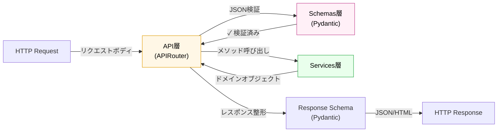

# API 層

## 役割

RESTful エンドポイントを定義し、HTTP リクエストを受け入れてサービス層に委譲する層です。リクエスト/レスポンスの形式（JSON）を定義し、Pydantic スキーマによるバリデーションを行います。またOpenAPI/Swagger 仕様を自動生成し、API 契約を明確化します。ビジネスロジック自体は持たず、スキーマ検証→サービス呼び出し→結果シリアライズの流れに統一します。

## 依存方向

**上位（プレゼンテーション層）からの流入**: HTTP リクエスト + 自動解析されたパス・クエリ・ボディ
**下位（スキーマ層）への利用**: リクエスト/レスポンス形式の定義
**下位（サービス層）への呼び出し**: ビジネスロジック実行

## 外部への依存

- Pydantic（スキーマ定義・バリデーション）
- FastAPI（デコレータ・DI フレームワーク）
- OpenAPI 仕様（自動ドキュメント生成）
- サービス層（ビジネスロジック実行）

## 設計原則

- **スキーマ第一**: リクエスト/レスポンスは必ず Pydantic スキーマで定義し、OpenAPI 仕様の基準とする
- **正規化されたフロー**: すべてのエンドポイントがスキーマ→サービス→結果に統一された流れを守る
- **エラーハンドリング統一**: HTTP ステータスコード・例外マッピングをこの層で行い、下位層の詳細を隠蔽

## 他のレイヤーとの関係

**API層は、リクエスト → スキーマ検証 → サービス呼び出し → レスポンス整形のパイプライン**を実装し、スキーマを契約の中心に置きます：

- **プレゼンテーション層 ← API層**: FastAPI ルータが HTTP リクエストを受け取り、パス・メソッド・クエリで適切なハンドラを選択
- **API層 ← → Schemas層**: 受け取ったリクエスト JSON を Pydantic スキーマで*自動検証*；型ミスマッチは 422 エラーで即座に拒否
- **API層 → Services層**: 検証済みスキーマのデータをサービスメソッドに渡す
- **API層 ← Services層**: サービスが返したドメインオブジェクト/リストを Pydantic レスポンススキーマでシリアライズ
- **API層 → プレゼンテーション層**: 整形済み JSON または HTML をクライアントに返す

