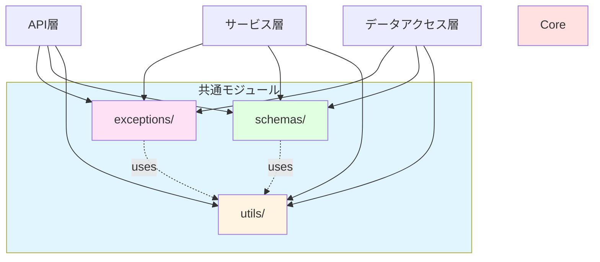
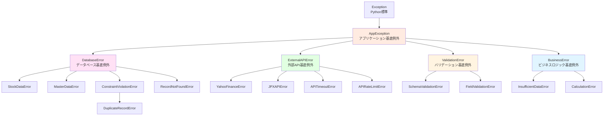
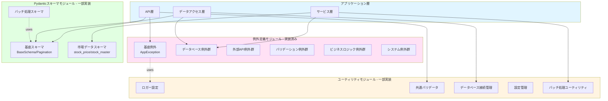
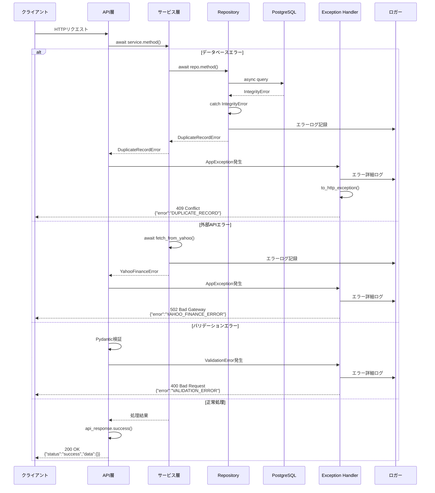
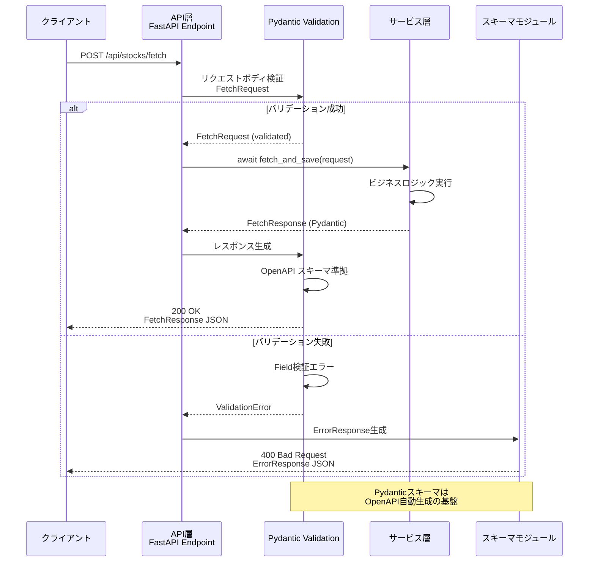

category: architecture
ai_context: high
last_updated: 2026-01-01
related_docs:
  - ../architecture_overview.md
  - ./api_layer.md
  - ./service_layer.md
  - ./data_access_layer.md

# 共通モジュール 仕様書

## 目次
- [共通モジュール 仕様書](#共通モジュール-仕様書)
  - [目次](#目次)
  - [1. 概要](#1-概要)
    - [役割](#役割)
    - [責務](#責務)
    - [設計原則](#設計原則)
    - [共通モジュールの配置基準](#共通モジュールの配置基準)
  - [2. 構成](#2-構成)
    - [ディレクトリ構造](#ディレクトリ構造)
    - [モジュール間依存関係](#モジュール間依存関係)
  - [3. 例外定義モジュール](#3-例外定義モジュール)
    - [3.1 例外階層](#31-例外階層)
    - [3.2 基底例外クラス](#32-基底例外クラス)
    - [3.3 例外カテゴリ別詳細](#33-例外カテゴリ別詳細)
      - [データベース関連例外（`app/exceptions/database.py`）](#データベース関連例外appexceptionsdatabasepy)
      - [外部API関連例外（`app/exceptions/external_api.py`）](#外部api関連例外appexceptionsexternal_apipy)
      - [バリデーション関連例外（`app/exceptions/validation.py`）](#バリデーション関連例外appexceptionsvalidationpy)
      - [ビジネスロジック関連例外（`app/exceptions/business.py`）](#ビジネスロジック関連例外appexceptionsbusinesspy)
    - [3.4 FastAPI例外ハンドラ（`app/exceptions/handlers.py`）](#34-fastapi例外ハンドラappexceptionshandlerspy)
  - [4. Pydanticスキーマモジュール](#4-pydanticスキーマモジュール)
    - [4.1 基底スキーマ（`app/schemas/base.py`）](#41-基底スキーマappschemasbasepy)
    - [4.2 ドメイン別スキーマ構成](#42-ドメイン別スキーマ構成)
      - [市場データドメイン（`app/schemas/market_data/`）](#市場データドメインappschemasmarket_data)
      - [バッチ処理スキーマ（`app/schemas/batch.py`）](#バッチ処理スキーマappschemasbatchpy)
  - [5. ユーティリティモジュール](#5-ユーティリティモジュール)
    - [5.1 ロガー設定（`app/utils/logger.py`）](#51-ロガー設定apputilsloggerpy)
    - [5.2 共通バリデータ（`app/utils/validation.py`）](#52-共通バリデータapputilsvalidationpy)
    - [5.3 データベース接続管理（`app/utils/database.py`）](#53-データベース接続管理apputilsdatabasepy)
    - [5.6 設定管理（`app/utils/config.py`）](#56-設定管理apputilsconfigpy)
    - [5.5 バッチ処理ユーティリティ（`app/utils/batch_utils.py`）](#55-バッチ処理ユーティリティapputilsbatch_utilspy)
  - [6. アーキテクチャ図](#6-アーキテクチャ図)
    - [6.1 共通モジュール全体構成](#61-共通モジュール全体構成)
    - [6.2 エラーハンドリングフロー](#62-エラーハンドリングフロー)
    - [7.3 Pydanticスキーマ連携フロー](#73-pydanticスキーマ連携フロー)
  - [7. 設計原則と利用ガイドライン](#7-設計原則と利用ガイドライン)
    - [7.1 例外処理のベストプラクティス](#71-例外処理のベストプラクティス)
    - [7.0 レイヤー別例外ハンドリング統一パターン](#70-レイヤー別例外ハンドリング統一パターン)
      - [API層（Presentation Layer）](#api層presentation-layer)
      - [サービス層（Service Layer）](#サービス層service-layer)
      - [リポジトリ層（Data Access Layer）](#リポジトリ層data-access-layer)
      - [統一パターンのまとめ](#統一パターンのまとめ)
    - [7.2 Pydanticスキーマのベストプラクティス](#72-pydanticスキーマのベストプラクティス)
    - [7.3 ユーティリティ関数のベストプラクティス](#73-ユーティリティ関数のベストプラクティス)
    - [7.4 共通モジュール利用時の注意点](#74-共通モジュール利用時の注意点)
  - [関連ドキュメント](#関連ドキュメント)
  - [8. 利用ガイドライン](#8-利用ガイドライン)
    - [8.1 共通モジュールの利用原則](#81-共通モジュールの利用原則)
    - [8.2 レイヤー別利用パターン](#82-レイヤー別利用パターン)
      - [プレゼンテーション層での利用](#プレゼンテーション層での利用)
      - [API層での利用](#api層での利用)
      - [サービス層での利用](#サービス層での利用)
      - [データアクセス層での利用](#データアクセス層での利用)
    - [8.3 実装時の注意点](#83-実装時の注意点)
      - [避けるべきパターン](#避けるべきパターン)
    - [8.4 期待される効果](#84-期待される効果)


---

## 1. 概要

### 役割

共通モジュールは、**全レイヤーで共有される型定義、例外クラス、ユーティリティ関数**を提供します。DRY原則に基づき、重複コードを排除し、一貫性のある実装を支援します。

### 責務

| 責務                      | 説明                                                      |
| ------------------------- | --------------------------------------------------------- |
| **型定義の統一**          | Pydanticモデルによるリクエスト/レスポンススキーマの標準化 |
| **例外階層の提供**        | カスタム例外クラスによる統一されたエラーハンドリング      |
| **共通処理の抽象化**      | ロガー、バリデータ、時間軸変換などの横断的機能の提供      |
| **API応答の標準化**       | 成功/エラーレスポンスの一貫した形式の保証                 |
| **OpenAPI自動生成の支援** | Pydanticスキーマからのドキュメント自動生成                |
| **型安全性の保証**        | 実行時型検証によるバグの早期発見                          |

### 設計原則

| 原則                 | 説明                               | 実装例                                                  |
| -------------------- | ---------------------------------- | ------------------------------------------------------- |
| **DRY原則**          | 重複コードを排除し、共通化を徹底   | 共通バリデータ、エラーハンドラの再利用                  |
| **型安全性**         | Pydanticによる実行時型検証         | 全データモデルにPydantic BaseModel使用                  |
| **単一責任の原則**   | 各モジュールは明確な責務を持つ     | 例外定義、型定義、ユーティリティを明確に分離            |
| **疎結合**           | モジュール間の依存を最小限に       | 各モジュールが独立して機能                              |
| **拡張性**           | 新機能追加が容易な構成             | ベースクラスの継承による拡張                            |
| **一貫性**           | 全レイヤーで統一された規約         | 統一されたレスポンス形式、エラーメッセージフォーマット  |
| **層を超えた再利用** | 横断的関心事は共通モジュールで提供 | 認証、レート制限、バリデーションをAPI層以外でも利用可能 |

### 共通モジュールの配置基準

各機能を共通モジュールに配置するか、各層に配置するかは以下の基準で判断します:

| 配置先             | 判断基準                         | 例                                                      |
| ------------------ | -------------------------------- | ------------------------------------------------------- |
| **共通モジュール** | 複数の層で使用される横断的関心事 | 認証、DB接続、レート制限、バリデーション、例外          |
| **各層**           | 特定の層でのみ使用される機能     | API層のサービス依存性注入、サービス層のビジネスロジック |

**共通モジュールに配置される機能**:
- **認証・認可** (`app/utils/security.py`): API層、WebSocket、CLI、バックグラウンドジョブで使用
- **データベース接続** (`app/utils/database.py`): 全層でDB接続が必要
- **レート制限** (`app/utils/rate_limiter.py`): API層、WebSocketハンドラで使用
- **バリデーション** (`app/utils/validators.py`): API層、サービス層で使用
- **エラーハンドリング** (`app/exceptions/`): 全層で統一されたエラー処理

**各層に配置される機能**:
- **サービス依存性注入** (`app/api/dependencies/services.py`): API層でのみ使用（FastAPI固有）

---

## 2. 構成

### ディレクトリ構造

```
app/
├── exceptions/                  # 例外定義モジュール
│   ├── __init__.py
│   ├── base.py                  # 基底例外クラス
│   ├── database.py              # データベース関連例外
│   ├── external_api.py          # 外部API関連例外
│   ├── validation.py            # バリデーション関連例外
│   ├── business.py              # ビジネスロジック関連例外
│   └── handlers.py              # FastAPI例外ハンドラ
│
├── schemas/                     # Pydanticスキーマモジュール
│   ├── __init__.py
│   ├── base.py                  # 基底スキーマ（BaseSchema、ページネーション等）
│   ├── market_data/             # 市場データドメインスキーマ
│   │   ├── __init__.py
│   │   ├── stock_price.py       # 株価データスキーマ
│   │   └── stock_master.py      # 銘柄マスタスキーマ
│   ├── batch.py                 # バッチ処理スキーマ
│   └── stock_data.py            # 株価データ関連スキーマ（旧版）
│
└── utils/                       # ユーティリティモジュール
    ├── __init__.py
    ├── logger.py                # ロガー設定
    ├── validation.py            # 共通バリデータ
    ├── database.py              # データベース接続管理
    ├── config.py                # 設定管理
    └── batch_utils.py           # バッチ処理ユーティリティ
```

### モジュール間依存関係



---

## 3. 例外定義モジュール

### 3.1 例外階層



### 3.2 基底例外クラス

**AppException（全例外の基底クラス）**:

| 属性             | 型                  | 説明                                    |
| ---------------- | ------------------- | --------------------------------------- |
| `message`        | str                 | エラーメッセージ                        |
| `error_code`     | str                 | エラーコード（例: "DB_001"）            |
| `status_code`    | int                 | HTTPステータスコード（デフォルト: 500） |
| `details`        | Optional[dict]      | エラー詳細情報                          |
| `original_error` | Optional[Exception] | 元の例外オブジェクト                    |

**主要メソッド**:

| メソッド              | 説明                                     |
| --------------------- | ---------------------------------------- |
| `to_dict()`           | 例外を辞書形式に変換（API レスポンス用） |
| `to_http_exception()` | FastAPI HTTPException に変換             |

### 3.3 例外カテゴリ別詳細

#### データベース関連例外（`app/exceptions/database.py`）

| 例外クラス                 | HTTPステータス | エラーコード           | 用途                   |
| -------------------------- | -------------- | ---------------------- | ---------------------- |
| `DatabaseError`            | 500            | `DB_ERROR`             | データベース基底エラー |
| `StockDataError`           | 500            | `STOCK_DATA_ERROR`     | 株価データ操作エラー   |
| `MasterDataError`          | 500            | `MASTER_DATA_ERROR`    | 銘柄マスタ操作エラー   |
| `ConstraintViolationError` | 400            | `CONSTRAINT_VIOLATION` | 制約違反エラー         |
| `DuplicateRecordError`     | 409            | `DUPLICATE_RECORD`     | UNIQUE制約違反         |
| `RecordNotFoundError`      | 404            | `RECORD_NOT_FOUND`     | レコード未検出         |

#### 外部API関連例外（`app/exceptions/external_api.py`）

| 例外クラス          | HTTPステータス | エラーコード          | 用途                     |
| ------------------- | -------------- | --------------------- | ------------------------ |
| `ExternalAPIError`  | 502            | `EXTERNAL_API_ERROR`  | 外部API基底エラー        |
| `YahooFinanceError` | 502            | `YAHOO_FINANCE_ERROR` | Yahoo Finance API エラー |
| `JPXAPIError`       | 502            | `JPX_API_ERROR`       | JPX API エラー           |
| `APITimeoutError`   | 504            | `API_TIMEOUT`         | APIタイムアウト          |
| `APIRateLimitError` | 429            | `API_RATE_LIMIT`      | APIレート制限超過        |

#### バリデーション関連例外（`app/exceptions/validation.py`）

| 例外クラス              | HTTPステータス | エラーコード              | 用途                       |
| ----------------------- | -------------- | ------------------------- | -------------------------- |
| `ValidationError`       | 400            | `VALIDATION_ERROR`        | バリデーション基底エラー   |
| `SchemaValidationError` | 400            | `SCHEMA_VALIDATION_ERROR` | Pydanticスキーマ検証エラー |
| `FieldValidationError`  | 400            | `FIELD_VALIDATION_ERROR`  | 特定フィールド検証エラー   |

#### ビジネスロジック関連例外（`app/exceptions/business.py`）

| 例外クラス              | HTTPステータス | エラーコード        | 用途                       |
| ----------------------- | -------------- | ------------------- | -------------------------- |
| `BusinessError`         | 400            | `BUSINESS_ERROR`    | ビジネスロジック基底エラー |
| `InsufficientDataError` | 422            | `INSUFFICIENT_DATA` | データ不足エラー           |
| `CalculationError`      | 500            | `CALCULATION_ERROR` | 計算処理エラー             |

### 3.4 FastAPI例外ハンドラ（`app/exceptions/handlers.py`）

**登録される例外ハンドラ**:

| 例外タイプ               | ハンドラ関数                   | 処理内容                                     |
| ------------------------ | ------------------------------ | -------------------------------------------- |
| `AppException`           | `app_exception_handler`        | カスタム例外を統一フォーマットでレスポンス   |
| `HTTPException`          | `http_exception_handler`       | FastAPI標準例外をカスタムフォーマットで返却  |
| `RequestValidationError` | `validation_exception_handler` | Pydantic検証エラーを詳細情報付きで返却       |
| `Exception`              | `general_exception_handler`    | 予期しないエラーをログ記録しエラーレスポンス |

**統一エラーレスポンス形式**:

```json
{
  "error": "ERROR_CODE",
  "message": "エラーメッセージ",
  "details": {
    "field": "symbol",
    "value": "invalid_value",
    "constraint": "銘柄コードは4桁の数字.Tの形式である必要があります"
  },
  "meta": {
    "timestamp": "2025-11-16T10:00:00Z",
    "request_id": "req-123456"
  }
}
```

---

## 4. Pydanticスキーマモジュール

### 4.1 基底スキーマ（`app/schemas/base.py`）

**実装済みのスキーマ**：

| スキーマ名                 | 用途                       |
| -------------------------- | -------------------------- |
| `BaseSchema`               | 全スキーマの基底クラス     |
| `BaseRequestSchema`        | リクエスト系スキーマの基底 |
| `BaseResponseSchema`       | レスポンス系スキーマの基底 |
| `PaginationRequestSchema`  | ページネーションリクエスト |
| `PaginationResponseSchema` | ページネーションレスポンス |

これらの基底スキーマは、他の全てのスキーマで継承され、共通の振る舞いを提供します。

### 4.2 ドメイン別スキーマ構成

#### 市場データドメイン（`app/schemas/market_data/`）

**株価データスキーマ（`stock_price.py`）**:

| スキーマ名          | 用途                     | 主要フィールド                                        |
| ------------------- | ------------------------ | ----------------------------------------------------- |
| `FetchRequest`      | 株価データ取得リクエスト | symbol, interval, period                              |
| `StockData`         | 株価データ単体           | symbol, date/datetime, open, high, low, close, volume |
| `FetchResponse`     | 株価データ取得レスポンス | symbol, interval, records_count, data                 |
| `ChartDataRequest`  | チャートデータリクエスト | symbol, interval, start_date, end_date                |
| `ChartDataResponse` | チャートデータレスポンス | symbol, interval, chart_data                          |

**銘柄マスタスキーマ（`stock_master.py`）**:

| スキーマ名           | 用途               | 主要フィールド                                  |
| -------------------- | ------------------ | ----------------------------------------------- |
| `StockMaster`        | 銘柄マスタデータ   | symbol, company_name, market, sector, is_active |
| `StockMasterList`    | 銘柄マスタリスト   | stocks (List[StockMaster])                      |
| `UpdateResult`       | 更新結果           | added_count, updated_count, deleted_count       |
| `StockSearchRequest` | 銘柄検索リクエスト | query, market_category, is_active               |

#### バッチ処理スキーマ（`app/schemas/batch.py`）

| スキーマ名      | 用途             | 主要フィールド                                    |
| --------------- | ---------------- | ------------------------------------------------- |
| `BatchRequest`  | バッチリクエスト | symbols, interval, period, max_workers            |
| `BatchResponse` | バッチレスポンス | job_id, batch_db_id, status, total_symbols        |
| `BatchSummary`  | バッチサマリ     | total, successful, failed, duration_seconds       |
| `ProgressInfo`  | 進捗情報         | total, processed, successful, failed, eta_seconds |

> **注**: `app/schemas/analysis/` および `app/schemas/user/` ディレクトリは現在未実装です。将来的な拡張として計画されています。

---

## 5. ユーティリティモジュール

### 5.1 ロガー設定（`app/utils/logger.py`）

**機能**:
- 統一されたログフォーマット設定
- ログレベルの環境変数による制御
- ファイル出力とコンソール出力の両対応
- リクエストIDによるトレーサビリティ確保

**ログレベル**:

| レベル   | 用途                               |
| -------- | ---------------------------------- |
| DEBUG    | 開発環境でのデバッグ情報           |
| INFO     | 通常の処理フロー情報               |
| WARNING  | 警告（処理は継続）                 |
| ERROR    | エラー（処理失敗）                 |
| CRITICAL | クリティカルエラー（システム停止） |

**ログフォーマット**:
```
[2025-11-16 10:00:00] [INFO] [req-123456] [app.services.stock_price] 株価データ取得開始: symbol=7203.T
```

### 5.2 共通バリデータ（`app/utils/validation.py`）

**実装済みのバリデータ関数**:

| 関数名                  | 引数                     | 戻り値                                   | 説明                           |
| ----------------------- | ------------------------ | ---------------------------------------- | ------------------------------ |
| `validate_pagination()` | limit, offset, max_limit | Tuple[int, int, Optional[HTTPException]] | ページネーションパラメータ検証 |

**検証ルール**:

ページネーション:
- limit: 1〜100（デフォルト: 100）
- offset: 0以上
- max_limit: システム全体の最大制限（デフォルト: 100）

> **注**: 時間軸変換・日時処理、APIレスポンス生成ヘルパー、その他のバリデータ関数は現在未実装です。必要に応じて将来的に追加される予定です。

### 5.3 データベース接続管理（`app/utils/database.py`）

**主要関数**:

| 関数名                         | 戻り値                       | 説明                                          |
| ------------------------------ | ---------------------------- | --------------------------------------------- |
| `get_database_url()`           | str                          | 環境変数からデータベースURL取得               |
| `create_async_engine()`        | AsyncEngine                  | 非同期エンジン作成                            |
| `create_async_session_maker()` | async_sessionmaker           | 非同期セッションメーカー作成                  |
| `get_db()`                     | AsyncGenerator[AsyncSession] | 非同期DBセッション提供（FastAPI依存性注入用） |

**接続プール設定**:

| パラメータ      | 値   | 説明                        |
| --------------- | ---- | --------------------------- |
| `pool_size`     | 10   | 通常時に保持する接続数      |
| `max_overflow`  | 20   | 追加接続数（最大30接続）    |
| `pool_pre_ping` | True | 接続使用前の有効性確認      |
| `pool_recycle`  | 3600 | 接続再利用最大秒数（1時間） |
| `pool_timeout`  | 30   | 接続取得時の最大待機秒数    |

**最大同時接続数**: 30（pool_size + max_overflow）

**非同期エンジン設定**:

環境変数:
```bash
DB_USER=postgres
DB_PASSWORD=your_password
DB_HOST=localhost
DB_PORT=5432
DB_NAME=stock_investment_db
```

接続URL:
```python
DATABASE_URL = f"postgresql+asyncpg://{DB_USER}:{DB_PASSWORD}@{DB_HOST}:{DB_PORT}/{DB_NAME}"
```

**実装例**:

```python
# app/utils/database.py
from sqlalchemy.ext.asyncio import create_async_engine, AsyncSession, async_sessionmaker
from typing import AsyncGenerator

from app.utils.config import settings

# 非同期エンジン作成
async_engine = create_async_engine(
    settings.DATABASE_URL,
    echo=settings.DEBUG,
    pool_size=10,
    max_overflow=20,
    pool_pre_ping=True,
    pool_recycle=3600,
    pool_timeout=30,
)

# 非同期セッションメーカー
async_session_maker = async_sessionmaker(
    async_engine,
    class_=AsyncSession,
    expire_on_commit=False,
    autocommit=False,
    autoflush=False,
)


async def get_db() -> AsyncGenerator[AsyncSession, None]:
    """非同期DBセッションを提供（トランザクション自動管理）.

    Yields:
        AsyncSession: 非同期DBセッション

    使用例（FastAPI依存性注入）:
        ```python
        from fastapi import Depends
        from app.utils.database import get_db

        @router.get("/stocks")
        async def get_stocks(db: AsyncSession = Depends(get_db)):
            # dbセッションを使用したデータベース操作
            ...
        ```
    """
    async with async_session_maker() as session:
        try:
            yield session
            await session.commit()  # 正常終了時: 自動コミット
        except Exception:
            await session.rollback()  # 例外発生時: 自動ロールバック
            raise
        finally:
            await session.close()  # 完了時: 自動クローズ
```

**トランザクション管理パターン**:

パターン1: FastAPI Dependencies経由（推奨）:
```python
# FastAPIエンドポイントでの使用（自動トランザクション管理）
from fastapi import Depends
from app.utils.database import get_db

@router.post("/stocks")
async def create_stock(
    request: StockRequest,
    db: AsyncSession = Depends(get_db)
):
    """株価データ作成（トランザクション自動管理）."""
    # get_db()により、自動的にコミット/ロールバックが実行される
    repo = StockRepository(session=db)
    result = await repo.create(**request.dict())
    return result
```

パターン2: サービス層での明示的トランザクション:
```python
# サービス層での複数操作のトランザクション制御
from app.utils.database import async_session_maker

async def fetch_and_save_multiple(self, symbols: List[str]) -> dict:
    """複数銘柄のデータ取得・保存（明示的トランザクション制御）."""
    async with async_session_maker() as session:
        try:
            results = []
            for symbol in symbols:
                # データ取得
                data = await self._fetch_from_yahoo(symbol)

                # Repository経由でDB保存
                repo = StockRepository(session=session)
                saved_data = await repo.bulk_upsert(data)
                results.append(saved_data)

            await session.commit()  # 全件成功時のみコミット
            return {"success": True, "results": results}

        except Exception as e:
            await session.rollback()  # 1件でも失敗したらロールバック
            raise
```

**トランザクション分離レベル**:

| 分離レベル          | 設定                 | 用途                     |
| ------------------- | -------------------- | ------------------------ |
| **READ COMMITTED**  | PostgreSQLデフォルト | 通常のCRUD操作           |
| **REPEATABLE READ** | 明示的に設定         | レポート生成、集計処理   |
| **SERIALIZABLE**    | 明示的に設定         | 高度な整合性が必要な場合 |

### 5.6 設定管理（`app/utils/config.py`）

**環境変数管理**:

| 設定項目                   | 環境変数名        | デフォルト値 | 説明                                 |
| -------------------------- | ----------------- | ------------ | ------------------------------------ |
| **データベース**           |                   |              |                                      |
| DB接続URL                  | `DATABASE_URL`    | -            | PostgreSQL接続URL                    |
| DBユーザー                 | `DB_USER`         | postgres     | データベースユーザー名               |
| DBパスワード               | `DB_PASSWORD`     | -            | データベースパスワード               |
| **アプリケーション**       |                   |              |                                      |
| 環境                       | `ENVIRONMENT`     | development  | 実行環境（dev/staging/prod）         |
| デバッグモード             | `DEBUG`           | False        | デバッグモード有効化                 |
| ログレベル                 | `LOG_LEVEL`       | INFO         | ログ出力レベル                       |
| **セキュリティ**           |                   |              |                                      |
| JWT秘密鍵                  | `JWT_SECRET_KEY`  | -            | JWT署名用秘密鍵                      |
| JWT有効期限                | `JWT_EXPIRATION`  | 3600         | アクセストークン有効期限（秒）       |
| APIキー                    | `API_KEY`         | -            | システム間連携用APIキー              |
| **外部API**                |                   |              |                                      |
| Yahoo Finance タイムアウト | `YAHOO_TIMEOUT`   | 30           | Yahoo Finance API タイムアウト（秒） |
| リトライ回数               | `API_RETRY_COUNT` | 3            | 外部API呼び出しリトライ回数          |

### 5.5 バッチ処理ユーティリティ（`app/utils/batch_utils.py`）

**実装済みの機能**:

| 関数/クラス          | 用途                               |
| -------------------- | ---------------------------------- |
| `chunk_list()`       | リストを指定サイズのチャンクに分割 |
| `parallel_execute()` | 並列実行ユーティリティ             |
| `ProgressTracker`    | バッチ処理の進捗追跡クラス         |

このモジュールは、大量データのバッチ処理を効率的に実行するためのユーティリティを提供します。

> **注**: 以下のモジュールは現在未実装です：
> - `app/utils/security.py` - セキュリティユーティリティ（認証、JWT等）
> - `app/utils/retry.py` - リトライロジック
> - `app/utils/rate_limiter.py` - レート制限
> - `app/utils/websocket_manager.py` - WebSocket接続管理
> - `app/utils/cache.py` - キャッシュ制御ミドルウェア
> - `app/utils/constants.py` - システム定数
> - `app/utils/time_utils.py` - 時間軸変換・日時処理
> - `app/utils/api_response.py` - APIレスポンス生成ヘルパー
>
> これらの機能は、必要に応じて将来的に実装される予定です。

---

## 6. アーキテクチャ図

### 6.1 共通モジュール全体構成



**実装状況の凡例**:
- **実装済み**: exceptions/ 配下の全モジュール
- **一部実装**: schemas/ (base.py, batch.py, market_data/)、utils/ (logger.py, validation.py, database.py, config.py, batch_utils.py)
- **未実装**: utils/ 配下のその他モジュール（time_utils.py, api_response.py, security.py, retry.py等）

### 6.2 エラーハンドリングフロー



### 7.3 Pydanticスキーマ連携フロー



---

## 7. 設計原則と利用ガイドライン

### 7.1 例外処理のベストプラクティス

**原則1: 適切な例外クラスを選択**

```python
# ❌ 悪い例: 汎用的すぎる
raise Exception("データが見つかりません")

# ✅ 良い例: 具体的な例外クラス
raise RecordNotFoundError(
    message=f"銘柄データが見つかりません: {symbol}",
    details={"symbol": symbol, "date": target_date}
)
```

**原則2: 元の例外を保持**

```python
# ✅ 良い例: 元の例外を記録
try:
    result = await repo.create(symbol="7203.T", ...)
except IntegrityError as e:
    raise DuplicateRecordError(
        message="銘柄データが既に存在します",
        original_error=e,  # 元の例外を保持
        details={"symbol": "7203.T"}
    )
```

**原則3: ログ記録を徹底**

```python
from app.utils.logger import get_logger

logger = get_logger(__name__)

try:
    data = await fetch_stock_data(symbol)
except YahooFinanceError as e:
    logger.error(
        f"Yahoo Finance API エラー: {e.message}",
        extra={"symbol": symbol, "error_code": e.error_code}
    )
    raise
```

---

### 7.0 レイヤー別例外ハンドリング統一パターン

本システムでは、各レイヤーで統一された例外ハンドリングパターンを使用します。

#### API層（Presentation Layer）

**役割**: HTTPリクエストを受け取り、適切なHTTPレスポンスを返却

```python
# app/api/stock_data.py
from fastapi import APIRouter, Depends, HTTPException
from app.schemas.stock_data import StockDataRequest, StockDataResponse
from app.services.market_data.stock_price_service import StockPriceService
from app.utils.api_response import success, error
from app.exceptions.validation import ValidationError
from app.exceptions.external_api import YahooFinanceError
from app.utils.logger import get_logger

router = APIRouter()
logger = get_logger(__name__)

@router.post("/stocks", response_model=StockDataResponse)
async def get_stock_data(
    request: StockDataRequest,
    service: StockPriceService = Depends(get_stock_price_service)
):
    """株価データ取得エンドポイント"""
    try:
        # サービス層を呼び出し
        data = await service.fetch_and_save(
            symbol=request.symbol,
            period=request.period,
            interval=request.interval
        )

        # 成功レスポンス
        return success(data=data, message="株価データを取得しました")

    except ValidationError as e:
        # バリデーションエラー: 400 Bad Request
        logger.warning(f"Validation error: {e.message}", extra={"symbol": request.symbol})
        return error(
            error_code=e.error_code,
            message=e.message,
            details=e.details,
            status_code=400
        )

    except YahooFinanceError as e:
        # 外部APIエラー: 502 Bad Gateway
        logger.error(f"Yahoo Finance API error: {e.message}", extra={"symbol": request.symbol})
        return error(
            error_code=e.error_code,
            message=e.message,
            details=e.details,
            status_code=502
        )

    except Exception as e:
        # 予期しないエラー: 500 Internal Server Error
        logger.exception(f"Unexpected error: {str(e)}")
        return error(
            error_code="INTERNAL_SERVER_ERROR",
            message="内部サーバーエラーが発生しました",
            status_code=500
        )
```

#### サービス層（Service Layer）

**役割**: ビジネスロジックを実行し、カスタム例外を発生

```python
# app/services/market_data/stock_price_service.py
from typing import List
from app.schemas.stock_data import StockData
from app.services.core.fetchers.base_fetcher import BaseFetcher
from app.services.core.savers.base_saver import BaseSaver
from app.exceptions.external_api import YahooFinanceError
from app.exceptions.validation import ValidationError
from app.exceptions.business import InsufficientDataError
from app.utils.logger import get_logger

logger = get_logger(__name__)

class StockPriceService:
    """株価データサービス"""

    def __init__(self, fetcher: BaseFetcher, saver: BaseSaver):
        self.fetcher = fetcher
        self.saver = saver

    async def fetch_and_save(
        self,
        symbol: str,
        period: str = "1mo",
        interval: str = "1d"
    ) -> List[StockData]:
        """株価データ取得と保存"""

        # 1. バリデーション
        if not symbol:
            raise ValidationError(
                message="銘柄コードが指定されていません",
                error_code="VALIDATION_ERROR",
                details={"field": "symbol"}
            )

        # 2. データ取得（外部API）
        try:
            data = await self.fetcher.fetch(
                symbol=symbol,
                period=period,
                interval=interval
            )
        except Exception as e:
            # 外部APIエラーをラップ
            logger.error(f"Failed to fetch data for {symbol}: {str(e)}")
            raise YahooFinanceError(
                message=f"Yahoo Finance APIからデータを取得できませんでした: {symbol}",
                error_code="YAHOO_FINANCE_ERROR",
                details={"symbol": symbol, "period": period, "interval": interval},
                original_error=e
            )

        # 3. データ検証
        if not data or len(data) == 0:
            raise InsufficientDataError(
                message=f"取得データが空です: {symbol}",
                error_code="INSUFFICIENT_DATA",
                details={"symbol": symbol, "period": period}
            )

        # 4. データ保存
        try:
            saved_count = await self.saver.save_batch(data)
            logger.info(f"Saved {saved_count} records for {symbol}")
        except Exception as e:
            logger.error(f"Failed to save data for {symbol}: {str(e)}")
            # データベースエラーはそのまま伝播
            raise

        return data
```

#### リポジトリ層（Data Access Layer）

**役割**: データベース操作を実行し、データベース関連例外を発生

```python
# app/repositories/stock_repository.py
from typing import List, Optional
from sqlalchemy.ext.asyncio import AsyncSession
from sqlalchemy.exc import IntegrityError, SQLAlchemyError
from sqlalchemy import select
from app.models import StockModel
from app.exceptions.database import (
    DatabaseError,
    DuplicateRecordError,
    RecordNotFoundError
)
from app.utils.logger import get_logger

logger = get_logger(__name__)

class StockRepository:
    """株価データリポジトリ"""

    def __init__(self, session: AsyncSession):
        self.session = session

    async def add(self, model: StockModel) -> StockModel:
        """単一レコード追加"""
        try:
            self.session.add(model)
            await self.session.flush()
            return model

        except IntegrityError as e:
            await self.session.rollback()
            logger.warning(f"Duplicate record: {model.symbol} at {model.datetime}")
            raise DuplicateRecordError(
                message=f"重複レコード: {model.symbol}",
                error_code="DUPLICATE_RECORD",
                details={"symbol": model.symbol, "datetime": str(model.datetime)},
                original_error=e
            )

        except SQLAlchemyError as e:
            await self.session.rollback()
            logger.error(f"Database error: {str(e)}")
            raise DatabaseError(
                message="データベースエラーが発生しました",
                error_code="DB_ERROR",
                details={"operation": "add", "symbol": model.symbol},
                original_error=e
            )

    async def bulk_add(self, models: List[StockModel]) -> None:
        """複数レコード一括追加"""
        try:
            self.session.add_all(models)
            await self.session.flush()

        except IntegrityError as e:
            await self.session.rollback()
            logger.warning(f"Duplicate records in bulk insert: {len(models)} records")
            raise DuplicateRecordError(
                message="一括登録中に重複レコードが見つかりました",
                error_code="DUPLICATE_RECORD",
                details={"count": len(models)},
                original_error=e
            )

        except SQLAlchemyError as e:
            await self.session.rollback()
            logger.error(f"Database error in bulk insert: {str(e)}")
            raise DatabaseError(
                message="一括登録中にデータベースエラーが発生しました",
                error_code="DB_ERROR",
                details={"operation": "bulk_add", "count": len(models)},
                original_error=e
            )

    async def get_by_symbol(self, symbol: str) -> Optional[StockModel]:
        """銘柄コードで検索"""
        try:
            stmt = select(StockModel).where(StockModel.symbol == symbol)
            result = await self.session.execute(stmt)
            record = result.scalar_one_or_none()

            if record is None:
                raise RecordNotFoundError(
                    message=f"銘柄データが見つかりません: {symbol}",
                    error_code="RECORD_NOT_FOUND",
                    details={"symbol": symbol}
                )

            return record

        except SQLAlchemyError as e:
            logger.error(f"Database query error: {str(e)}")
            raise DatabaseError(
                message="データ取得中にエラーが発生しました",
                error_code="DB_ERROR",
                details={"operation": "get_by_symbol", "symbol": symbol},
                original_error=e
            )

    async def commit(self) -> None:
        """トランザクションコミット"""
        try:
            await self.session.commit()
        except SQLAlchemyError as e:
            await self.session.rollback()
            logger.error(f"Commit failed: {str(e)}")
            raise DatabaseError(
                message="トランザクションのコミットに失敗しました",
                error_code="DB_COMMIT_ERROR",
                original_error=e
            )

    async def rollback(self) -> None:
        """トランザクションロールバック"""
        try:
            await self.session.rollback()
        except SQLAlchemyError as e:
            logger.error(f"Rollback failed: {str(e)}")
            raise DatabaseError(
                message="トランザクションのロールバックに失敗しました",
                error_code="DB_ROLLBACK_ERROR",
                original_error=e
            )
```

#### 統一パターンのまとめ

| レイヤー         | 責務                          | 例外処理パターン                                                             | 発生させる例外                                                  |
| ---------------- | ----------------------------- | ---------------------------------------------------------------------------- | --------------------------------------------------------------- |
| **API層**        | HTTPリクエスト/レスポンス処理 | try-exceptで全例外をキャッチし、適切なHTTPステータスコードとレスポンスを返却 | なし（例外をHTTPレスポンスに変換）                              |
| **サービス層**   | ビジネスロジック実行          | ビジネスルール違反や外部APIエラーを検出し、カスタム例外を発生                | `ValidationError`, `YahooFinanceError`, `InsufficientDataError` |
| **リポジトリ層** | データベース操作              | SQLAlchemyの例外をキャッチし、カスタムデータベース例外に変換                 | `DatabaseError`, `DuplicateRecordError`, `RecordNotFoundError`  |

**例外伝播の流れ:**

```
Repository Layer → Service Layer → API Layer → HTTP Response
    ↓                 ↓               ↓
DatabaseError → YahooFinanceError → 502 Bad Gateway
```

### 7.2 Pydanticスキーマのベストプラクティス

**原則1: 型ヒントを明示**

```python
from pydantic import BaseModel, Field
from typing import Optional
from datetime import date

class FetchRequest(BaseModel):
    """株価データ取得リクエスト."""

    symbol: str = Field(..., description="銘柄コード", example="7203.T")
    interval: str = Field(..., description="時間軸", example="1d")
    start_date: Optional[date] = Field(None, description="開始日")
    end_date: Optional[date] = Field(None, description="終了日")
```

**原則2: バリデータを活用**

```python
from pydantic import BaseModel, validator

class FetchRequest(BaseModel):
    symbol: str
    interval: str

    @validator("symbol")
    def validate_symbol(cls, v):
        """銘柄コード検証."""
        if not re.match(r"^\d{4}\.(T|JP)$", v):
            raise ValueError("銘柄コードは4桁の数字.Tの形式である必要があります")
        return v

    @validator("interval")
    def validate_interval(cls, v):
        """時間軸検証."""
        if v not in SUPPORTED_INTERVALS:
            raise ValueError(f"サポートされていない時間軸です: {v}")
        return v
```

**原則3: OpenAPI ドキュメント対応**

```python
from pydantic import BaseModel, Field

class StockData(BaseModel):
    """株価データ."""

    class Config:
        json_schema_extra = {
            "example": {
                "symbol": "7203.T",
                "date": "2025-11-16",
                "open": 1500.0,
                "high": 1520.0,
                "low": 1495.0,
                "close": 1510.0,
                "volume": 1000000
            }
        }

    symbol: str = Field(..., description="銘柄コード")
    date: date = Field(..., description="データ日付")
    open: float = Field(..., ge=0, description="始値")
    high: float = Field(..., ge=0, description="高値")
    low: float = Field(..., ge=0, description="安値")
    close: float = Field(..., ge=0, description="終値")
    volume: int = Field(..., ge=0, description="出来高")
```

### 7.3 ユーティリティ関数のベストプラクティス

**原則1: 単一責任の原則を守る**

```python
# ✅ 良い例: 1つの関数が1つの責務
def validate_symbol(symbol: str) -> Tuple[bool, Optional[str]]:
    """銘柄コード検証のみ."""
    if not re.match(r"^\d{4}\.(T|JP)$", symbol):
        return False, "銘柄コードの形式が不正です"
    return True, None

def validate_interval(interval: str) -> Tuple[bool, Optional[str]]:
    """時間軸検証のみ."""
    if interval not in SUPPORTED_INTERVALS:
        return False, f"サポートされていない時間軸です: {interval}"
    return True, None
```

**原則2: 型ヒントを必ず付与**

```python
from typing import Optional, Tuple
from datetime import datetime

def parse_datetime(datetime_str: str) -> datetime:
    """ISO 8601文字列をdatetimeに変換.

    Args:
        datetime_str: ISO 8601形式の日時文字列

    Returns:
        datetime: パース済みdatetimeオブジェクト

    Raises:
        ValueError: 不正な日時文字列
    """
    try:
        return datetime.fromisoformat(datetime_str)
    except ValueError as e:
        raise ValueError(f"不正な日時形式です: {datetime_str}") from e
```

**原則3: テスタビリティを確保**

```python
# ✅ 良い例: 純粋関数（副作用なし）
def convert_interval_to_table_name(interval: str) -> str:
    """時間軸文字列からテーブル名を取得.

    Args:
        interval: 時間軸（例: "1d"）

    Returns:
        str: テーブル名（例: "stocks_1d"）
    """
    return INTERVAL_TABLE_MAPPING.get(interval, "stocks_1d")
```

### 7.4 共通モジュール利用時の注意点

**1. 循環参照の回避**

```python
# ❌ 悪い例: 循環参照が発生
# app/schemas/stock.py
from app.services.stock_service import StockService  # 循環参照

# ✅ 良い例: 型ヒントはTYPE_CHECKINGで分離
from typing import TYPE_CHECKING

if TYPE_CHECKING:
    from app.services.stock_service import StockService
```

**2. 例外の過度なネスト回避**

```python
# ❌ 悪い例: 例外の再ラップが多すぎる
try:
    data = await fetch_data()
except YahooFinanceError as e:
    raise ExternalAPIError(...) from e  # 必要以上の変換

# ✅ 良い例: 適切なレベルで例外を処理
try:
    data = await fetch_data()
except YahooFinanceError:
    # Yahoo Finance固有のエラーなので、そのまま伝播
    raise
```

**3. ユーティリティ関数の適切な配置**

- ドメイン固有のロジック → サービス層
- 汎用的な処理 → ユーティリティモジュール

```python
# ❌ 悪い例: ビジネスロジックをユーティリティに配置
# app/utils/stock_utils.py
def calculate_portfolio_value(holdings, current_prices):
    """ポートフォリオ評価額計算（ビジネスロジック）"""
    # これはユーティリティではなくサービス層に配置すべき

# ✅ 良い例: 汎用的な処理のみユーティリティに配置
# app/utils/time_utils.py
def is_trading_day(target_date: date) -> bool:
    """取引日判定（汎用的な処理）"""
    return target_date.weekday() < 5 and not is_holiday(target_date)
```

---

## 関連ドキュメント

- [アーキテクチャ概要](../architecture_overview.md)
- [API層仕様書](./api_layer.md)
- [サービス層仕様書](./service_layer.md)
- [データアクセス層仕様書](./data_access_layer.md)

---

## 8. 利用ガイドライン

### 8.1 共通モジュールの利用原則

共通モジュールは以下の原則に従って利用してください:

| 原則                   | 説明                                                 | 例                                              |
| ---------------------- | ---------------------------------------------------- | ----------------------------------------------- |
| **横断的関心事の集約** | 複数の層で使用する機能は共通モジュールに配置         | 認証、バリデーション、エラーハンドリング        |
| **明示的なインポート** | 使用する機能を明示的にインポート                     | `from app.utils.security import verify_api_key` |
| **型安全性の活用**     | Pydanticスキーマ、TypedDictを積極的に使用            | リクエスト/レスポンススキーマの定義             |
| **例外階層の活用**     | カスタム例外クラスを使用し、適切なエラーハンドリング | `raise RecordNotFoundError(...)`                |
| **依存性注入の活用**   | FastAPIの`Depends()`パターンで疎結合を実現           | `db: AsyncSession = Depends(get_db)`            |

### 8.2 レイヤー別利用パターン

#### プレゼンテーション層での利用

```python
# WebSocket接続管理
from app.utils.websocket_manager import websocket_manager

# セキュリティミドルウェア
from app.utils.security import SecurityHeadersMiddleware

# キャッシュ制御ミドルウェア
from app.utils.cache import CacheControlMiddleware

# 設定管理
from app.utils.config import settings

# FastAPI Application Factory での利用例
from fastapi import FastAPI
from fastapi.middleware.cors import CORSMiddleware
from fastapi.middleware.gzip import GZIPMiddleware

def create_app():
    """FastAPIアプリケーション生成（共通モジュール活用）."""
    app = FastAPI(
        title=settings.APP_NAME,
        version=settings.VERSION,
        debug=settings.DEBUG
    )

    # 共通モジュールのミドルウェアを追加
    app.add_middleware(SecurityHeadersMiddleware)
    app.add_middleware(CacheControlMiddleware)
    app.add_middleware(GZIPMiddleware, minimum_size=1000)
    app.add_middleware(
        CORSMiddleware,
        allow_origins=settings.CORS_ORIGINS,
        allow_credentials=True,
        allow_methods=["*"],
        allow_headers=["*"],
    )

    # WebSocketManagerを app.state に登録
    app.state.websocket_manager = websocket_manager

    return app
```

#### API層での利用

```python
# 認証・認可
from app.utils.security import verify_api_key, get_current_user

# データベース接続
from app.utils.database import get_db

# レート制限
from app.utils.rate_limiter import rate_limit

# バリデーション
from app.utils.validators import validate_symbols, validate_pagination

# レスポンス生成
from app.utils.api_response import success, error, paginated

# スキーマ
from app.schemas.responses import SuccessResponse, ErrorResponse
from app.schemas.market_data.stock_price import FetchRequest, FetchResponse

# 例外
from app.exceptions.validation import ValidationError
from app.exceptions.database import RecordNotFoundError
```

#### サービス層での利用

```python
# 例外
from app.exceptions.external_api import YahooFinanceError
from app.exceptions.business import InsufficientDataError

# ユーティリティ
from app.utils.time_utils import convert_interval_to_model
from app.utils.retry import retry_async
from app.utils.logger import get_logger

# スキーマ
from app.schemas.market_data.stock_price import StockData
```

#### データアクセス層での利用

```python
# 例外
from app.exceptions.database import DuplicateRecordError, RecordNotFoundError

# ユーティリティ
from app.utils.logger import get_logger
from app.utils.time_utils import get_table_name_for_interval

# スキーマ
from app.schemas.common import PaginationMeta
```

### 8.3 実装時の注意点

#### 避けるべきパターン

❌ **循環参照**:
```python
# app/schemas/stock.py
from app.services.stock_service import StockService  # NG: 循環参照
```

✅ **正しいパターン**:
```python
# app/schemas/stock.py
from typing import TYPE_CHECKING

if TYPE_CHECKING:
    from app.services.stock_service import StockService
```

❌ **層を超えた依存**:
```python
# app/utils/validators.py
from app.services.stock_service import StockService  # NG: utilsはサービス層に依存しない
```

✅ **正しいパターン**:
```python
# app/api/stock_data.py
from app.utils.validators import validate_symbols
from app.api.dependencies.services import get_stock_service

@router.post("/api/stocks")
async def create_stock(
    request: StockRequest,
    stock_service: StockService = Depends(get_stock_service)
):
    is_valid, error = validate_symbols(request.symbols)
    if not is_valid:
        raise error

    result = await stock_service.process(request.symbols)
    return result
```

### 8.4 期待される効果

共通モジュールを正しく活用することで、以下の効果が得られます:

| 効果                   | 説明                                            | 指標                               |
| ---------------------- | ----------------------------------------------- | ---------------------------------- |
| **コード重複削減**     | 同一ロジックを複数箇所で実装する必要がなくなる  | 重複コード率: 目標 < 5%            |
| **保守性向上**         | 変更箇所が1箇所に集約され、バグ修正が容易になる | バグ修正時間: 従来比 -50%          |
| **再利用性向上**       | API層以外（WebSocket、CLI、ジョブ）でも使用可能 | 共通コード再利用率: 目標 > 80%     |
| **一貫性保証**         | 全レイヤーで統一された動作を保証                | エラーメッセージ形式の統一率: 100% |
| **テスタビリティ向上** | 独立したモジュールとして単体テストが容易        | テストカバレッジ: 目標 > 90%       |
| **開発速度向上**       | 既存の共通モジュールを活用し、新機能開発を加速  | 新機能開発時間: 従来比 -30%        |

---

**最終更新**: 2026-01-01
**設計方針**: DRY原則 + 型安全性 + 一貫性による保守性の向上
**アーキテクチャ**: 横断的関心事の共通化により、薄いAPI層とクリーンなサービス層を実現

**実装状況**:
- **例外定義モジュール**: 完全実装済み (base.py, database.py, external_api.py, validation.py, business.py, system.py, handlers.py)
- **Pydanticスキーマモジュール**: 一部実装済み (base.py, batch.py, market_data/)
- **ユーティリティモジュール**: 一部実装済み (logger.py, validation.py, database.py, config.py, batch_utils.py)
- **未実装**: time_utils.py, api_response.py, security.py, retry.py, rate_limiter.py, websocket_manager.py, cache.py, constants.py 等は将来的に実装予定
