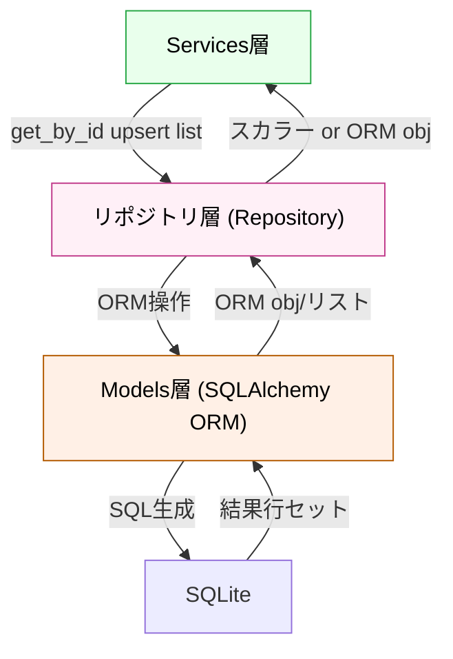

# データアクセス層（リポジトリ層）

## 役割

永続化操作を統一インタフェースで提供し、データベース実装詳細を隠蔽する層です。Repository Pattern に基づき、各ドメイン要素（株価、銘柄マスタ、ユーザー等）に対して CRUD・検索・集約操作の抽象化を提供します。これにより上位層はデータベースの物理構造を意識せず、ビジネスロジックに集中できます。

## 依存方向

**上位（サービス層）からの呼び出し**: リポジトリメソッド経由でのデータ取得・保存・削除
**下位（モデル層）への依存**: SQLAlchemy ORM モデルの操作

## 外部への依存

- SQLAlchemy ORM（ORM 操作）
- aiosqlite（非同期 DB ドライバ）
- 例外クラス（DB エラーの統一）
- ログ（アクセス履歴）

## 設計原則

- **DB 実装の隠蔽**: SQL・テーブル構造・インデックス戦略はこの層の内部に留め、上位層には曝さない
- **インタフェース統一**: すべてのリポジトリが共通の CRUD インタフェース（BaseRepository）を継承
- **テスト容易性**: リポジトリは インタフェースで定義され、テスト時は簡単にモック置き換え可能
- **非同期操作**: 大量データアクセスは async/await で並列化

## 他のレイヤーとの関係

**リポジトリ層は、DB 実装の「障壁」**として機能し、上位層を DB の詳細から隔離します：

- **リポジトリ層 ← Services層**: `get_by_id()`、`list()`、`upsert()` 等のメソッド呼び出しを受け取る；サービス層は **「何をしたいか」のみ** 指定
- **リポジトリ層 → Models層**: ORM モデルを内部でのみ使用；インタフェースには現れない
- **リポジトリ層 → DB（SQLite）**: ORM が生成した SQL をドライバ（aiosqlite）経由で実行
- **リポジトリ層 ← DB（SQLite）**: 取得した ORM オブジェクト or スカラー値（ID、件数等）を返す
- **リポジトリ層 → Services層**: 取得結果を返却；Services層が結果を多重リポジトリの結果と組み合わせ
- **テスト時**: リポジトリインタフェースをモック/スタブに置き換え；サービスロジックの単体テストが容易

