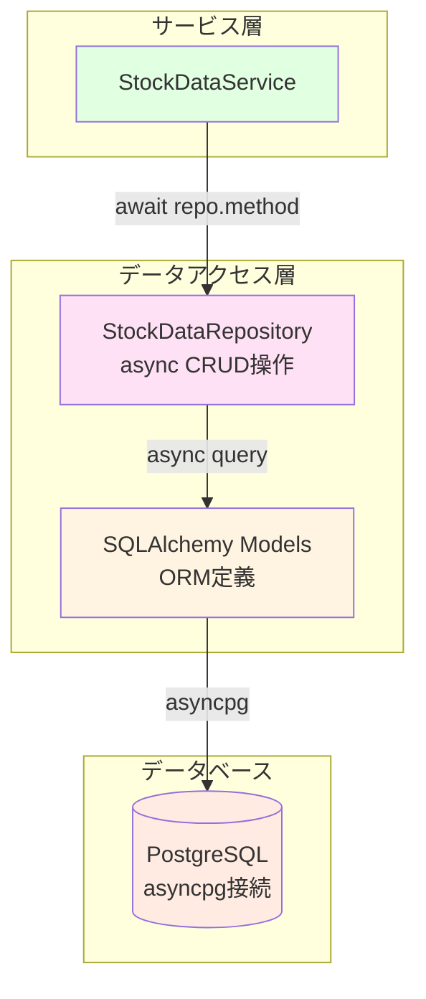
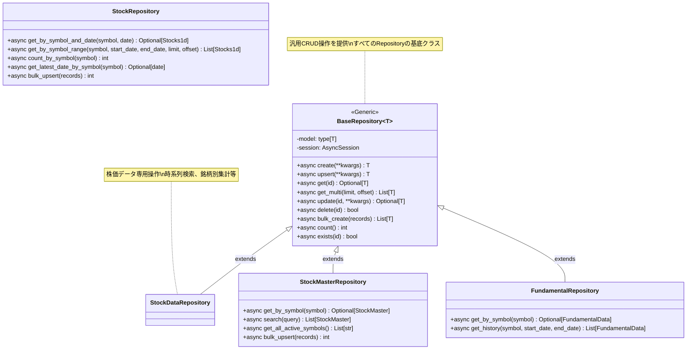

category: architecture
ai_context: high
last_updated: 2025-12-02
related_docs:
  - ../architecture_overview.md
  - ./service_layer.md
  - ./api_layer.md
  - ../database_design.md

# データアクセス層 仕様書

## 目次
- [データアクセス層 仕様書](#データアクセス層-仕様書)
  - [目次](#目次)
  - [1. 概要](#1-概要)
    - [役割](#役割)
    - [責務](#責務)
    - [設計原則](#設計原則)
  - [2. 構成](#2-構成)
    - [ディレクトリ構造](#ディレクトリ構造)
    - [責任分離](#責任分離)
  - [3. Repositoryパターン設計](#3-repositoryパターン設計)
    - [3.1 BaseRepository（汎用CRUD）](#31-baserepository汎用crud)
    - [3.2 StockDataRepository（株価データ専用）](#32-stockdatarepository株価データ専用)
    - [3.3 依存性注入パターン（共通モジュール利用）](#33-依存性注入パターン共通モジュール利用)
  - [実装上の注意](#実装上の注意)
    - [ファイル名とモジュール構成](#ファイル名とモジュール構成)
    - [初期化パラメータの順序](#初期化パラメータの順序)
  - [4. モデル定義](#4-モデル定義)
    - [4.1 モデル一覧](#41-モデル一覧)
    - [4.2 株価データモデル詳細](#42-株価データモデル詳細)
    - [4.3 モデル実装例](#43-モデル実装例)
  - [5. データベース接続管理（共通モジュール利用）](#5-データベース接続管理共通モジュール利用)
    - [5.1 共通モジュールの活用](#51-共通モジュールの活用)
    - [5.2 Repository層での使用方法](#52-repository層での使用方法)
    - [5.3 接続プール設定（共通モジュール管理）](#53-接続プール設定共通モジュール管理)
  - [6. アーキテクチャ図](#6-アーキテクチャ図)
    - [6.1 データアクセス層構成](#61-データアクセス層構成)
    - [6.2 Repository Pattern詳細](#62-repository-pattern詳細)
  - [7. トランザクション管理（共通モジュール利用）](#7-トランザクション管理共通モジュール利用)
    - [7.1 共通モジュールのトランザクション管理機能](#71-共通モジュールのトランザクション管理機能)
    - [7.2 Repository層でのトランザクション利用](#72-repository層でのトランザクション利用)
    - [7.3 トランザクション分離レベル（共通モジュール管理）](#73-トランザクション分離レベル共通モジュール管理)
  - [8. エラーハンドリング（共通モジュール利用）](#8-エラーハンドリング共通モジュール利用)
    - [8.1 共通モジュールの例外クラス活用](#81-共通モジュールの例外クラス活用)
    - [8.2 データアクセス層で使用する例外クラス](#82-データアクセス層で使用する例外クラス)
    - [8.3 Repository層でのエラーハンドリング実装例](#83-repository層でのエラーハンドリング実装例)
    - [8.4 ログ記録の統一](#84-ログ記録の統一)
  - [関連ドキュメント](#関連ドキュメント)


---

## 1. 概要

### 役割

データアクセス層は、**SQLAlchemyを使用してデータベーススキーマとPythonオブジェクトをマッピングし、データの永続化を担当**します。Repository Patternを採用することで、サービス層からデータベース実装詳細を隠蔽し、テスタビリティを向上させます。

### 責務

| 責務                   | 説明                                                               |
| ---------------------- | ------------------------------------------------------------------ |
| **非同期ORM定義**      | SQLAlchemy async対応によるテーブル定義とマッピング                 |
| **Repository実装**     | 株価データ、銘柄マスタ、バッチ履歴等のデータアクセス抽象化         |
| **制約定義**           | ユニーク制約、チェック制約、インデックスの設定                     |
| **非同期CRUD操作**     | asyncpg経由での非同期データベース操作（Create/Read/Update/Delete） |
| **セッション管理**     | 非同期データベース接続のライフサイクル管理                         |
| **型安全なデータ変換** | データベース型⇔Python型⇔Pydanticモデルの相互変換                   |
| **クエリ最適化**       | インデックス設計とクエリパフォーマンスの最適化                     |

### 設計原則

- **Repository Pattern**: データアクセスロジックをRepositoryに集約し、サービス層からDB詳細を隠蔽
- **非同期ファースト**: 全データベース操作でasync/await使用、asyncpgドライバ採用
- **型安全性**: `Mapped`による型ヒント、Pydanticモデルとの連携
- **整合性保証**: データベース制約による不正データの防止
- **依存性注入**: FastAPIのDependsパターンでRepository提供
- **テスタビリティ**: Repositoryインターフェースによるモック注入の容易化

---

## 2. 構成

### ディレクトリ構造

```
app/
├── models/                        # SQLAlchemyモデル（ORM定義）
│   ├── __init__.py
│   ├── base.py                    # 基底クラス ✅
│   ├── stock_data.py              # 株価データモデル（8種類の時間軸）✅
│   ├── stock_master.py            # 銘柄マスタモデル ✅
│   ├── batch_execution.py         # バッチ実行履歴モデル ✅
│   ├── fundamental_data.py        # ファンダメンタルデータモデル 🔲
│   ├── user.py                    # ユーザー管理モデル 🔲
│   ├── portfolio.py               # ポートフォリオモデル 🔲
│   ├── market_indices.py          # 市場インデックスモデル 🔲
│   ├── screening.py               # スクリーニングモデル 🔲
│   ├── backtest.py                # バックテストモデル 🔲
│   └── notification.py            # 通知モデル 🔲
│
└── repositories/                  # Repository実装
    ├── __init__.py                # パッケージエクスポート ✅
    ├── base.py                    # BaseRepository（汎用CRUD操作）✅
    ├── stock_data_repository.py   # StockDataRepository（株価データ専用）✅
    ├── stock_master_repository.py # StockMasterRepository（銘柄マスタ専用）✅
    ├── batch_execution_repository.py # BatchExecutionRepository（バッチ履歴専用）✅
    ├── fundamental_repository.py  # FundamentalRepository（財務データ専用）🔲
    ├── user_repository.py         # UserRepository（ユーザー管理専用）🔲
    ├── portfolio_repository.py    # PortfolioRepository（ポートフォリオ専用）🔲
    ├── indices_repository.py      # IndexRepository（インデックス専用）🔲
    ├── screening_repository.py    # ScreeningRepository（スクリーニング専用）🔲
    ├── backtest_repository.py     # BacktestRepository（バックテスト専用）🔲
    └── notification_repository.py # NotificationRepository（通知専用）🔲
```

**Note**:
- ✅ = 実装済み
- 🔲 = 未実装（将来実装予定）
- ファイル名には`_repository`サフィックスを使用しています

### 責任分離

| 層                     | 責任                                       | 配置                 |
| ---------------------- | ------------------------------------------ | -------------------- |
| **SQLAlchemyモデル層** | テーブル定義、制約、インデックス           | `app/models/`        |
| **Repository層**       | 非同期CRUD操作、ビジネス固有クエリ、型変換 | `app/repositories/`  |
| **セッション管理層**   | 非同期DB接続、トランザクション制御         | FastAPI Dependencies |

---

## 3. Repositoryパターン設計

### 3.1 BaseRepository（汎用CRUD）

**目的**: すべてのRepositoryの基底クラスとして、共通のCRUD操作を提供

**主要メソッド**:

| メソッド                  | 説明                               | 戻り値型                  | 実装状況 |
| ------------------------- | ---------------------------------- | ------------------------- | -------- |
| `async def create()`      | 新規レコード作成                   | `T`（モデルインスタンス） | ✅        |
| `async def upsert()`      | UPSERT（作成または更新）           | `T`（モデルインスタンス） | ✅        |
| `async def get()`         | ID検索                             | `Optional[T]`             | ✅        |
| `async def get_multi()`   | 複数件取得（ページネーション対応） | `List[T]`                 | ✅        |
| `async def update()`      | レコード更新                       | `Optional[T]`             | ✅        |
| `async def delete()`      | レコード削除                       | `bool`                    | ✅        |
| `async def bulk_create()` | 一括作成                           | `List[T]`                 | ✅        |
| `async def count()`       | 件数取得                           | `int`                     | ✅        |
| `async def exists()`      | 存在確認                           | `bool`                    | ✅        |


### 3.2 StockDataRepository（株価データ専用）

**目的**: 株価データ特有のクエリ操作を提供（時系列検索、銘柄別集計等）

**実装クラス**:
- `StockDataRepository`: 基底クラス（時間軸非依存のロジック）
- `StockData1mRepository`, `StockData5mRepository`, `StockData15mRepository`, `StockData30mRepository`, `StockData1hRepository`, `StockData1dRepository`, `StockData1wkRepository`, `StockData1moRepository`: 各時間軸専用のRepository

**主要メソッド**:

| メソッド                                  | 説明                                  | 戻り値型      |
| ----------------------------------------- | ------------------------------------- | ------------- |
| `async def get_by_symbol_and_timestamp()` | 銘柄コード+タイムスタンプ検索         | `Optional[T]` |
| `async def get_by_symbol_and_date()`      | 銘柄コード+日付検索（日付で範囲指定） | `Optional[T]` |
| `async def get_by_symbol_and_range()`     | 銘柄コード+期間範囲検索               | `List[T]`     |
| `async def count_by_symbol()`             | 銘柄ごとのレコード数                  | `int`         |
| `async def get_latest()`                  | 銘柄の最新データ取得                  | `Optional[T]` |
| `async def upsert_single()`               | 単一レコードのUPSERT                  | `T`           |
| `async def upsert_bulk()`                 | 一括UPSERT（重複時更新）              | `int`         |
| `async def delete_all()`                  | 全件削除（テスト用）                  | `None`        |

**実装例**:

```python
from datetime import date, datetime
from typing import Optional, List
from sqlalchemy import select, func, and_
from sqlalchemy.dialects.postgresql import insert

from app.repositories.base import BaseRepository
from app.models.stock_data import Stocks1d


class StockData1dRepository(BaseRepository[Stocks1d]):
    """日足株価データRepository（時系列データ専用操作提供）."""

    def __init__(self, session: AsyncSession):
        """初期化.

        Args:
            session: 非同期DBセッション
        """
        super().__init__(session=session, model=Stocks1d)

    async def get_by_symbol_and_timestamp(
        self,
        symbol: str,
        timestamp: datetime
    ) -> Optional[Stocks1d]:
        """銘柄コード+タイムスタンプ検索.

        Args:
            symbol: 銘柄コード（例: "7203"）
            timestamp: 対象タイムスタンプ

        Returns:
            モデルインスタンス、見つからない場合はNone
        """
        result = await self.session.execute(
            select(self.model).where(
                and_(
                    self.model.symbol == symbol,
                    self.model.timestamp == timestamp
                )
            )
        )
        return result.scalar_one_or_none()

    async def get_by_symbol_and_range(
        self,
        symbol: str,
        start_date: Optional[datetime] = None,
        end_date: Optional[datetime] = None,
        limit: int = 100,
        offset: int = 0
    ) -> List[Stocks1d]:
        """銘柄コード+期間範囲検索.

        Args:
            symbol: 銘柄コード
            start_date: 開始日時（省略可）
            end_date: 終了日時（省略可）
            limit: 取得件数（デフォルト: 100）
            offset: オフセット（デフォルト: 0）

        Returns:
            モデルインスタンスのリスト
        """
        query = select(self.model).where(self.model.symbol == symbol)

        if start_date:
            query = query.where(self.model.timestamp >= start_date)
        if end_date:
            query = query.where(self.model.timestamp <= end_date)

        query = query.order_by(self.model.timestamp.desc()).limit(limit).offset(offset)
        result = await self.session.execute(query)
        return list(result.scalars().all())

    async def upsert_bulk(self, records: List[dict]) -> int:
        """一括UPSERT（PostgreSQL専用）.

        Args:
            records: レコードのリスト（辞書形式）

        Returns:
            挿入・更新されたレコード数
        """
        stmt = insert(self.model).values(records)
        stmt = stmt.on_conflict_do_update(
            index_elements=['symbol', 'timestamp'],
            set_={
                'open': stmt.excluded.open,
                'high': stmt.excluded.high,
                'low': stmt.excluded.low,
                'close': stmt.excluded.close,
                'volume': stmt.excluded.volume,
                'updated_at': func.now()
            }
        )
        result = await self.session.execute(stmt)
        return result.rowcount
```

### 3.3 依存性注入パターン（共通モジュール利用）

**FastAPIのDependsパターンでRepositoryを注入**:

データベースセッションの提供は、**共通モジュール（`app/utils/database.py`）の`get_db()`関数**を使用します。

```python
# app/api/dependencies/repositories.py
from fastapi import Depends
from sqlalchemy.ext.asyncio import AsyncSession

from app.repositories.stock import StockRepository
from app.utils.database import get_db  # 共通モジュールから提供


def get_stock_repository(
    db: AsyncSession = Depends(get_db)  # 共通モジュールのget_db()を使用
) -> StockRepository:
    """StockRepositoryを提供.

    Args:
        db: 非同期DBセッション（共通モジュールから提供）

    Returns:
        StockRepository: 株価データRepository
    """
    return StockRepository(session=db)
```

**APIエンドポイントでの使用例**:

**パターン1: Repositoryを直接注入**

```python
# app/api/stock_data.py
from fastapi import APIRouter, Depends

from app.repositories import StockData1dRepository
from app.utils.database import get_db

router = APIRouter()


@router.get("/stocks/{symbol}")
async def get_stock_data(
    symbol: str,
    db: AsyncSession = Depends(get_db)
):
    """株価データ取得エンドポイント.

    Args:
        symbol: 銘柄コード
        db: 非同期DBセッション（共通モジュールから自動注入）

    Returns:
        株価データ
    """
    repo = StockData1dRepository(session=db)
    data = await repo.get_by_symbol_and_range(symbol, limit=100)
    return {"data": [item.dict() for item in data]}
```

**パターン2: DBセッションを注入してRepository作成**

```python
# app/api/stock_data.py
from fastapi import APIRouter, Depends
from sqlalchemy.ext.asyncio import AsyncSession

from app.repositories import StockData1dRepository
from app.utils.database import get_db  # 共通モジュールから提供

router = APIRouter()


@router.get("/stocks/{symbol}")
async def get_stock_data(
    symbol: str,
    db: AsyncSession = Depends(get_db)  # 共通モジュールのget_db()を使用
):
    """株価データ取得エンドポイント.

    Args:
        symbol: 銘柄コード
        db: 非同期DBセッション（共通モジュールから自動注入）

    Returns:
        株価データ
    """
    repo = StockData1dRepository(session=db)
    data = await repo.get_by_symbol_and_range(symbol, limit=100)
    return {"data": data}
```

**Note**: `get_db()`関数の詳細な実装とトランザクション管理については、[共通モジュール仕様書](./common_modules.md#55-データベース接続管理apputilsdatabasepy)を参照してください。

**詳細な使用例**: Repository DIの詳細な使用例とパターンについては、[Repository DI使用例ドキュメント](../../examples/repository_di_usage.md)を参照してください。

<!-- 実装に関する注記 -->

## 実装上の注意

### ファイル名とモジュール構成

- リポジトリモジュールのファイル名には `_repository` サフィックスを使用しています:
  - ✅ `app/repositories/stock_data_repository.py`
  - ✅ `app/repositories/stock_master_repository.py`
  - ✅ `app/repositories/batch_execution_repository.py`

- パッケージの公開インターフェースとして `app/repositories/__init__.py` で主要な
    Repositoryクラスを `__all__` 経由でエクスポートしています。アプリケーション側では
    個別ファイルを直接参照するよりも以下のようにパッケージからインポートすることを推奨します:

```python
from app.repositories import StockMasterRepository, StockData1dRepository, BatchExecutionRepository

def get_stock_master_repository(db: AsyncSession = Depends(get_db)) -> StockMasterRepository:
    return StockMasterRepository(session=db)

def get_stock_data_1d_repository(db: AsyncSession = Depends(get_db)) -> StockData1dRepository:
    return StockData1dRepository(session=db)
```

これにより、将来的なファイル名変更や実装差分の影響を受けにくくなります。

### 初期化パラメータの順序

BaseRepositoryの初期化時は、以下の順序でパラメータを渡してください:

```python
super().__init__(session=session, model=ModelClass)
```

---

## 4. モデル定義

### 4.1 モデル一覧

**株価データモデル（8種類の時間軸）**

| モデルクラス | テーブル名 | 時間軸  | 日時カラム | 用途                 | 実装状況 |
| ------------ | ---------- | ------- | ---------- | -------------------- | -------- |
| `Stocks1m`   | stocks_1m  | 1分足   | timestamp  | 短期トレード分析     | ✅        |
| `Stocks5m`   | stocks_5m  | 5分足   | timestamp  | 短期トレード分析     | ✅        |
| `Stocks15m`  | stocks_15m | 15分足  | timestamp  | デイトレード分析     | ✅        |
| `Stocks30m`  | stocks_30m | 30分足  | timestamp  | デイトレード分析     | ✅        |
| `Stocks1h`   | stocks_1h  | 1時間足 | timestamp  | スイングトレード分析 | ✅        |
| `Stocks1d`   | stocks_1d  | 日足    | timestamp  | 中期投資分析         | ✅        |
| `Stocks1wk`  | stocks_1wk | 週足    | timestamp  | 中長期投資分析       | ✅        |
| `Stocks1mo`  | stocks_1mo | 月足    | timestamp  | 長期投資分析         | ✅        |

**管理データモデル**

| モデルクラス           | テーブル名              | 用途                       | 実装状況 |
| ---------------------- | ----------------------- | -------------------------- | -------- |
| `StockMaster`          | stock_master            | JPX銘柄マスタ管理          | ✅        |
| `BatchExecution`       | batch_executions        | バッチ処理実行情報         | ✅        |
| `BatchExecutionDetail` | batch_execution_details | バッチ処理詳細（銘柄単位） | 🔲 未実装 |
| `FundamentalData`      | fundamental_data        | ファンダメンタルデータ     | 🔲 未実装 |

**将来実装予定のモデル（🔲 未実装）**

以下のモデルは、将来のバージョンで実装予定です:

<details>
<summary>ユーザー管理モデル（クリックして展開）</summary>

| モデルクラス   | テーブル名    | 用途                                   |
| -------------- | ------------- | -------------------------------------- |
| `User`         | users         | ユーザー情報（認証情報、プロフィール） |
| `UserSession`  | user_sessions | ユーザーセッション（JWT管理）          |
| `UserSettings` | user_settings | ユーザー設定（表示設定、通知設定等）   |

</details>

<details>
<summary>ポートフォリオ管理モデル（クリックして展開）</summary>

| モデルクラス       | テーブル名         | 用途                       |
| ------------------ | ------------------ | -------------------------- |
| `Portfolio`        | portfolios         | ポートフォリオ情報         |
| `PortfolioHolding` | portfolio_holdings | 保有銘柄（数量・取得単価） |

</details>

<details>
<summary>その他のモデル（クリックして展開）</summary>

| モデルクラス         | テーブル名           | 用途                                                   |
| -------------------- | -------------------- | ------------------------------------------------------ |
| `MarketIndex`        | market_indices       | 市場インデックス（日経平均、TOPIX等）                  |
| `ScreeningCondition` | screening_conditions | スクリーニング条件（保存された条件セット）             |
| `ScreeningResult`    | screening_results    | スクリーニング結果（実行結果の保存）                   |
| `BacktestJob`        | backtest_jobs        | バックテストジョブ（実行履歴、パラメータ、結果サマリ） |
| `BacktestTrade`      | backtest_trades      | バックテスト取引履歴（売買タイミング、損益詳細）       |
| `UserAlert`          | user_alerts          | ユーザーアラート（株価アラート設定、通知履歴）         |

</details>

### 4.2 株価データモデル詳細

**共通カラム**:

| カラム名     | 型            | 制約               | 説明                       |
| ------------ | ------------- | ------------------ | -------------------------- |
| `id`         | Integer       | PK, Auto Increment | レコードID                 |
| `symbol`     | String(20)    | NOT NULL           | 銘柄コード（例: "7203.T"） |
| `open`       | Numeric(10,2) | NOT NULL, >= 0     | 始値                       |
| `high`       | Numeric(10,2) | NOT NULL, >= 0     | 高値                       |
| `low`        | Numeric(10,2) | NOT NULL, >= 0     | 安値                       |
| `close`      | Numeric(10,2) | NOT NULL, >= 0     | 終値                       |
| `volume`     | BigInteger    | NOT NULL, >= 0     | 出来高                     |
| `created_at` | DateTime(TZ)  | DEFAULT now()      | 作成日時                   |
| `updated_at` | DateTime(TZ)  | DEFAULT now()      | 更新日時                   |

**全時間軸共通の日時カラム**:

| カラム名    | 型           | 制約                                | 説明                                 |
| ----------- | ------------ | ----------------------------------- | ------------------------------------ |
| `timestamp` | DateTime(TZ) | NOT NULL, UNIQUE(symbol, timestamp) | データ日時（全時間軸で統一的に使用） |

**制約**:

- **ユニーク制約**: `(symbol, timestamp)`
- **外部キー制約**: `symbol` → `stock_master.stock_code` (CASCADE DELETE)
- **価格チェック**: 価格カラムの非負制約（ORM層で実装）
- **出来高チェック**: `volume >= 0`（ORM層で実装）

**インデックス**:

- `idx_stocks_{interval}_timestamp`: タイムスタンプ
- `uix_stocks_{interval}_symbol_timestamp`: 銘柄コード + タイムスタンプ（ユニーク）

### 4.3 モデル実装例

```python
# app/models/stock_data.py
from datetime import datetime
from decimal import Decimal
from sqlalchemy import String, DateTime, Numeric, BigInteger, Index, UniqueConstraint, ForeignKey
from sqlalchemy.orm import Mapped, mapped_column
from sqlalchemy.sql import func

from app.models.base import Base, SerialPKMixin, TimestampMixin


class Stocks1d(SerialPKMixin, TimestampMixin, Base):
    """日足株価データモデル."""

    __tablename__ = "stocks_1d"

    symbol: Mapped[str] = mapped_column(
        String(10),
        ForeignKey("stock_master.stock_code", ondelete="CASCADE"),
        nullable=False,
    )
    timestamp: Mapped[datetime] = mapped_column(
        DateTime(timezone=True), nullable=False
    )
    open: Mapped[Decimal] = mapped_column(Numeric(10, 2), nullable=False)
    high: Mapped[Decimal] = mapped_column(Numeric(10, 2), nullable=False)
    low: Mapped[Decimal] = mapped_column(Numeric(10, 2), nullable=False)
    close: Mapped[Decimal] = mapped_column(Numeric(10, 2), nullable=False)
    volume: Mapped[int] = mapped_column(BigInteger, nullable=False)

    __table_args__ = (
        UniqueConstraint("symbol", "timestamp", name="uix_stocks_1d_symbol_timestamp"),
        Index("idx_stocks_1d_timestamp", "timestamp"),
    )

    def dict(self) -> dict:
        """辞書形式に変換."""
        return {
            "id": self.id,
            "symbol": self.symbol,
            "timestamp": self.timestamp.isoformat(),
            "open": float(self.open),
            "high": float(self.high),
            "low": float(self.low),
            "close": float(self.close),
            "volume": self.volume,
            "created_at": self.created_at.isoformat(),
            "updated_at": self.updated_at.isoformat(),
        }
```

---

## 5. データベース接続管理（共通モジュール利用）

### 5.1 共通モジュールの活用

データベース接続管理は、**共通モジュール（`app/utils/database.py`）で提供される機能**を利用します。詳細な設定やトランザクション管理パターンについては、[共通モジュール仕様書](./common_modules.md#55-データベース接続管理apputilsdatabasepy)を参照してください。

### 5.2 Repository層での使用方法

**非同期セッション取得**:

Repositoryクラスは、FastAPIの依存性注入またはサービス層から受け取った`AsyncSession`を使用します。

```python
# app/repositories/stock.py
from sqlalchemy.ext.asyncio import AsyncSession

class StockData1dRepository(BaseRepository[Stocks1d]):
    """日足株価データRepository."""

    def __init__(self, session: AsyncSession):
        """初期化.

        Args:
            session: 共通モジュールから提供される非同期DBセッション
        """
        super().__init__(session=session, model=Stocks1d)
```

**FastAPI依存性注入での使用**:

```python
# app/api/stock_data.py
from fastapi import APIRouter, Depends
from sqlalchemy.ext.asyncio import AsyncSession

from app.repositories.stock import StockRepository
from app.utils.database import get_db  # 共通モジュールから提供

router = APIRouter()


@router.get("/stocks/{symbol}")
async def get_stock_data(
    symbol: str,
    db: AsyncSession = Depends(get_db)  # 共通モジュールのget_db()を利用
):
    """株価データ取得エンドポイント.

    Args:
        symbol: 銘柄コード
        db: 非同期DBセッション（共通モジュールから自動注入）

    Returns:
        株価データ
    """
    repo = StockData1dRepository(session=db)
    data = await repo.get_by_symbol_and_range(symbol, limit=100)
    return {"data": [item.to_dict() for item in data]}
```

### 5.3 接続プール設定（共通モジュール管理）

接続プールは共通モジュールで一元管理されています:

| パラメータ      | 値   | 説明                                  |
| --------------- | ---- | ------------------------------------- |
| `pool_size`     | 10   | 通常時に保持する接続数                |
| `max_overflow`  | 20   | pool_sizeを超えて作成可能な追加接続数 |
| `pool_pre_ping` | True | 接続使用前にpingして有効性確認        |
| `pool_recycle`  | 3600 | 接続を再利用する最大秒数（1時間）     |
| `pool_timeout`  | 30   | 接続取得時の最大待機秒数              |

**最大接続数**: 30（pool_size + max_overflow）

**Note**: 接続プール設定の変更は、共通モジュール（`app/utils/database.py`）で行います。

---

## 6. アーキテクチャ図

### 6.1 データアクセス層構成



### 6.2 Repository Pattern詳細



---

## 7. トランザクション管理（共通モジュール利用）

### 7.1 共通モジュールのトランザクション管理機能

トランザクション管理は、**共通モジュール（`app/utils/database.py`）で提供される機能**を利用します。詳細なトランザクション管理パターンについては、[共通モジュール仕様書](./common_modules.md#55-データベース接続管理apputilsdatabasepy)を参照してください。

### 7.2 Repository層でのトランザクション利用

**パターン1: FastAPI Dependencies経由（推奨）**

FastAPIの依存性注入を使用する場合、トランザクションは自動的に管理されます:

```python
# app/api/stock_data.py
from fastapi import APIRouter, Depends
from sqlalchemy.ext.asyncio import AsyncSession

from app.repositories import StockData1dRepository
from app.utils.database import get_db  # 共通モジュールから提供

router = APIRouter()


@router.post("/stocks")
async def create_stock(
    request: StockRequest,
    db: AsyncSession = Depends(get_db)  # トランザクション自動管理
):
    """株価データ作成.

    共通モジュールのget_db()により、自動的にコミット/ロールバックが実行される
    """
    repo = StockData1dRepository(session=db)
    result = await repo.create(**request.dict())
    return result
```

**パターン2: Repository内での複数操作**

Repository内で複数の操作を実行する場合も、同じセッションを使用することでトランザクションが保証されます:

```python
# app/repositories/stock.py
class StockData1dRepository(BaseRepository[Stocks1d]):
    """日足株価データRepository."""

    async def upsert_bulk(self, records: List[dict]) -> int:
        """一括UPSERT（トランザクション保証）.

        同一セッション内で実行されるため、全件成功または全件失敗が保証される
        """
        stmt = insert(self.model).values(records)
        stmt = stmt.on_conflict_do_update(
            index_elements=['symbol', 'timestamp'],
            set_={
                'open': stmt.excluded.open,
                'high': stmt.excluded.high,
                'low': stmt.excluded.low,
                'close': stmt.excluded.close,
                'volume': stmt.excluded.volume,
                'updated_at': func.now()
            }
        )
        result = await self.session.execute(stmt)
        # コミットは共通モジュールのget_db()により自動実行
        return result.rowcount
```

### 7.3 トランザクション分離レベル（共通モジュール管理）

トランザクション分離レベルは共通モジュールで管理されています:

| 分離レベル          | 設定                 | 用途                     |
| ------------------- | -------------------- | ------------------------ |
| **READ COMMITTED**  | PostgreSQLデフォルト | 通常のCRUD操作           |
| **REPEATABLE READ** | 明示的に設定         | レポート生成、集計処理   |
| **SERIALIZABLE**    | 明示的に設定         | 高度な整合性が必要な場合 |

**Note**: トランザクション分離レベルの変更は、共通モジュール（`app/utils/database.py`）で行います。

---

## 8. エラーハンドリング（共通モジュール利用）

### 8.1 共通モジュールの例外クラス活用

エラーハンドリングは、**共通モジュール（`app/exceptions/`）で定義された例外クラス**を利用します。詳細な例外階層と使用方法については、[共通モジュール仕様書](./common_modules.md#3-例外定義モジュール)を参照してください。

### 8.2 データアクセス層で使用する例外クラス

データアクセス層では、以下の例外クラスを使用します:

| 例外クラス                 | 用途                         | 発生箇所         | インポート元              |
| -------------------------- | ---------------------------- | ---------------- | ------------------------- |
| `DatabaseError`            | データベース操作の基底エラー | 全Repository     | `app.exceptions.database` |
| `StockDataError`           | 株価データ操作エラー         | StockRepository  | `app.exceptions.database` |
| `MasterDataError`          | 銘柄マスタ操作エラー         | MasterRepository | `app.exceptions.database` |
| `ConstraintViolationError` | 制約違反エラー               | Repository       | `app.exceptions.database` |
| `DuplicateRecordError`     | UNIQUE制約違反               | Repository       | `app.exceptions.database` |
| `RecordNotFoundError`      | レコード未検出エラー         | Repository       | `app.exceptions.database` |

### 8.3 Repository層でのエラーハンドリング実装例

**例1: UNIQUE制約違反のハンドリング**

```python
# app/repositories/stock.py
from sqlalchemy.exc import IntegrityError
from app.exceptions.database import DuplicateRecordError, DatabaseError  # 共通モジュールから提供


class StockRepository(BaseRepository[Stocks1d]):
    """株価データRepository."""

    async def create(self, **kwargs) -> Stocks1d:
        """新規レコード作成（重複エラーハンドリング）."""
        try:
            instance = self.model(**kwargs)
            self.session.add(instance)
            await self.session.flush()
            return instance

        except IntegrityError as e:
            await self.session.rollback()
            error_message = str(e.orig)

            if "unique constraint" in error_message.lower():
                # 共通モジュールの例外クラスを使用
                raise DuplicateRecordError(
                    message=f"Duplicate record: symbol={kwargs.get('symbol')}, date={kwargs.get('date')}",
                    details={
                        "model": self.model.__name__,
                        "duplicate_fields": kwargs
                    },
                    original_error=e,
                )
            else:
                # 共通モジュールの例外クラスを使用
                raise DatabaseError(
                    message=f"Database error: {error_message}",
                    original_error=e,
                )
```

**例2: レコード未検出のハンドリング**

```python
# app/repositories/stock.py
from app.exceptions.database import RecordNotFoundError  # 共通モジュールから提供


class StockRepository(BaseRepository[Stocks1d]):
    """株価データRepository."""

    async def get_by_id(self, record_id: int) -> Stocks1d:
        """ID検索（レコード未検出時は例外発生）."""
        result = await self.session.execute(
            select(self.model).where(self.model.id == record_id)
        )
        instance = result.scalar_one_or_none()

        if instance is None:
            # 共通モジュールの例外クラスを使用
            raise RecordNotFoundError(
                message=f"Record not found: id={record_id}",
                details={
                    "model": self.model.__name__,
                    "record_id": record_id
                }
            )

        return instance
```

### 8.4 ログ記録の統一

エラー発生時は、共通モジュールのロガーを使用してログを記録します:

```python
# app/repositories/stock.py
from app.utils.logger import get_logger  # 共通モジュールから提供

logger = get_logger(__name__)


class StockData1dRepository(BaseRepository[Stocks1d]):
    """日足株価データRepository."""

    async def create(self, **kwargs) -> Stocks1d:
        """新規レコード作成."""
        try:
            instance = self.model(**kwargs)
            self.session.add(instance)
            await self.session.flush()
            logger.info(f"Record created: {self.model.__name__} id={instance.id}")
            return instance

        except IntegrityError as e:
            await self.session.rollback()
            logger.error(
                f"Database error: {str(e)}",
                extra={"model": self.model.__name__, "data": kwargs}
            )
            raise DuplicateRecordError(
                message=f"Duplicate record: {kwargs}",
                original_error=e
            )
```

---

## 関連ドキュメント

- [アーキテクチャ概要](../architecture_overview.md)
- [サービス層仕様書](./service_layer.md)
- [API層仕様書](./api_layer.md)
- [データベース設計](../database_design.md)

---

**最終更新**: 2025-11-16
**設計方針**: Repository Pattern + 非同期処理による型安全なデータアクセス
