category: architecture
ai_context: high
last_updated: 2025-01-09
related_docs:
  - ../architecture_overview.md
  - ./data_access_layer.md
  - ../database_design.md
  - ../../guides/DATABASE_SETUP.md

# データストレージ層 仕様書

## 目次
- [データストレージ層 仕様書](#データストレージ層-仕様書)
  - [目次](#目次)
  - [1. 概要](#1-概要)
    - [役割](#役割)
    - [責務](#責務)
    - [設計原則](#設計原則)
  - [2. 構成](#2-構成)
    - [DBMS情報](#dbms情報)
    - [データベース構成](#データベース構成)
    - [依存関係](#依存関係)
  - [3. データベーススキーマ](#3-データベーススキーマ)
    - [3.1 株価データテーブル（8テーブル）](#31-株価データテーブル8テーブル)
    - [3.2 管理データテーブル（22 テーブル）](#32-管理データテーブル22-テーブル)
      - [stock\_master（銘柄マスタ）](#stock_master銘柄マスタ)
      - [stock\_basic\_info（企業基本情報）](#stock_basic_info企業基本情報)
      - [stock\_financial\_info（企業財務情報）](#stock_financial_info企業財務情報)
      - [stock\_financials\_annual（年次財務指標）](#stock_financials_annual年次財務指標)
      - [stock\_financials\_quarterly（四半期損益）](#stock_financials_quarterly四半期損益)
      - [stock\_balance\_sheet\_quarterly（四半期貸借対照表）](#stock_balance_sheet_quarterly四半期貸借対照表)
      - [stock\_cashflow\_quarterly（四半期キャッシュフロー）](#stock_cashflow_quarterly四半期キャッシュフロー)
      - [stock\_analyst\_recommendations（アナリスト推奨）](#stock_analyst_recommendationsアナリスト推奨)
      - [stock\_balance\_sheet\_annual（年次貸借対照表）](#stock_balance_sheet_annual年次貸借対照表)
      - [stock\_cashflow\_annual（年次キャッシュフロー）](#stock_cashflow_annual年次キャッシュフロー)
      - [stock\_shares\_outstanding（発行済株式数）](#stock_shares_outstanding発行済株式数)
      - [stock\_holders\_mutualfund（投信／ファンド保有情報）](#stock_holders_mutualfund投信ファンド保有情報)
      - [stock\_insider\_transactions（インサイダー取引情報）](#stock_insider_transactionsインサイダー取引情報)
      - [stock\_splits（株式分割情報）](#stock_splits株式分割情報)
      - [stock\_master\_updates（銘柄更新履歴）](#stock_master_updates銘柄更新履歴)
      - [batch\_executions（バッチ実行情報）](#batch_executionsバッチ実行情報)
      - [batch\_execution\_details（バッチ実行詳細）](#batch_execution_detailsバッチ実行詳細)
      - [accounts（ユーザ / アカウント）](#accountsユーザ--アカウント)
      - [account\_transactions（アカウント取引履歴）](#account_transactionsアカウント取引履歴)
      - [account\_portfolios（アカウント保有ポートフォリオ）](#account_portfoliosアカウント保有ポートフォリオ)
  - [4. 接続管理](#4-接続管理)
    - [4.1 データベース接続](#41-データベース接続)
    - [4.2 トランザクション管理](#42-トランザクション管理)
  - [関連ドキュメント](#関連ドキュメント)


---

## 1. 概要

### 役割

データストレージ層は、PostgreSQLデータベースによる株価データと管理データの永続化を担当します。

### 責務

| 責務               | 説明                                         | 実装箇所                |
| ------------------ | -------------------------------------------- | ----------------------- |
| **データ永続化**   | 株価データ、銘柄マスタ、バッチ履歴の物理保存 | PostgreSQL Server       |
| **データ整合性**   | トランザクション、制約による一貫性保証       | PostgreSQL（ACID特性）  |
| **クエリ実行**     | SQL実行とインデックスによる高速検索          | PostgreSQL Query Engine |
| **ストレージ管理** | ディスク容量、テーブルパーティション管理     | PostgreSQL Server       |

> **Note**: アプリケーション層のコネクション管理（接続プール、タイムアウト、リトライ制御）は共通モジュール(`app/utils/database.py`)で実装されています。データストレージ層はPostgreSQL自体のサーバー設定と運用に責任を持ちます。

### 設計原則

- **信頼性**: ACID特性によるデータ保護
- **スケーラビリティ**: 4,000銘柄以上のデータを効率的に管理
- **パフォーマンス**: インデックス最適化とコネクションプール
- **保守性**: シンプルなスキーマ設計、明確な命名規則

---

## 2. 構成

### DBMS情報

| 項目               | 値               | 説明                       |
| ------------------ | ---------------- | -------------------------- |
| **DBMS**           | PostgreSQL       | バージョン12以上推奨       |
| **文字コード**     | UTF-8            | すべてのテキストデータ     |
| **タイムゾーン**   | Asia/Tokyo (JST) | 日本株式市場に合わせて設定 |
| **接続プロトコル** | TCP/IP           | デフォルトポート 5432      |

### データベース構成

```
PostgreSQL Server
└── stock_investment_db              # メインデータベース
    ├── 株価データテーブル（8）
    │   ├── stocks_1m                # 1分足
    │   ├── stocks_5m                # 5分足
    │   ├── stocks_15m               # 15分足
    │   ├── stocks_30m               # 30分足
    │   ├── stocks_1h                # 1時間足
    │   ├── stocks_1d                # 日足
    │   ├── stocks_1wk               # 週足
    │   └── stocks_1mo               # 月足
    └── 管理データテーブル（22 実装済み）
        ├── stock_master             # 銘柄マスタ ✅実装済み
        ├── batch_executions         # バッチ実行情報 ✅実装済み
        ├── stock_basic_info         # 企業基本情報 ✅実装済み
        ├── stock_financial_info     # 企業財務情報 ✅実装済み
        ├── stock_dividends          # 配当情報 ✅実装済み
        ├── stock_splits             # 株式分割情報 ✅実装済み
        ├── stock_financials_annual  # 年次財務指標 ✅実装済み
        ├── stock_financials_quarterly # 四半期損益（四半期財務） ✅実装済み
        ├── stock_analyst_recommendations # アナリスト推奨（recommendations） ✅実装済み
        ├── stock_balance_sheet_annual # 年次貸借対照表 ✅実装済み
        ├── stock_cashflow_quarterly # 四半期キャッシュフロー ✅実装済み
        ├── stock_balance_sheet_quarterly # 四半期貸借対照表 ✅実装済み
        ├── stock_cashflow_annual     # 年次キャッシュフロー ✅実装済み
        ├── stock_shares_outstanding  # 発行済株式数 ✅実装済み
        ├── stock_holders_institutional # 機関投資家保有情報 ✅実装済み
        ├── stock_holders_mutualfund  # 投信／ファンド保有情報 ✅ 実装済み
        ├── stock_insider_transactions # インサイダー取引情報 ✅ 実装済み
        ├── stock_master_updates     # 銘柄更新履歴 ✅実装済み
        ├── batch_execution_details  # バッチ実行詳細 ✅実装済み
        ├── accounts                 # ユーザ/アカウント（認証・ポートフォリオ） ✅実装済み
        ├── account_transactions     # 取引履歴 ✅実装済み
        └── account_portfolios       # ポートフォリオ ✅実装済み
```

### 依存関係

```mermaid
graph TB
    subgraph CommonModules[共通モジュール]
        DatabaseUtil[app/utils/database.py<br/>接続管理・依存性注入]
        ConfigUtil[app/utils/config.py<br/>環境変数管理]
    end

    subgraph DataAccessLayer[データアクセス層]
        DAL[SQLAlchemy Models<br/>ORM定義]
    end

    ConfigUtil --> DatabaseUtil
    DatabaseUtil --> Engine[SQLAlchemy AsyncEngine<br/>非同期エンジン]
    DAL --> DatabaseUtil

    Engine --> Pool[Connection Pool<br/>pool_size=10, max_overflow=20]
    Pool --> PG[PostgreSQL Server]

    PG --> DB[(stock_investment_db)]

    DB --> StockTables[株価データテーブル x8]
    DB --> MgmtTables[管理データテーブル x17]

    %% 管理テーブルの内訳
    MgmtTables --> StockMaster[stock_master]
    MgmtTables --> BatchExec[batch_executions]
    MgmtTables --> StockBasic[stock_basic_info]
    MgmtTables --> StockFinancial[stock_financial_info]
    MgmtTables --> StockDividends[stock_dividends]
    MgmtTables --> StockSplits[stock_splits]
    MgmtTables --> StockFinAnn[stock_financials_annual]
    MgmtTables --> StockBalSheet[stock_balance_sheet_annual]
    MgmtTables --> StockBalSheetQ[stock_balance_sheet_quarterly]
    MgmtTables --> StockCashflow[stock_cashflow_annual]
    MgmtTables --> StockCashflowQ[stock_cashflow_quarterly]
    MgmtTables --> StockFinQ[stock_financials_quarterly]
    MgmtTables --> StockAnalyst[stock_analyst_recommendations]
    MgmtTables --> InstitutionalHolders[stock_holders_institutional]
    MgmtTables --> MutualFundHolders[stock_holders_mutualfund]
    MgmtTables --> InsiderTx[stock_insider_transactions]
    MgmtTables --> StockShares[stock_shares_outstanding]
    MgmtTables --> MasterUpdates[stock_master_updates]
    MgmtTables --> BatchDetails[batch_execution_details]
    MgmtTables --> Accounts[accounts]
    MgmtTables --> UserTx[account_transactions]
    MgmtTables --> UserPortfolios[account_portfolios]

    StockTables --> Disk1[ディスクストレージ<br/>株価データ]
    MgmtTables --> Disk2[ディスクストレージ<br/>管理データ]

    style CommonModules fill:#fff4e1
    style DataAccessLayer fill:#e1f5ff
    style PG fill:#ffebe1
    style DB fill:#ffe1f5
    style Pool fill:#e1f5ff
```



---

## 3. データベーススキーマ

### 3.1 株価データテーブル（8テーブル）

**テーブル一覧:**

| テーブル名   | 時間軸  | 日時型                  | 想定レコード数（1銘柄/1年） |
| ------------ | ------- | ----------------------- | --------------------------- |
| `stocks_1m`  | 1分足   | TIMESTAMP WITH TIMEZONE | 約80,000件                  |
| `stocks_5m`  | 5分足   | TIMESTAMP WITH TIMEZONE | 約16,000件                  |
| `stocks_15m` | 15分足  | TIMESTAMP WITH TIMEZONE | 約5,300件                   |
| `stocks_30m` | 30分足  | TIMESTAMP WITH TIMEZONE | 約2,600件                   |
| `stocks_1h`  | 1時間足 | TIMESTAMP WITH TIMEZONE | 約1,300件                   |
| `stocks_1d`  | 日足    | TIMESTAMP WITH TIMEZONE | 約245件                     |
| `stocks_1wk` | 週足    | TIMESTAMP WITH TIMEZONE | 約52件                      |
| `stocks_1mo` | 月足    | TIMESTAMP WITH TIMEZONE | 約12件                      |

**カラム定義:**

以下は `stocks_1m/5m/15m/30m/1h/1d/1wk/1mo` の各テーブルで共通して定義されているカラムです（`app/models/stock_data.py` を参照）。

| カラム名     | 型            | 制約                                                         | 説明                                   |
| ------------ | ------------- | ------------------------------------------------------------ | -------------------------------------- |
| `id`         | INTEGER       | PK, Auto Increment                                           | レコードID（主キー）                   |
| `symbol`     | VARCHAR(10)   | NOT NULL, FK → `stock_master.stock_code` (ON DELETE CASCADE) | 銘柄コード                             |
| `timestamp`  | TIMESTAMP(TZ) | NOT NULL                                                     | データの時刻（UTC）                    |
| `open`       | NUMERIC(14,4) | NOT NULL                                                     | 始値                                   |
| `high`       | NUMERIC(14,4) | NOT NULL                                                     | 高値                                   |
| `low`        | NUMERIC(14,4) | NOT NULL                                                     | 安値                                   |
| `close`      | NUMERIC(14,4) | NOT NULL                                                     | 終値                                   |
| `adj_close`  | NUMERIC(14,4) | NULLABLE                                                     | 調整終値（yfinance の `Adj Close` 用） |
| `volume`     | BIGINT        | NOT NULL, DEFAULT 0                                          | 出来高                                 |
| `created_at` | TIMESTAMP(TZ) | DEFAULT now()                                                | レコード作成日時                       |
| `updated_at` | TIMESTAMP(TZ) | DEFAULT now()                                                | レコード更新日時                       |

**共通制約:**

- **主キー**: `id` (SERIAL, AUTO INCREMENT)
- **ユニーク制約**: `(symbol, timestamp)` ※すべてのテーブルで`timestamp`カラムを使用
- **外部キー制約**: `symbol` → `stock_master.stock_code` (ON DELETE CASCADE)
- **価格チェック制約**:
  - `open >= 0 AND high >= 0 AND low >= 0 AND close >= 0`
  - `high >= low AND high >= open AND high >= close AND low <= open AND low <= close`
- **出来高チェック制約**: `volume >= 0`

**共通インデックス（各テーブルに適用）:**

```sql
-- 銘柄コード検索用
CREATE INDEX idx_stocks_{interval}_symbol ON stocks_{interval} (symbol);

-- タイムスタンプ検索用
CREATE INDEX idx_stocks_{interval}_timestamp ON stocks_{interval} (timestamp);

-- 銘柄別最新データ取得用（複合インデックス、降順）
CREATE INDEX idx_stocks_{interval}_symbol_timestamp_desc
    ON stocks_{interval} (symbol, timestamp DESC);
```

---

### 3.2 管理データテーブル（22 テーブル）

> **Note**: 管理データテーブル群はアプリケーション層でほぼ実装済みです。`stock_master_updates` と `batch_execution_details` も SQLAlchemy モデルとして追加済みで、Alembic マイグレーションを作成すればマイグレーション適用可能です。

#### stock_master（銘柄マスタ）

**用途**: JPX上場銘柄の基本情報管理

**カラム定義:**

| カラム名          | 型            | 制約                | 説明                                   |
| ----------------- | ------------- | ------------------- | -------------------------------------- |
| `id`              | INTEGER       | PK, Auto Increment  | レコードID                             |
| `stock_code`      | VARCHAR(10)   | UNIQUE, NOT NULL    | 銘柄コード（例: "7203"）               |
| `stock_name`      | VARCHAR(100)  | NOT NULL            | 銘柄名（例: "トヨタ自動車"）           |
| `market_category` | VARCHAR(50)   | Nullable            | 市場区分（例: "プライム（内国株式）"） |
| `sector_code_33`  | VARCHAR(10)   | Nullable            | 33業種コード                           |
| `sector_name_33`  | VARCHAR(100)  | Nullable            | 33業種区分                             |
| `sector_code_17`  | VARCHAR(10)   | Nullable            | 17業種コード                           |
| `sector_name_17`  | VARCHAR(100)  | Nullable            | 17業種区分                             |
| `scale_code`      | VARCHAR(10)   | Nullable            | 規模コード                             |
| `scale_category`  | VARCHAR(50)   | Nullable            | 規模区分（TOPIX分類）                  |
| `data_date`       | VARCHAR(8)    | Nullable            | データ取得日（YYYYMMDD形式）           |
| `is_active`       | INTEGER       | NOT NULL, DEFAULT 1 | 有効フラグ（1=有効, 0=無効）           |
| `created_at`      | TIMESTAMP(TZ) | DEFAULT now()       | 作成日時                               |
| `updated_at`      | TIMESTAMP(TZ) | DEFAULT now()       | 更新日時                               |

**インデックス:**
```sql
CREATE INDEX idx_stock_master_code ON stock_master (stock_code);
CREATE INDEX idx_stock_master_active ON stock_master (is_active);
CREATE INDEX idx_stock_master_market ON stock_master (market_category);
CREATE INDEX idx_stock_master_sector_33 ON stock_master (sector_code_33);
```

#### stock_basic_info（企業基本情報）

**用途**: `Ticker.info` から取得した企業の基本情報を保持するマスタテーブル。`stock_master` に統合するか独立テーブルとして運用する選択肢がある（`work/yfinance_data_investigation.md` を参照）。

> **実装ステータス**: ✅ **実装済み** - `app/models/stock_basic_info.py` に SQLAlchemy モデルを追加しました。

**カラム定義:**

| カラム名              | 型            | 制約                  | 説明                       |
| --------------------- | ------------- | --------------------- | -------------------------- |
| `symbol`              | VARCHAR(20)   | PK / UNIQUE, NOT NULL | 銘柄コード（例: "7203.T"） |
| `short_name`          | VARCHAR(100)  | Nullable              | 短縮名                     |
| `long_name`           | VARCHAR(200)  | Nullable              | 正式名称                   |
| `sector`              | VARCHAR(100)  | Nullable              | セクター                   |
| `industry`            | VARCHAR(100)  | Nullable              | 業種                       |
| `country`             | VARCHAR(50)   | Nullable              | 国                         |
| `city`                | VARCHAR(100)  | Nullable              | 都市                       |
| `website`             | VARCHAR(200)  | Nullable              | ウェブサイト               |
| `full_time_employees` | INTEGER       | Nullable              | 従業員数                   |
| `phone`               | VARCHAR(50)   | Nullable              | 連絡先電話番号             |
| `address`             | VARCHAR(300)  | Nullable              | 住所                       |
| `created_at`          | TIMESTAMP(TZ) | DEFAULT now()         | レコード作成日時           |
| `updated_at`          | TIMESTAMP(TZ) | DEFAULT now()         | レコード更新日時           |

**インデックス:**

```sql
CREATE INDEX idx_stock_basic_sector ON stock_basic_info(sector);
CREATE INDEX idx_stock_basic_industry ON stock_basic_info(industry);
```

#### stock_financial_info（企業財務情報）

> **実装ステータス**: ✅ **実装済み** - `app/models/stock_financial_info.py` に SQLAlchemy モデルを追加しました。

**用途**: `yfinance` の `financials` / `quarterly_financials` / `balance_sheet` / `cashflow` 等から取得した企業の財務データを格納します。分析・レポート・指標計算の基データとして利用します。

**カラム定義:**

| カラム名                    | 型            | 制約                                     | 説明                           |
| --------------------------- | ------------- | ---------------------------------------- | ------------------------------ |
| `id`                        | INTEGER       | PK, Auto Increment                       | レコードID（主キー）           |
| `symbol`                    | VARCHAR(20)   | NOT NULL, FK → `stock_master.stock_code` | 銘柄コード（例: "7203.T"）     |
| `fiscal_year`               | INTEGER       | NOT NULL                                 | 会計年度（西暦）               |
| `period_end`                | DATE          | NOT NULL                                 | 期末日                         |
| `currency`                  | VARCHAR(10)   | Nullable                                 | 通貨コード                     |
| `total_revenue`             | NUMERIC(20,2) | Nullable                                 | 売上高（合計）                 |
| `gross_profit`              | NUMERIC(20,2) | Nullable                                 | 売上総利益                     |
| `operating_income`          | NUMERIC(20,2) | Nullable                                 | 営業利益                       |
| `net_income`                | NUMERIC(20,2) | Nullable                                 | 当期純利益                     |
| `basic_eps`                 | NUMERIC(18,4) | Nullable                                 | 基本1株当たり利益              |
| `diluted_eps`               | NUMERIC(18,4) | Nullable                                 | 希薄化後1株当たり利益          |
| `total_assets`              | NUMERIC(20,2) | Nullable                                 | 総資産                         |
| `total_liabilities`         | NUMERIC(20,2) | Nullable                                 | 総負債                         |
| `cash_and_cash_equivalents` | NUMERIC(20,2) | Nullable                                 | 現金及び現金同等物             |
| `operating_cashflow`        | NUMERIC(20,2) | Nullable                                 | 営業活動によるキャッシュフロー |
| `free_cashflow`             | NUMERIC(20,2) | Nullable                                 | フリーキャッシュフロー         |
| `created_at`                | TIMESTAMP(TZ) | DEFAULT now()                            | レコード作成日時               |
| `updated_at`                | TIMESTAMP(TZ) | DEFAULT now()                            | レコード更新日時               |

**注意・設計上のポイント:**

- 会計期間は年度・期末日で一意に識別できるようにし、銘柄ごと同一期の重複を避けるために `(symbol, fiscal_year, period_end)` のユニーク制約を想定します。
- 数値精度は大きな金額を扱えるよう `NUMERIC(20,2)` 等を採用しています。

**インデックス:**

```sql
CREATE INDEX idx_stock_financial_symbol ON stock_financial_info (symbol);
CREATE INDEX idx_stock_financial_fiscal ON stock_financial_info (fiscal_year);
CREATE INDEX idx_stock_financial_period ON stock_financial_info (period_end);
```

#### stock_financials_annual（年次財務指標）

> **実装ステータス**: ✅ **実装済み** - `app/models/stock_financials_annual.py` に SQLAlchemy モデルを追加しました。

**用途**: 年次ベースで標準化した財務指標を保存します。外部APIや内部集計から算出した指標（売上、営業利益、EPS、ROE、ROA 等）の履歴を年次で保持し、集計・分析・比較に利用します。

**カラム定義:**

| カラム名              | 型            | 制約                                     | 説明                                       |
| --------------------- | ------------- | ---------------------------------------- | ------------------------------------------ |
| `id`                  | INTEGER       | PK, Auto Increment                       | レコードID（主キー）                       |
| `symbol`              | VARCHAR(20)   | NOT NULL, FK → `stock_master.stock_code` | 銘柄コード（例: "7203.T"）                 |
| `fiscal_year`         | INTEGER       | NOT NULL                                 | 会計年度（西暦）                           |
| `period_end`          | DATE          | Nullable                                 | 期末日（年次レポートの期末日）             |
| `revenue`             | NUMERIC(20,2) | Nullable                                 | 売上高                                     |
| `operating_income`    | NUMERIC(20,2) | Nullable                                 | 営業利益                                   |
| `net_income`          | NUMERIC(20,2) | Nullable                                 | 当期純利益                                 |
| `basic_eps`           | NUMERIC(18,4) | Nullable                                 | 基本1株当たり利益                          |
| `roe`                 | NUMERIC(6,4)  | Nullable                                 | 自己資本利益率（割合: 例 0.1234 = 12.34%） |
| `roa`                 | NUMERIC(6,4)  | Nullable                                 | 総資産利益率                               |
| `total_assets`        | NUMERIC(20,2) | Nullable                                 | 総資産                                     |
| `total_liabilities`   | NUMERIC(20,2) | Nullable                                 | 総負債                                     |
| `dividends_per_share` | NUMERIC(18,4) | Nullable                                 | 1株当たり配当金                            |
| `created_at`          | TIMESTAMP(TZ) | DEFAULT now()                            | レコード作成日時                           |
| `updated_at`          | TIMESTAMP(TZ) | DEFAULT now()                            | レコード更新日時                           |

**注意・設計上のポイント:**

- 年次指標は `(symbol, fiscal_year)` のユニーク制約を想定します。
- 指標は外部ソースと内部計算の両方から来るため、NULL許容のカラムが多くなります。

**インデックス:**

```sql
CREATE INDEX idx_stock_finann_symbol ON stock_financials_annual (symbol);
CREATE INDEX idx_stock_finann_year ON stock_financials_annual (fiscal_year);
```

#### stock_financials_quarterly（四半期損益）

> **実装ステータス**: ✅ **実装済み** - `app/models/stock_financials_quarterly.py` に SQLAlchemy モデルを追加しました。

**用途**: 四半期単位の損益計算書データを保持します。`Ticker.quarterly_financials` より取得し、四半期ベースの成長率やトレンド分析、短期比較に利用します。

**カラム定義:**

| カラム名           | 型            | 制約                                     | 説明                       |
| ------------------ | ------------- | ---------------------------------------- | -------------------------- |
| `id`               | INTEGER       | PK, Auto Increment                       | レコードID（主キー）       |
| `symbol`           | VARCHAR(20)   | NOT NULL, FK → `stock_master.stock_code` | 銘柄コード（例: "7203.T"） |
| `fiscal_year`      | INTEGER       | NOT NULL                                 | 会計年度（西暦）           |
| `fiscal_quarter`   | INTEGER       | NOT NULL                                 | 四半期番号（1-4）          |
| `period_end`       | DATE          | NOT NULL                                 | 期末日（四半期の最終日）   |
| `revenue`          | NUMERIC(20,2) | Nullable                                 | 売上高                     |
| `operating_income` | NUMERIC(20,2) | Nullable                                 | 営業利益                   |
| `net_income`       | NUMERIC(20,2) | Nullable                                 | 当期純利益                 |
| `basic_eps`        | NUMERIC(18,4) | Nullable                                 | 基本1株当たり利益          |
| `diluted_eps`      | NUMERIC(18,4) | Nullable                                 | 希薄化後1株当たり利益      |
| `created_at`       | TIMESTAMP(TZ) | DEFAULT now()                            | レコード作成日時           |
| `updated_at`       | TIMESTAMP(TZ) | DEFAULT now()                            | レコード更新日時           |

**注意・設計上のポイント:**

- 四半期データは `(symbol, fiscal_year, fiscal_quarter)` で一意化するユニーク制約を想定します。
- 年次データと同様の主要項目を保持し、四半期比の変化や累積値計算に利用します。
- 四半期項目は欠損が多くなる可能性があるため NULL 許容とします。

**インデックス:**

```sql
CREATE INDEX idx_stock_finq_symbol ON stock_financials_quarterly (symbol);
CREATE INDEX idx_stock_finq_year_quarter ON stock_financials_quarterly (fiscal_year, fiscal_quarter);
```

#### stock_balance_sheet_quarterly（四半期貸借対照表）

> **実装ステータス**: ✅ **実装済み** - `app/models/stock_balance_sheet_quarterly.py` に SQLAlchemy モデルを追加しました。

**用途**: 四半期単位の貸借対照表の主要項目を保存します。`Ticker.quarterly_balance_sheet` より取得し、短期の財務健全性や流動性分析、四半期比較に利用します。

**カラム定義:**

| カラム名                  | 型            | 制約                                     | 説明                       |
| ------------------------- | ------------- | ---------------------------------------- | -------------------------- |
| `id`                      | INTEGER       | PK, Auto Increment                       | レコードID（主キー）       |
| `symbol`                  | VARCHAR(20)   | NOT NULL, FK → `stock_master.stock_code` | 銘柄コード（例: "7203.T"） |
| `fiscal_year`             | INTEGER       | NOT NULL                                 | 会計年度（西暦）           |
| `fiscal_quarter`          | INTEGER       | NOT NULL                                 | 四半期番号（1-4）          |
| `period_end`              | DATE          | Nullable                                 | 期末日（四半期の最終日）   |
| `total_assets`            | NUMERIC(20,2) | Nullable                                 | 総資産                     |
| `current_assets`          | NUMERIC(20,2) | Nullable                                 | 流動資産                   |
| `non_current_assets`      | NUMERIC(20,2) | Nullable                                 | 固定資産等                 |
| `total_liabilities`       | NUMERIC(20,2) | Nullable                                 | 総負債                     |
| `current_liabilities`     | NUMERIC(20,2) | Nullable                                 | 流動負債                   |
| `non_current_liabilities` | NUMERIC(20,2) | Nullable                                 | 固定負債等                 |
| `total_equity`            | NUMERIC(20,2) | Nullable                                 | 純資産（株主資本）         |
| `cash_and_equivalents`    | NUMERIC(20,2) | Nullable                                 | 現金及び現金同等物         |
| `retained_earnings`       | NUMERIC(20,2) | Nullable                                 | 利益剰余金                 |
| `created_at`              | TIMESTAMP(TZ) | DEFAULT now()                            | レコード作成日時           |
| `updated_at`              | TIMESTAMP(TZ) | DEFAULT now()                            | レコード更新日時           |

**注意・設計上のポイント:**

- 四半期データは `(symbol, fiscal_year, fiscal_quarter)` のユニーク制約を想定します。
- 企業や国によって取得可能な項目が異なるため、多くのカラムを NULL 許容とし、サブセットで保持できるようにします。

**インデックス:**

```sql
CREATE INDEX idx_stock_bsq_symbol ON stock_balance_sheet_quarterly (symbol);
CREATE INDEX idx_stock_bsq_year_quarter ON stock_balance_sheet_quarterly (fiscal_year, fiscal_quarter);
```

#### stock_cashflow_quarterly（四半期キャッシュフロー）

> **実装ステータス**: ✅ **実装済み** - `app/models/stock_cashflow_quarterly.py` に SQLAlchemy モデルを追加しました。

**用途**: 四半期単位のキャッシュフロー計算書主要項目を保存します。`Ticker.quarterly_cashflow` より取得し、短期のキャッシュ動向分析やQoQ比較、キャッシュ効率の評価に利用します。

**カラム定義:**

| カラム名              | 型            | 制約                                     | 説明                           |
| --------------------- | ------------- | ---------------------------------------- | ------------------------------ |
| `id`                  | INTEGER       | PK, Auto Increment                       | レコードID（主キー）           |
| `symbol`              | VARCHAR(20)   | NOT NULL, FK → `stock_master.stock_code` | 銘柄コード（例: "7203.T"）     |
| `fiscal_year`         | INTEGER       | NOT NULL                                 | 会計年度（西暦）               |
| `fiscal_quarter`      | INTEGER       | NOT NULL                                 | 四半期番号（1-4）              |
| `period_end`          | DATE          | NOT NULL                                 | 期末日（四半期の最終日）       |
| `operating_cashflow`  | NUMERIC(20,2) | Nullable                                 | 営業活動によるキャッシュフロー |
| `investing_cashflow`  | NUMERIC(20,2) | Nullable                                 | 投資活動によるキャッシュフロー |
| `financing_cashflow`  | NUMERIC(20,2) | Nullable                                 | 財務活動によるキャッシュフロー |
| `free_cashflow`       | NUMERIC(20,2) | Nullable                                 | フリーキャッシュフロー         |
| `capital_expenditure` | NUMERIC(20,2) | Nullable                                 | 設備投資（CAPEX）              |
| `additional_data`     | JSONB         | Nullable                                 | その他の項目（柔軟保存）       |
| `created_at`          | TIMESTAMP(TZ) | DEFAULT now()                            | レコード作成日時               |
| `updated_at`          | TIMESTAMP(TZ) | DEFAULT now()                            | レコード更新日時               |

**注意・設計上のポイント:**

- 四半期データは `(symbol, fiscal_year, fiscal_quarter)` のユニーク制約を想定します。
- 四半期のキャッシュフローは季節性や一時項目の影響を受けやすいため、年率換算や累積（YTD）比較の取り扱いルールを運用で定義することを推奨します。
- `additional_data` によって、yfinance の列に存在するがスキーマ化していない項目を保存できるようにします。

**インデックス:**

```sql
CREATE INDEX idx_stock_cashflowq_symbol ON stock_cashflow_quarterly (symbol);
CREATE INDEX idx_stock_cashflowq_year_quarter ON stock_cashflow_quarterly (fiscal_year, fiscal_quarter);
```


#### stock_analyst_recommendations（アナリスト推奨）

> **実装ステータス**: ✅ **実装済み** - `app/models/stock_analyst_recommendations.py` に SQLAlchemy モデルを追加しました。

**用途**: アナリストレポート・推奨（`Ticker.recommendations`）の集計・時系列保存。期間ごとの強気/買い/中立/売りの推移を記録し、センチメント指標や推奨の変化検出に利用します。

**カラム定義:**

| カラム名      | 型            | 制約                                     | 説明                               |
| ------------- | ------------- | ---------------------------------------- | ---------------------------------- |
| `id`          | INTEGER       | PK, Auto Increment                       | レコードID（主キー）               |
| `symbol`      | VARCHAR(20)   | NOT NULL, FK → `stock_master.stock_code` | 銘柄コード（例: "7203.T"）         |
| `period`      | DATE          | NOT NULL                                 | 集計期間（例: 月末 or 四半期末日） |
| `strong_buy`  | INTEGER       | Nullable                                 | 強気買いの件数                     |
| `buy`         | INTEGER       | Nullable                                 | 買いの件数                         |
| `hold`        | INTEGER       | Nullable                                 | 中立の件数                         |
| `sell`        | INTEGER       | Nullable                                 | 売りの件数                         |
| `strong_sell` | INTEGER       | Nullable                                 | 強気売りの件数                     |
| `source`      | VARCHAR(100)  | Nullable                                 | データ元（Yahoo集計等）            |
| `created_at`  | TIMESTAMP(TZ) | DEFAULT now()                            | レコード作成日時                   |

**注意・設計上のポイント:**

- `period` は yfinance の `period` カラム（例: "0m", "-1m" 等）を正規化して日付（月末や四半期末）で保存することを想定します。
- 推奨件数は集計値のため欠損時は NULL を許容します。
- `source` を保持することで複数ソースや将来のデータ差分検証が可能になります。

**インデックス:**

```sql
CREATE INDEX idx_recommendations_symbol_period ON stock_analyst_recommendations (symbol, period DESC);
```

#### stock_balance_sheet_annual（年次貸借対照表）

> **実装ステータス**: ✅ **実装済み** - `app/models/stock_balance_sheet_annual.py` に SQLAlchemy モデルを追加しました。

**用途**: 年次の貸借対照表主要項目を保存します。財務分析・比率計算（自己資本比率、流動比率等）や年次比較に利用します。

**カラム定義:**

| カラム名                  | 型            | 制約                                     | 説明                           |
| ------------------------- | ------------- | ---------------------------------------- | ------------------------------ |
| `id`                      | INTEGER       | PK, Auto Increment                       | レコードID（主キー）           |
| `symbol`                  | VARCHAR(20)   | NOT NULL, FK → `stock_master.stock_code` | 銘柄コード（例: "7203.T"）     |
| `fiscal_year`             | INTEGER       | NOT NULL                                 | 会計年度（西暦）               |
| `period_end`              | DATE          | Nullable                                 | 期末日（年次レポートの期末日） |
| `total_assets`            | NUMERIC(20,2) | Nullable                                 | 総資産                         |
| `current_assets`          | NUMERIC(20,2) | Nullable                                 | 流動資産                       |
| `non_current_assets`      | NUMERIC(20,2) | Nullable                                 | 固定資産等                     |
| `total_liabilities`       | NUMERIC(20,2) | Nullable                                 | 総負債                         |
| `current_liabilities`     | NUMERIC(20,2) | Nullable                                 | 流動負債                       |
| `non_current_liabilities` | NUMERIC(20,2) | Nullable                                 | 固定負債等                     |
| `total_equity`            | NUMERIC(20,2) | Nullable                                 | 純資産（株主資本）             |
| `cash_and_equivalents`    | NUMERIC(20,2) | Nullable                                 | 現金及び現金同等物             |
| `retained_earnings`       | NUMERIC(20,2) | Nullable                                 | 利益剰余金                     |
| `created_at`              | TIMESTAMP(TZ) | DEFAULT now()                            | レコード作成日時               |
| `updated_at`              | TIMESTAMP(TZ) | DEFAULT now()                            | レコード更新日時               |

**注意・設計上のポイント:**

- 年次貸借対照表は `(symbol, fiscal_year)` のユニーク制約を想定します。
- 貸借対照表項目は企業や国によって取得可能な項目が異なるため、NULL許容としサブセットで保持できるように設計します。

**インデックス:**

```sql
CREATE INDEX idx_stock_balancesheet_symbol ON stock_balance_sheet_annual (symbol);
CREATE INDEX idx_stock_balancesheet_year ON stock_balance_sheet_annual (fiscal_year);
```

#### stock_cashflow_annual（年次キャッシュフロー）

> **実装ステータス**: ✅ **実装済み** - `app/models/stock_cashflow_annual.py` に SQLAlchemy モデルを追加しました。

**用途**: 年次ベースのキャッシュフロー計算書主要項目を保存します。営業活動・投資活動・財務活動からのキャッシュ推移やフリーキャッシュフローの履歴を保持し、キャッシュ効率・財務健全性の分析に利用します。

**カラム定義:**

| カラム名                   | 型            | 制約                                     | 説明                           |
| -------------------------- | ------------- | ---------------------------------------- | ------------------------------ |
| `id`                       | INTEGER       | PK, Auto Increment                       | レコードID（主キー）           |
| `symbol`                   | VARCHAR(20)   | NOT NULL, FK → `stock_master.stock_code` | 銘柄コード（例: "7203.T"）     |
| `fiscal_year`              | INTEGER       | NOT NULL                                 | 会計年度（西暦）               |
| `period_end`               | DATE          | Nullable                                 | 期末日（年次レポートの期末日） |
| `operating_cashflow`       | NUMERIC(20,2) | Nullable                                 | 営業活動によるキャッシュフロー |
| `investing_cashflow`       | NUMERIC(20,2) | Nullable                                 | 投資活動によるキャッシュフロー |
| `financing_cashflow`       | NUMERIC(20,2) | Nullable                                 | 財務活動によるキャッシュフロー |
| `net_change_in_cash`       | NUMERIC(20,2) | Nullable                                 | 現金及び現金同等物の増減       |
| `free_cashflow`            | NUMERIC(20,2) | Nullable                                 | フリーキャッシュフロー         |
| `cash_and_equivalents_end` | NUMERIC(20,2) | Nullable                                 | 期末の現金及び現金同等物       |
| `created_at`               | TIMESTAMP(TZ) | DEFAULT now()                            | レコード作成日時               |
| `updated_at`               | TIMESTAMP(TZ) | DEFAULT now()                            | レコード更新日時               |

**注意・設計上のポイント:**

- 年次キャッシュフローは `(symbol, fiscal_year)` のユニーク制約を想定します。
- キャッシュフロー項目は企業ごとに取得可能な項目が異なるため、NULL許容とします。

**インデックス:**

```sql
CREATE INDEX idx_stock_cashflow_symbol ON stock_cashflow_annual (symbol);
CREATE INDEX idx_stock_cashflow_year ON stock_cashflow_annual (fiscal_year);
```

#### stock_shares_outstanding（発行済株式数）

> **実装ステータス**: ✅ **実装済み** - `app/models/stock_shares_outstanding.py` に SQLAlchemy モデルを追加しました。

**用途**: 企業の発行済株式数（および希薄化後発行株式数のスナップショット）を記録します。yfinanceの`Ticker.info`や企業開示データから取得した値を時系列で保持し、時価総額計算や希薄化計算、指標算出に利用します。

**カラム定義:**

| カラム名               | 型            | 制約                                     | 説明                                   |
| ---------------------- | ------------- | ---------------------------------------- | -------------------------------------- |
| `id`                   | INTEGER       | PK, Auto Increment                       | レコードID（主キー）                   |
| `symbol`               | VARCHAR(20)   | NOT NULL, FK → `stock_master.stock_code` | 銘柄コード（例: "7203.T"）             |
| `as_of_date`           | DATE          | NOT NULL                                 | 取得日時またはスナップショット日       |
| `shares_outstanding`   | NUMERIC(20,0) | NULLABLE                                 | 発行済株式数（普通株ベース）           |
| `fully_diluted_shares` | NUMERIC(20,0) | NULLABLE                                 | 希薄化後発行株式数（利用可能な場合）   |
| `source`               | VARCHAR(200)  | Nullable                                 | データ取得元（yfinance、EDGAR、API等） |
| `currency`             | VARCHAR(10)   | Nullable                                 | 通貨コード（必要に応じて）             |
| `created_at`           | TIMESTAMP(TZ) | DEFAULT now()                            | レコード作成日時                       |
| `updated_at`           | TIMESTAMP(TZ) | DEFAULT now()                            | レコード更新日時                       |

**注意・設計上のポイント:**

- スナップショットは `(symbol, as_of_date)` で一意とするためユニーク制約を想定します。
- yfinanceの`sharesOutstanding`は時点の1値のため、履歴管理のために`as_of_date`を付与します。
- 値は大きな整数となるため `NUMERIC(20,0)` を採用し、必要に応じてBIGINTに変更可能です。

**インデックス:**

```sql
CREATE INDEX idx_stock_shares_symbol ON stock_shares_outstanding (symbol);
CREATE INDEX idx_stock_shares_date ON stock_shares_outstanding (as_of_date);


#### stock_holders_institutional（機関投資家保有情報）

> **実装ステータス**: ⚠️ **未実装** - SQLAlchemyモデルは未作成です。

**用途**: 機関投資家・大口保有者の保有比率・保有株数のスナップショットを保持します。yfinance の `institutional_holders` や各種開示資料から取得したデータを時系列保存し、所有構造・売買動向の分析に利用します。

**カラム定義:**

| カラム名          | 型            | 制約                                     | 説明                                             |
| ----------------- | ------------- | ---------------------------------------- | ------------------------------------------------ |
| `id`              | INTEGER       | PK, Auto Increment                       | レコードID（主キー）                             |
| `symbol`          | VARCHAR(20)   | NOT NULL, FK → `stock_master.stock_code` | 銘柄コード（例: "7203.T"）                       |
| `as_of_date`      | DATE          | NOT NULL                                 | スナップショット日（集計日）                     |
| `holder_name`     | VARCHAR(200)  | NOT NULL                                 | 保有者名称（機関名）                             |
| `holder_type`     | VARCHAR(50)   | Nullable                                 | 保有者種別（institutional/etf/mutualfund/other） |
| `holder_shares`   | NUMERIC(20,0) | Nullable                                 | 保有株式数（スナップショット時点）               |
| `holder_percent`  | NUMERIC(6,4)  | Nullable                                 | 保有比率（例: 0.1234 = 12.34%）                  |
| `reported_shares` | NUMERIC(20,0) | Nullable                                 | 開示値として報告された株数（利用可能な場合）     |
| `source`          | VARCHAR(200)  | Nullable                                 | データ取得元（yfinance, EDGAR, proprietary 等）  |
| `filing_url`      | VARCHAR(500)  | Nullable                                 | 出典の参照URL（開示資料やリリース等）            |
| `created_at`      | TIMESTAMP(TZ) | DEFAULT now()                            | レコード作成日時                                 |
| `updated_at`      | TIMESTAMP(TZ) | DEFAULT now()                            | レコード更新日時                                 |

**注意・設計上のポイント:**

- スナップショットは `(symbol, holder_name, as_of_date, source)` で一意化するユニーク制約を想定します。
- 保有者名称は表記揺れが発生しやすいため、正規化・マスター化を検討してください（`holder_name` を別テーブル化する選択肢あり）。
- `holder_shares` は非常に大きな整数となるため `NUMERIC(20,0)` を採用しています。必要に応じて `BIGINT` に変更可能です。
- `holder_percent` は小数で表現し、表示用途に応じてパーセンテージ換算して利用します。

**インデックス:**

```sql
CREATE INDEX idx_institutional_symbol ON stock_holders_institutional (symbol);
CREATE INDEX idx_institutional_asof ON stock_holders_institutional (as_of_date);
CREATE INDEX idx_institutional_holder ON stock_holders_institutional (holder_name);
```

#### stock_holders_mutualfund（投信／ファンド保有情報）

> **実装ステータス**: ✅ **実装済み** - SQLAlchemyモデルを `app/models/stock_holders_mutualfund.py` に追加しました。

**用途**: 投資信託・ファンドが保有する銘柄の保有株数・保有比率を時系列で保持します。yfinance の `mutualfund_holders` やファンド報告書から取得したデータを保存し、投信フローや資金流入出の分析に利用します。

**カラム定義:**

| カラム名          | 型            | 制約                                     | 説明                                               |
| ----------------- | ------------- | ---------------------------------------- | -------------------------------------------------- |
| `id`              | INTEGER       | PK, Auto Increment                       | レコードID（主キー）                               |
| `symbol`          | VARCHAR(20)   | NOT NULL, FK → `stock_master.stock_code` | 銘柄コード（例: "7203.T"）                         |
| `as_of_date`      | DATE          | NOT NULL                                 | スナップショット日（集計日）                       |
| `fund_name`       | VARCHAR(200)  | NOT NULL                                 | ファンド名称                                       |
| `fund_type`       | VARCHAR(50)   | Nullable                                 | ファンド種別（mutualfund/etf/other）               |
| `fund_shares`     | NUMERIC(20,0) | Nullable                                 | ファンド保有株式数（スナップショット時点）         |
| `fund_percent`    | NUMERIC(6,4)  | Nullable                                 | ファンド保有比率（例: 0.1234 = 12.34%）            |
| `reported_shares` | NUMERIC(20,0) | Nullable                                 | 開示値として報告された株数（利用可能な場合）       |
| `source`          | VARCHAR(200)  | Nullable                                 | データ取得元（yfinance, fund_report, proprietary） |
| `filing_url`      | VARCHAR(500)  | Nullable                                 | 出典の参照URL                                      |
| `created_at`      | TIMESTAMP(TZ) | DEFAULT now()                            | レコード作成日時                                   |
| `updated_at`      | TIMESTAMP(TZ) | DEFAULT now()                            | レコード更新日時                                   |

**注意・設計上のポイント:**

- スナップショットは `(symbol, fund_name, as_of_date, source)` で一意化するユニーク制約を想定します。
- `fund_name` の表記揺れ対策として正規化・参照マスタ化を検討してください。
- 保有数は大きな整数のため `NUMERIC(20,0)` を採用しています。必要に応じて `BIGINT` に変更可能です。

**インデックス:**

```sql
CREATE INDEX idx_mutualfund_symbol ON stock_holders_mutualfund (symbol);
CREATE INDEX idx_mutualfund_asof ON stock_holders_mutualfund (as_of_date);
CREATE INDEX idx_mutualfund_fund ON stock_holders_mutualfund (fund_name);
```

#### stock_insider_transactions（インサイダー取引情報）

> **実装ステータス**: ✅ **実装済み** - SQLAlchemyモデルを `app/models/stock_insider_transactions.py` に追加しました。

**用途**: 企業の役員・大株主などによるインサイダー取引（売買）を記録します。yfinance の `insider_transactions` や開示資料の情報を時系列で保存し、内部者取引の監視、コンプライアンス確認、イベント検出に利用します。

**カラム定義:**

| カラム名            | 型            | 制約                                     | 説明                                       |
| ------------------- | ------------- | ---------------------------------------- | ------------------------------------------ |
| `id`                | INTEGER       | PK, Auto Increment                       | レコードID（主キー）                       |
| `symbol`            | VARCHAR(20)   | NOT NULL, FK → `stock_master.stock_code` | 銘柄コード（例: "7203.T"）                 |
| `transaction_date`  | DATE          | NOT NULL                                 | 取引日（開示上の取引日）                   |
| `insider_name`      | VARCHAR(200)  | NOT NULL                                 | 内部者氏名                                 |
| `relationship`      | VARCHAR(100)  | Nullable                                 | 内部者との関係（executive/director/other） |
| `transaction_type`  | VARCHAR(50)   | Nullable                                 | 取引種別（Buy/Sell/Option/Other）          |
| `shares`            | NUMERIC(20,0) | Nullable                                 | 取引株数                                   |
| `price`             | NUMERIC(20,4) | Nullable                                 | 取引価格（1株あたり）                      |
| `total_value`       | NUMERIC(24,2) | Nullable                                 | 取引総額（price * shares、利用可能な場合） |
| `ownership_after`   | NUMERIC(20,0) | Nullable                                 | 取引後の保有株数（開示がある場合）         |
| `ownership_percent` | NUMERIC(6,4)  | Nullable                                 | 取引後の保有比率（例: 0.1234 = 12.34%）    |
| `filing_url`        | VARCHAR(500)  | Nullable                                 | 出典の参照URL（開示資料や報告書）          |
| `note`              | TEXT          | Nullable                                 | 補足情報（テキスト）                       |
| `created_at`        | TIMESTAMP(TZ) | DEFAULT now()                            | レコード作成日時                           |
| `updated_at`        | TIMESTAMP(TZ) | DEFAULT now()                            | レコード更新日時                           |

**注意・設計上のポイント:**

- `(symbol, insider_name, transaction_date, transaction_type)` で一意化するユニーク制約を想定します。
- `filing_url` と `note` を保存することで、開示文書の参照や行間の解釈を保持できます。
- `shares` / `ownership_after` は大きな整数となることがあるため `NUMERIC(20,0)` を採用しています。

**インデックス:**

```sql
CREATE INDEX idx_insider_symbol ON stock_insider_transactions (symbol);
CREATE INDEX idx_insider_date ON stock_insider_transactions (transaction_date);
CREATE INDEX idx_insider_name ON stock_insider_transactions (insider_name);
```

```


#### stock_dividends（配当情報）

> **実装ステータス**: ⚠️ **未実装** - SQLAlchemyモデルは未作成です。

**用途**: `yfinance` の `dividends` データや企業開示情報から取得した配当支払い履歴を保持します。総配当、配当利回り、重要日付（権利落ち日・支払日）などの分析に利用します。

**カラム定義:**

| カラム名           | 型            | 制約                                     | 説明                           |
| ------------------ | ------------- | ---------------------------------------- | ------------------------------ |
| `id`               | INTEGER       | PK, Auto Increment                       | レコードID（主キー）           |
| `symbol`           | VARCHAR(20)   | NOT NULL, FK → `stock_master.stock_code` | 銘柄コード（例: "7203.T"）     |
| `ex_date`          | DATE          | NOT NULL                                 | 権利落ち日（ex-dividend date） |
| `record_date`      | DATE          | Nullable                                 | 権利確定日（record date）      |
| `payment_date`     | DATE          | Nullable                                 | 支払日                         |
| `declaration_date` | DATE          | Nullable                                 | 発表日                         |
| `amount`           | NUMERIC(18,4) | NOT NULL                                 | 1株あたり配当金（通貨単位）    |
| `currency`         | VARCHAR(10)   | Nullable                                 | 通貨コード                     |
| `frequency`        | VARCHAR(20)   | Nullable                                 | 周期（annual/quarterly/etc）   |
| `created_at`       | TIMESTAMP(TZ) | DEFAULT now()                            | レコード作成日時               |
| `updated_at`       | TIMESTAMP(TZ) | DEFAULT now()                            | レコード更新日時               |

**注意・設計上のポイント:**

- 同一銘柄に対して `ex_date` が重複しないように `(symbol, ex_date)` のユニーク制約を想定します。
- `amount` は小数を含むため `NUMERIC(18,4)` を採用しています。

**インデックス:**

```sql
CREATE INDEX idx_stock_dividends_symbol ON stock_dividends (symbol);
CREATE INDEX idx_stock_dividends_exdate ON stock_dividends (ex_date);
CREATE INDEX idx_stock_dividends_payment ON stock_dividends (payment_date);
```

#### stock_splits（株式分割情報）

> **実装ステータス**: ✅ **実装済み** - `app/models/stock_splits.py` に SQLAlchemy モデルを追加しました。

**用途**: 企業による株式分割／併合の履歴を保持します。株価調整や株式数の変化を考慮した時系列分析で利用します。

**カラム定義:**

| カラム名     | 型            | 制約                                     | 説明                                         |
| ------------ | ------------- | ---------------------------------------- | -------------------------------------------- |
| `id`         | INTEGER       | PK, Auto Increment                       | レコードID（主キー）                         |
| `symbol`     | VARCHAR(20)   | NOT NULL, FK → `stock_master.stock_code` | 銘柄コード（例: "7203.T"）                   |
| `split_date` | DATE          | NOT NULL                                 | 権利落ち日 / 分割実施日                      |
| `ratio`      | NUMERIC(18,8) | NOT NULL                                 | 分割比率（新株数/旧株数、例: 2.0 = 2-for-1） |
| `split_type` | VARCHAR(20)   | Nullable                                 | 種類（split/reverse_split/other）            |
| `notes`      | TEXT          | Nullable                                 | 補足情報、発表の説明                         |
| `created_at` | TIMESTAMP(TZ) | DEFAULT now()                            | レコード作成日時                             |
| `updated_at` | TIMESTAMP(TZ) | DEFAULT now()                            | レコード更新日時                             |

**注意・設計上のポイント:**

- 同一銘柄・同日重複を避けるため `(symbol, split_date)` のユニーク制約を想定します。
- `ratio` は小数を含むため高精度の `NUMERIC(18,8)` を採用しています。

**インデックス:**

```sql
CREATE INDEX idx_stock_splits_symbol ON stock_splits (symbol);
CREATE INDEX idx_stock_splits_date ON stock_splits (split_date);
```


#### stock_master_updates（銘柄更新履歴）

> **実装ステータス**: ✅ **実装済み** - SQLスクリプトに定義され、アプリケーション層にSQLAlchemyモデルを追加しました。

**用途**: 銘柄マスタの更新履歴記録

**カラム定義:**

| カラム名         | 型            | 制約               | 説明                           |
| ---------------- | ------------- | ------------------ | ------------------------------ |
| `id`             | INTEGER       | PK, Auto Increment | レコードID                     |
| `update_type`    | VARCHAR(20)   | NOT NULL           | 更新タイプ（manual/scheduled） |
| `total_stocks`   | INTEGER       | NOT NULL           | 総銘柄数                       |
| `added_stocks`   | INTEGER       | DEFAULT 0          | 新規追加銘柄数                 |
| `updated_stocks` | INTEGER       | DEFAULT 0          | 更新銘柄数                     |
| `removed_stocks` | INTEGER       | DEFAULT 0          | 削除（無効化）銘柄数           |
| `status`         | VARCHAR(20)   | NOT NULL           | ステータス（success/failed）   |
| `error_message`  | TEXT          | Nullable           | エラーメッセージ               |
| `started_at`     | TIMESTAMP(TZ) | DEFAULT now()      | 開始日時                       |
| `completed_at`   | TIMESTAMP(TZ) | Nullable           | 完了日時                       |

#### batch_executions（バッチ実行情報）

**用途**: バッチ処理の実行サマリ

**カラム定義:**

| カラム名            | 型            | 制約               | 説明                                          |
| ------------------- | ------------- | ------------------ | --------------------------------------------- |
| `id`                | INTEGER       | PK, Auto Increment | バッチID                                      |
| `batch_type`        | VARCHAR(50)   | NOT NULL           | バッチタイプ（all_stocks/partial）            |
| `status`            | VARCHAR(20)   | NOT NULL           | ステータス（running/completed/failed/paused） |
| `total_stocks`      | INTEGER       | NOT NULL           | 総銘柄数                                      |
| `processed_stocks`  | INTEGER       | DEFAULT 0          | 処理済み銘柄数                                |
| `successful_stocks` | INTEGER       | DEFAULT 0          | 成功銘柄数                                    |
| `failed_stocks`     | INTEGER       | DEFAULT 0          | 失敗銘柄数                                    |
| `start_time`        | TIMESTAMP(TZ) | DEFAULT now()      | 開始日時                                      |
| `end_time`          | TIMESTAMP(TZ) | Nullable           | 終了日時                                      |
| `error_message`     | TEXT          | Nullable           | エラーメッセージ                              |
| `created_at`        | TIMESTAMP(TZ) | DEFAULT now()      | 作成日時                                      |

**インデックス:**
```sql
CREATE INDEX idx_batch_executions_status ON batch_executions (status);
CREATE INDEX idx_batch_executions_batch_type ON batch_executions (batch_type);
CREATE INDEX idx_batch_executions_start_time ON batch_executions (start_time);
```

#### batch_execution_details（バッチ実行進捗: タイムフレーム集計）

> **実装ステータス**: ✅ **実装済み** - SQLAlchemyモデルをアプリケーション層に追加しました。

**用途**: バッチ処理の進捗をタイムフレーム（例: `1d`, `1h`, `1m`）単位で集計して記録します。個別銘柄ごとの逐次書き込みを避け、APIでの進捗照会を低コストにするための設計です。

**カラム定義（主なもの）:**

| カラム名             | 型            | 制約                | 説明                                        |
| -------------------- | ------------- | ------------------- | ------------------------------------------- |
| `id`                 | INTEGER       | PK, Auto Increment  | 詳細レコードID                              |
| `batch_execution_id` | INTEGER       | NOT NULL            | バッチID（外部キー）                        |
| `interval`           | VARCHAR(20)   | Nullable            | タイムフレーム（例: `1d`, `1h`, `1m`）      |
| `total_stocks`       | INTEGER       | NOT NULL, DEFAULT 0 | 当該インターバルの総対象銘柄数              |
| `processed_stocks`   | INTEGER       | NOT NULL, DEFAULT 0 | 現在まで処理済みの銘柄数                    |
| `successful_stocks`  | INTEGER       | NOT NULL, DEFAULT 0 | 成功した銘柄数                              |
| `failed_stocks`      | INTEGER       | NOT NULL, DEFAULT 0 | 失敗した銘柄数                              |
| `status`             | VARCHAR(20)   | Nullable            | ステータス（running/completed/failed など） |
| `start_time`         | TIMESTAMP(TZ) | Nullable            | 処理開始時刻                                |
| `end_time`           | TIMESTAMP(TZ) | Nullable            | 処理終了時刻                                |
| `error_message`      | TEXT          | Nullable            | エラーメッセージ                            |
| `created_at`         | TIMESTAMP(TZ) | DEFAULT now()       | 作成日時                                    |

**インデックス（想定）:**
```
CREATE INDEX idx_batch_execution_details_batch_id
    ON batch_execution_details (batch_execution_id);
CREATE INDEX idx_batch_execution_details_interval
    ON batch_execution_details (interval);
CREATE INDEX idx_batch_execution_details_status
    ON batch_execution_details (status);
CREATE INDEX idx_batch_execution_details_batch_interval
    ON batch_execution_details (batch_execution_id, interval);
```

#### accounts（ユーザ / アカウント）

> **実装ステータス**: ✅ **実装済み** - `app/models/accounts.py` に SQLAlchemy モデルを追加しました。Alembic リビジョンによるマイグレーション準備済みです。

**用途**: アプリケーションのユーザ管理（認証情報、ログインID、作成/更新日時）。

**カラム定義:**

| カラム名          | 型                       | 制約               | 説明                   |
| ----------------- | ------------------------ | ------------------ | ---------------------- |
| `id`              | SERIAL / INTEGER         | PK, Auto Increment | レコードID（主キー）   |
| `username`        | VARCHAR(50)              | NOT NULL, UNIQUE   | ユーザ名（ログインID） |
| `hashed_password` | VARCHAR(255)             | NOT NULL           | ハッシュ化パスワード   |
| `created_at`      | TIMESTAMP WITH TIME ZONE | DEFAULT now()      | 作成日時               |
| `updated_at`      | TIMESTAMP WITH TIME ZONE | DEFAULT now()      | 更新日時               |

**インデックス:**

```sql
CREATE INDEX IF NOT EXISTS idx_accounts_username ON accounts (username);
```

#### account_transactions（アカウント取引履歴）

> **実装ステータス**: ✅ **実装済み** - `app/models/account_transactions.py` に SQLAlchemy モデルを追加しました。Alembic リビジョンによるマイグレーション準備済みです。

**用途**: アカウント（ユーザ）ごとの売買履歴を記録し、ポートフォリオ計算・履歴表示・課金レポート等に利用します。

**カラム定義:**

| カラム名           | 型                       | 制約                                                | 説明                  |
| ------------------ | ------------------------ | --------------------------------------------------- | --------------------- |
| `id`               | SERIAL / INTEGER         | PK, Auto Increment                                  | レコードID            |
| `account_id`       | INTEGER                  | NOT NULL, FK → `accounts(id)` ON DELETE CASCADE     | アカウントID          |
| `symbol`           | VARCHAR(20)              | NOT NULL                                            | 銘柄コード            |
| `transaction_type` | VARCHAR(4)               | NOT NULL CHECK (transaction_type IN ('BUY','SELL')) | 取引種別（BUY/SELL）  |
| `quantity`         | NUMERIC(15,4)            | NOT NULL                                            | 取引数量              |
| `price`            | NUMERIC(15,2)            | NOT NULL                                            | 取引価格（1株あたり） |
| `total_amount`     | NUMERIC(20,2)            | NOT NULL                                            | 合計金額              |
| `commission`       | NUMERIC(10,2)            | DEFAULT 0                                           | 手数料                |
| `transaction_date` | TIMESTAMP WITH TIME ZONE | NOT NULL                                            | 取引日時              |
| `notes`            | TEXT                     | Nullable                                            | 補足情報              |
| `created_at`       | TIMESTAMP WITH TIME ZONE | DEFAULT now()                                       | 作成日時              |
| `updated_at`       | TIMESTAMP WITH TIME ZONE | DEFAULT now()                                       | 更新日時              |

**インデックス:**

```sql
CREATE INDEX IF NOT EXISTS idx_account_transactions_account_symbol_date ON account_transactions (account_id, symbol, transaction_date);
```

#### account_portfolios（アカウント保有ポートフォリオ）

> **実装ステータス**: ✅ **実装済み** - `app/models/account_portfolios.py` に SQLAlchemy モデルを追加しました。Alembic リビジョンによるマイグレーション準備済みです。

**用途**: アカウントごとの保有株式のスナップショット（数量、平均取得単価、合計コスト、損益計算など）を保存します。

**カラム定義:**

| カラム名            | 型                       | 制約                                            | 説明             |
| ------------------- | ------------------------ | ----------------------------------------------- | ---------------- |
| `id`                | SERIAL / INTEGER         | PK, Auto Increment                              | レコードID       |
| `account_id`        | INTEGER                  | NOT NULL, FK → `accounts(id)` ON DELETE CASCADE | アカウントID     |
| `symbol`            | VARCHAR(20)              | NOT NULL                                        | 銘柄コード       |
| `quantity`          | NUMERIC(15,4)            | NOT NULL, DEFAULT 0                             | 保有数量         |
| `average_price`     | NUMERIC(15,2)            | NOT NULL, DEFAULT 0                             | 平均取得単価     |
| `total_cost`        | NUMERIC(20,2)            | NOT NULL, DEFAULT 0                             | 合計コスト       |
| `stop_loss_price`   | NUMERIC(15,2)            | Nullable                                        | ストップロス価格 |
| `take_profit_price` | NUMERIC(15,2)            | Nullable                                        | 利食い目標価格   |
| `created_at`        | TIMESTAMP WITH TIME ZONE | DEFAULT now()                                   | 作成日時         |
| `updated_at`        | TIMESTAMP WITH TIME ZONE | DEFAULT now()                                   | 更新日時         |

**インデックス:**

```sql
CREATE INDEX IF NOT EXISTS idx_account_portfolios_account_id ON account_portfolios (account_id);
```

---

## 4. 接続管理

### 4.1 データベース接続

**PostgreSQLへの接続は共通モジュール(`app/utils/database.py`)で管理されます。**

詳細は [共通モジュール仕様書 - 5.5 データベース接続管理](./common_modules.md#55-データベース接続管理apputilsdatabasepy) を参照してください。

**主要な接続設定:**

| 項目                   | 説明                                                            | 参照先                                                                                                     |
| ---------------------- | --------------------------------------------------------------- | ---------------------------------------------------------------------------------------------------------- |
| **環境変数管理**       | `.env`ファイルによる設定管理                                    | [共通モジュール - 5.6 設定管理](./common_modules.md#56-設定管理apputilsconfigpy)                           |
| **非同期エンジン**     | SQLAlchemy AsyncEngine による非同期接続                         | [共通モジュール - 5.5 データベース接続管理](./common_modules.md#55-データベース接続管理apputilsdatabasepy) |
| **コネクションプール** | pool_size=5, max_overflow=10 (最大15接続) ※環境変数で上書き可能 | [共通モジュール - 5.5 データベース接続管理](./common_modules.md#55-データベース接続管理apputilsdatabasepy) |
| **依存性注入**         | FastAPIの`get_db()`による自動トランザクション管理               | [共通モジュール - 5.5 データベース接続管理](./common_modules.md#55-データベース接続管理apputilsdatabasepy) |

**環境変数 (`.env`):**

```bash
DB_USER=postgres                    # データベースユーザー
DB_PASSWORD=your_password           # パスワード
DB_HOST=localhost                   # ホスト名
DB_PORT=5432                        # ポート番号
DB_NAME=stock_investment_db         # データベース名
```

### 4.2 トランザクション管理

**PostgreSQLのACID特性:**

| 特性                      | PostgreSQL実装                       | 説明                                             |
| ------------------------- | ------------------------------------ | ------------------------------------------------ |
| **Atomicity（原子性）**   | BEGIN/COMMIT/ROLLBACK                | トランザクション内の処理は全て成功または全て失敗 |
| **Consistency（一貫性）** | 制約、チェック制約                   | データベースは常に整合性のある状態を維持         |
| **Isolation（独立性）**   | デフォルト分離レベル: READ COMMITTED | トランザクション間の干渉を防止                   |
| **Durability（永続性）**  | WAL（Write-Ahead Logging）           | コミット後のデータは障害発生時も保持             |

**トランザクション分離レベル:**

PostgreSQLのデフォルト分離レベルは `READ COMMITTED` です。

```sql
-- 現在の分離レベル確認
SHOW default_transaction_isolation;

-- トランザクション分離レベル変更（必要に応じて）
SET TRANSACTION ISOLATION LEVEL REPEATABLE READ;
```

**アプリケーション層でのトランザクション管理:**

トランザクションの開始、コミット、ロールバックは**共通モジュールの`get_db()`関数**で自動管理されます。

詳細は [共通モジュール仕様書 - 5.5 データベース接続管理](./common_modules.md#55-データベース接続管理apputilsdatabasepy) を参照してください。

**トランザクション分離レベルの設定方法:**

SQLAlchemyを使用したアプリケーション層での分離レベル設定の具体例:

```python
from sqlalchemy import create_engine
from sqlalchemy.orm import sessionmaker

# 方法1: エンジン作成時にデフォルト分離レベルを設定
engine = create_engine(
    DATABASE_URL,
    isolation_level="READ COMMITTED"  # デフォルト分離レベル
)

# 方法2: セッション単位で分離レベルを変更
async with get_db() as session:
    # トランザクション開始時に分離レベルを指定
    await session.execute(
        text("SET TRANSACTION ISOLATION LEVEL REPEATABLE READ")
    )
    # レポート生成処理など
    result = await session.execute(select(StockMaster))
    await session.commit()

# 方法3: connection.execution_optionsを使用（推奨）
async with engine.connect() as conn:
    await conn.execution_options(
        isolation_level="SERIALIZABLE"
    )
    # 高度な整合性が必要な処理
```

**トランザクション分離レベル一覧:**

| 分離レベル          | 用途                     | 設定方法                            | 特徴                                                 |
| ------------------- | ------------------------ | ----------------------------------- | ---------------------------------------------------- |
| **READ COMMITTED**  | 通常のCRUD操作           | デフォルト（PostgreSQL）            | コミット済みデータのみ読取、ファントムリード発生可能 |
| **REPEATABLE READ** | レポート生成、集計処理   | `isolation_level="REPEATABLE READ"` | 同一トランザクション内で一貫した読取保証             |
| **SERIALIZABLE**    | 高度な整合性が必要な場合 | `isolation_level="SERIALIZABLE"`    | 最高レベルの整合性、シリアライゼーション異常を防止   |

**推奨される使い分け:**

- **READ COMMITTED**: 通常の株価データ取得、銘柄マスタCRUD（デフォルト）
- **REPEATABLE READ**: バッチ処理での集計、レポート生成
- **SERIALIZABLE**: 銘柄マスタの一括更新、クリティカルなデータ整合性が必要な処理

---

## 関連ドキュメント

- [アーキテクチャ概要](../architecture_overview.md) - システム全体像
- [共通モジュール仕様書](./common_modules.md) - データベース接続管理、環境変数管理
- [データアクセス層仕様書](./data_access_layer.md) - SQLAlchemyモデル定義
- [データベース設計書](../database_design.md) - 詳細なスキーマ定義
- [データベースセットアップガイド](../../guides/DATABASE_SETUP.md) - 構築手順

---

**最終更新**: 2026-01-01
**更新内容**: 実装との乖離を修正（TIMESTAMP型の統一、管理テーブルの実装状況の明確化、接続プール設定の修正、インデックス名の統一）
