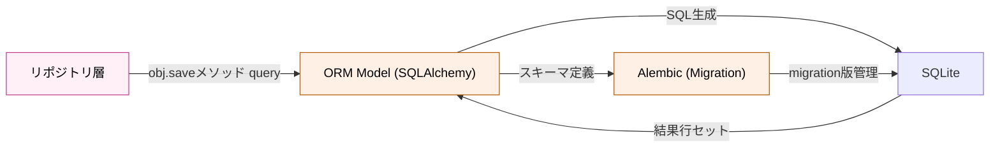

# データストレージ層（ORM/DB 層）

## 役割

SQLAlchemy ORM モデル、データベーススキーマ定義、マイグレーション管理を統一する層です。永続化の物理的な実装を担い、テーブル構造・カラム定義・インデックス・外部キーなどのスキーマを管理します。リポジトリ層を通じた論理的な操作と、SQL レベルでの効率化を分離し、DB の変更が上位層に波及しない設計を実現します。

## 依存方向

**上位（リポジトリ層）からの呼び出し**: ORM モデル経由でのデータベースアクセス
**下位（SQLite データベース）の管理**: テーブル・スキーマ・インデックス・マイグレーション

## 外部への依存

- SQLAlchemy ORM（モデル定義・操作）
- Alembic（スキーママイグレーション）
- SQLite（永続化ストレージ）
- aiosqlite（非同期ドライバ）

## 設計原則

- **宣言的スキーマ定義**: SQLAlchemy の declarative_base を使い、メタデータと実装を一元管理
- **マイグレーション による段階的進化**: Alembic で変更を追跡し、本番環境での安全な更新を実現
- **インデックス戦略の集中管理**: 性能要件に応じたインデックス定義はこの層で一元化
- **パフォーマンス最適化の領域**: 複雑な SQL・クエリ最適化はリポジトリ層から提案を受け、この層で実装

## 他のレイヤーとの関係

**ORM/DB層は、永続化の「真実の源」**として機能し、スキーマ進化を一元管理します：

- **ORM/DB層 ← リポジトリ層**: リポジトリが ORM モデルを操作（CUD操作）；DB スキーマ詳細はリポジトリから隠蔽
- **ORM/DB層 ← → Services層**: 一切直接呼ばれない；すべての DB アクセスはリポジトリ経由
- **ORM/DB層 → SQLite**: ORM が Python の操作を SQL に変換 → aiosqlite ドライバが非同期で実行
- **ORM/DB層 ← → Alembic**: スキーマ変更時は Alembic でマイグレーション生成；手動 SQL は避ける。本番環境に段階的適用
- **ORM/DB層の独立性**: API・サービス層の機能拡張とは独立してスキーマ進化；カラム追加・テーブル新規作成は安全に実施可能

