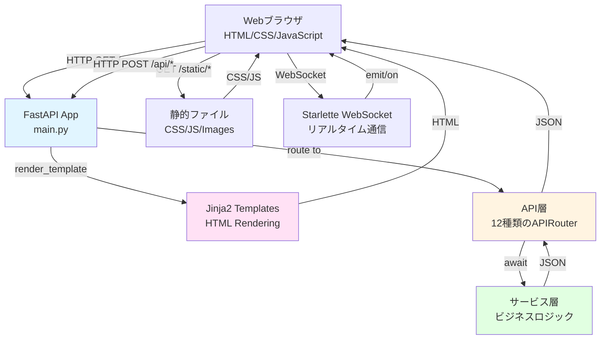
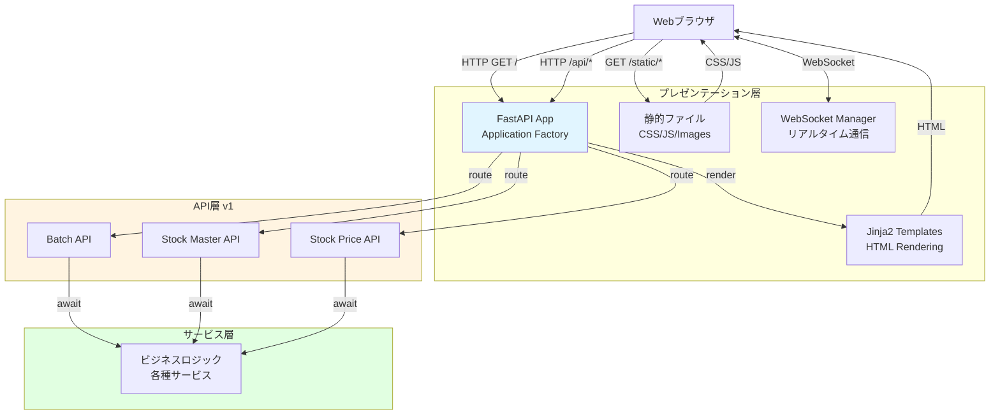
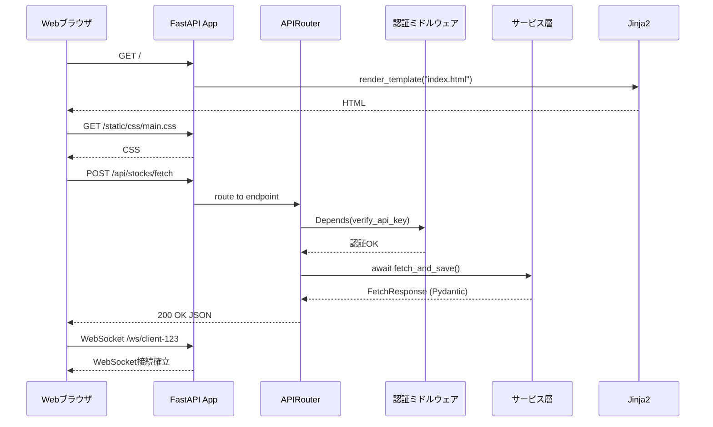

category: architecture
ai_context: high
last_updated: 2025-11-16
related_docs:
  - ../architecture_overview.md
  - ./common_modules.md
  - ./api_layer.md
  - ./service_layer.md
  - ../frontend/frontend_spec.md

# プレゼンテーション層 仕様書

## 目次
- [プレゼンテーション層 仕様書](#プレゼンテーション層-仕様書)
  - [目次](#目次)
  - [1. 概要](#1-概要)
    - [役割](#役割)
    - [責務](#責務)
    - [設計原則](#設計原則)
  - [2. 構成](#2-構成)
    - [ディレクトリ構造](#ディレクトリ構造)
    - [レイヤー間の通信](#レイヤー間の通信)
  - [3. FastAPI アプリケーション構成](#3-fastapi-アプリケーション構成)
    - [3.1 アプリケーション生成（app/main.py）](#31-アプリケーション生成appmainpy)
    - [3.2 設定クラス（app/utils/config.py）](#32-設定クラスapputilsconfigpy)
    - [3.3 例外ハンドラ登録（app/main.py）](#33-例外ハンドラ登録appmainpy)
    - [3.4 将来の拡張機能（計画）](#34-将来の拡張機能計画)
  - [4. テンプレートエンジン（将来実装予定）](#4-テンプレートエンジン将来実装予定)
    - [4.1 実装計画](#41-実装計画)
  - [5. 静的ファイル管理（将来実装予定）](#5-静的ファイル管理将来実装予定)
    - [5.1 実装計画](#51-実装計画)
  - [6. WebSocket通信（将来実装予定）](#6-websocket通信将来実装予定)
    - [6.1 実装計画](#61-実装計画)
  - [7. APIドキュメント自動生成](#7-apiドキュメント自動生成)
    - [7.1 Swagger UI](#71-swagger-ui)
    - [7.2 ReDoc](#72-redoc)
    - [7.3 OpenAPI仕様書](#73-openapi仕様書)
  - [8. アーキテクチャ図](#8-アーキテクチャ図)
    - [8.1 プレゼンテーション層全体構成](#81-プレゼンテーション層全体構成)
    - [8.2 リクエスト処理フロー](#82-リクエスト処理フロー)
  - [9. セキュリティ](#9-セキュリティ)
    - [9.1 CORS設定（将来実装予定）](#91-cors設定将来実装予定)
    - [9.2 セキュリティヘッダー（将来実装予定）](#92-セキュリティヘッダー将来実装予定)
    - [9.3 レート制限（将来実装予定）](#93-レート制限将来実装予定)
  - [10. パフォーマンス最適化](#10-パフォーマンス最適化)
    - [10.1 非同期処理](#101-非同期処理)
    - [10.2 将来の最適化計画](#102-将来の最適化計画)
  - [関連ドキュメント](#関連ドキュメント)


---

## 1. 概要

### 役割

プレゼンテーション層は、**FastAPIを使用してHTTPリクエスト/レスポンスの処理、HTMLレンダリング、WebSocket通信を担当**します。ユーザーとシステム間のインターフェースを提供し、API層とフロントエンドを統合します。

### 責務

| 責務                    | 説明                                                           |
| ----------------------- | -------------------------------------------------------------- |
| **非同期HTTPサーバー**  | FastAPI/Uvicornによる高速な非同期リクエスト処理                |
| **HTMLレンダリング**    | Jinja2テンプレートエンジンによるサーバーサイドレンダリング     |
| **WebSocket通信**       | Starlette WebSocketによるリアルタイム双方向通信                |
| **静的ファイル配信**    | CSS/JavaScript/画像ファイルの効率的な配信                      |
| **APIルーティング管理** | APIRouterによるエンドポイントの統合管理                        |
| **OpenAPI自動生成**     | Pydanticスキーマからの自動ドキュメント生成（Swagger UI/ReDoc） |
| **セキュリティ管理**    | CORS設定、認証・認可の統合                                     |
| **エラーハンドリング**  | 統一されたエラーレスポンスとログ記録                           |

### 設計原則

| 原則                     | 説明                                                 | 実装例                                     |
| ------------------------ | ---------------------------------------------------- | ------------------------------------------ |
| **Application Factory**  | 環境ごとに異なる設定でアプリを生成                   | `create_app(config_name)`パターン          |
| **責任の分離**           | ルーティング、ビジネスロジック、データ層を明確に分離 | API層を通じたサービス層呼び出し            |
| **型安全性**             | Pydantic統合による実行時型検証                       | 全エンドポイントでPydanticモデル使用       |
| **非同期ファースト**     | 全HTTPハンドラで async/await 使用                    | FastAPI の非同期機能をフル活用             |
| **テスタビリティ**       | 依存性注入による疎結合設計                           | `Depends()`パターンで認証・DB接続を注入    |
| **ドキュメント駆動開発** | OpenAPI自動生成でフロント/バック並行開発             | Pydanticスキーマ定義 → Swagger UI 自動生成 |

---

## 2. 構成

### ディレクトリ構造

```
app/
├── main.py                    # FastAPI Application Factory（エントリーポイント）
├── config.py                  # 環境別設定クラス
├── extensions.py              # 拡張機能初期化（WebSocket等）
│
├── api/                       # API層
│   ├── __init__.py            # v1ルーターの統合
│   ├── dependencies/          # 依存性注入モジュール
│   └── v1/                    # バージョン1のAPIエンドポイント
│       ├── __init__.py        # v1サブルーターの統合
│       ├── batch.py           # バッチ処理API
│       ├── stock_master.py    # 銘柄マスタAPI
│       └── stock_price.py     # 株価データAPI
│
├── templates/                 # Jinja2テンプレート（将来実装予定）
│   └── .gitkeep
│
└── static/                    # 静的ファイル（将来実装予定）
    ├── css/
    │   └── .gitkeep
    ├── js/
    │   └── .gitkeep
    └── images/
```

### レイヤー間の通信



---

## 3. FastAPI アプリケーション構成

### 3.1 アプリケーション生成（app/main.py）

**現在の実装状況**:

現在は直接 `FastAPI` インスタンスを生成する方式を採用しています。将来的には Application Factory パターンへの移行を検討します。

**主要機能**:

- FastAPIインスタンス直接生成（title, lifespan設定）
- ライフスパンハンドラによるDB接続管理
- 例外ハンドラ登録（`AppException`, `HTTPException`, `RequestValidationError`, 汎用例外）
- APIRouter登録（`/api` プレフィックス）
- ヘルスチェックエンドポイント（`/health`）

**実装例**:

```python
from fastapi import FastAPI
from contextlib import asynccontextmanager

@asynccontextmanager
async def lifespan(_app: FastAPI):
    # 起動処理: DBプールのウォームアップ
    yield
    # 終了処理: DBリソースのクリーンアップ

app = FastAPI(title="Stock Investment Analyzer API", lifespan=lifespan)
```

### 3.2 設定クラス（app/utils/config.py）

**実装状況**:

現在は `pydantic-settings` を使用した単一の `Settings` クラスで環境変数から設定を読み込んでいます。

**主要設定項目**:

- `APP_NAME`: アプリケーション名
- `APP_VERSION`: アプリケーションバージョン
- `DEBUG`: デバッグフラグ
- `ENV`: 環境識別子（development/production/test）
- `batch`: バッチ処理関連のネスト設定（`BatchProcessingSettings`）

**BatchProcessingSettings**:

- `batch_size`: バッチサイズ（デフォルト: 100）
- `max_concurrent`: 同時実行タスク数（デフォルト: 20）
- `retry_attempts`: リトライ試行回数（デフォルト: 3）
- `retry_delay`: リトライ間の遅延秒数（デフォルト: 1.0）
- `request_timeout`: HTTPリクエストタイムアウト秒数（デフォルト: 30）
- `operation_timeout`: 全体操作タイムアウト秒数（デフォルト: 3600）
- `rate_limit_calls`: API呼び出し上限（デフォルト: 2000）
- `rate_limit_period`: レート制限時間窓秒数（デフォルト: 3600）

**設定の取得**:

```python
from app.utils.config import get_settings

settings = get_settings()  # シングルトンパターン
```

### 3.3 例外ハンドラ登録（app/main.py）

**実装状況**:

現在、以下の例外ハンドラが登録されています:

| 例外タイプ               | ハンドラ                       | 用途                               |
| ------------------------ | ------------------------------ | ---------------------------------- |
| `AppException`           | `app_exception_handler`        | アプリケーション固有の例外処理     |
| `HTTPException`          | `http_exception_handler`       | FastAPI標準のHTTP例外処理          |
| `RequestValidationError` | `validation_exception_handler` | リクエストバリデーションエラー処理 |
| `Exception`              | `general_exception_handler`    | 予期しない例外の汎用処理           |

**実装例**:

```python
from app.exceptions import (
    AppException,
    app_exception_handler,
    general_exception_handler,
    http_exception_handler,
    validation_exception_handler,
)

app.add_exception_handler(AppException, app_exception_handler)
app.add_exception_handler(HTTPException, http_exception_handler)
app.add_exception_handler(RequestValidationError, validation_exception_handler)
app.add_exception_handler(Exception, general_exception_handler)
```

### 3.4 将来の拡張機能（計画）

以下の機能は将来的な実装を計画しています:

- **WebSocket接続管理**: リアルタイム通信用のWebSocketManager
- **セキュリティヘッダーミドルウェア**: セキュリティヘッダー自動設定
- **キャッシュ制御ミドルウェア**: キャッシュ制御ヘッダー自動設定
- **レート制限**: API呼び出しのレート制限機能

---

## 4. テンプレートエンジン（将来実装予定）

### 4.1 実装計画

現在、HTMLフロントエンドは未実装です。将来的に以下の実装を計画しています:

**予定されているテンプレート構成**:

- Jinja2テンプレートエンジンの導入
- 基本レイアウトテンプレート（`base.html`）
- ページ固有テンプレート（ダッシュボード、認証ページ等）
- 再利用可能な部品テンプレート（ナビゲーション、フッター等）

**予定されているページエンドポイント**:

| エンドポイント    | 説明                 | 優先度 |
| ----------------- | -------------------- | ------ |
| `GET /`           | メインダッシュボード | 高     |
| `GET /auth/login` | ログインページ       | 高     |
| `GET /portfolio`  | ポートフォリオ表示   | 中     |
| `GET /screening`  | スクリーニング       | 中     |

---

## 5. 静的ファイル管理（将来実装予定）

### 5.1 実装計画

現在、静的ファイル（CSS/JavaScript）は未実装です。将来的に以下の実装を計画しています:

**予定されているCSS構成**:

- BEM命名規則によるCSS設計
- CSS変数によるテーマ管理（ライト/ダーク切替）
- レスポンシブデザイン対応
- モジュール化されたコンポーネントスタイル

**予定されているJavaScript構成**:

| モジュール（予定）    | 責務                                   |
| --------------------- | -------------------------------------- |
| `app.js`              | メインエントリーポイント、初期化処理   |
| `api-client.js`       | Fetch API ラッパー、エラーハンドリング |
| `websocket-client.js` | WebSocket通信の抽象化                  |
| `chart-manager.js`    | チャート描画管理（Lightweight Charts） |
| `utils.js`            | ユーティリティ関数                     |

---

## 6. WebSocket通信（将来実装予定）

### 6.1 実装計画

現在、WebSocket機能は未実装です。将来的に以下の実装を計画しています:

**予定されている機能**:

- リアルタイム株価更新配信
- バッチ処理進捗通知
- システムアラート・通知配信
- クライアント接続管理（WebSocketManager）

**予定されているメッセージタイプ**:

| タイプ（予定） | 用途                 |
| -------------- | -------------------- |
| `progress`     | バッチ処理進捗通知   |
| `complete`     | バッチ処理完了通知   |
| `error`        | エラー通知           |
| `realtime`     | リアルタイム株価更新 |

**予定されているエンドポイント**:

```
GET /ws/{client_id}
```

**実装優先度**: 中（v0.3.0以降で検討）

---

## 7. APIドキュメント自動生成

### 7.1 Swagger UI

**アクセスURL**: `http://localhost:8000/docs`

**特徴**:

- Pydanticスキーマから自動生成
- インタラクティブなAPI試行
- 認証ヘッダーの設定が可能
- cURLコマンド自動生成

### 7.2 ReDoc

**アクセスURL**: `http://localhost:8000/redoc`

**特徴**:

- 読みやすいドキュメント形式
- サイドバーナビゲーション
- サンプルコード表示

### 7.3 OpenAPI仕様書

**アクセスURL**: `http://localhost:8000/openapi.json`

**用途**:

- クライアントSDK自動生成
- API仕様の共有
- バージョン管理

---

## 8. アーキテクチャ図

### 8.1 プレゼンテーション層全体構成



### 8.2 リクエスト処理フロー



---

## 9. セキュリティ

プレゼンテーション層では、共通モジュールのセキュリティ機能を活用してアプリケーションを保護します。

### 9.1 CORS設定（将来実装予定）

現在、CORSミドルウェアは未設定です。将来的にフロントエンドを実装する際に追加します。

**実装計画**:

```python
from fastapi.middleware.cors import CORSMiddleware

app.add_middleware(
    CORSMiddleware,
    allow_origins=["http://localhost:3000"],  # 開発環境
    allow_credentials=True,
    allow_methods=["*"],
    allow_headers=["*"],
)
```

### 9.2 セキュリティヘッダー（将来実装予定）

現在、セキュリティヘッダーの自動設定は未実装です。将来的に以下のヘッダーを追加する計画です:

| ヘッダー（予定）            | 値                                    | 効果                     |
| --------------------------- | ------------------------------------- | ------------------------ |
| `X-Content-Type-Options`    | `nosniff`                             | MIME スニッフィング防止  |
| `X-Frame-Options`           | `DENY`                                | クリックジャッキング防止 |
| `X-XSS-Protection`          | `1; mode=block`                       | XSS 攻撃検出・ブロック   |
| `Strict-Transport-Security` | `max-age=31536000; includeSubDomains` | HTTPS 強制（本番環境）   |

### 9.3 レート制限（将来実装予定）

現在、レート制限機能は未実装です。将来的にAPIエンドポイントごとにレート制限を追加する計画です。

---

## 10. パフォーマンス最適化

### 10.1 非同期処理

**現在の実装状況**:

FastAPIの非同期機能を活用しています:

- 全APIエンドポイントで `async/await` を使用
- データベースアクセスの非同期実行
- 並行処理による高速なバッチ処理（`asyncio.gather`）

### 10.2 将来の最適化計画

以下の最適化を将来的に実装する計画です:

**静的ファイルキャッシュ**:
- Cache-Controlヘッダーの自動設定
- 静的ファイルの長期キャッシュ（1年間）

**レスポンス圧縮**:
- GZipミドルウェアの追加
- JSONレスポンスの自動圧縮

**CDN活用**（本番環境）:
- 静的ファイルのCDN配信
- 外部ライブラリのCDN利用

---

## 関連ドキュメント

- [アーキテクチャ概要](../architecture_overview.md)
- [共通モジュール仕様書](./common_modules.md) ⭐ **重要**: WebSocket、セキュリティ、キャッシュ制御の詳細
- [API層仕様書](./api_layer.md)
- [サービス層仕様書](./service_layer.md)
- [フロントエンド機能仕様](../../frontend/frontend_spec.md)

---

**最終更新**: 2025-11-16
**設計方針**: Application Factory Pattern + FastAPI + Jinja2 + WebSocket
