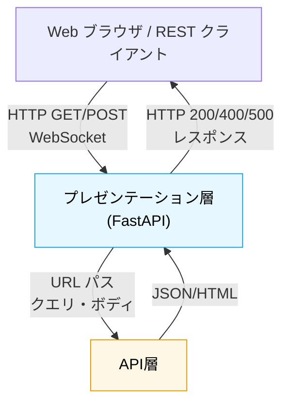

# プレゼンテーション層

## 役割

ユーザーやクライアントとシステムの間のインタフェースを提供する層です。HTTP リクエスト・レスポンス、テンプレート描画、WebSocket 通信といった UI 側のプロトコルを処理します。ビジネスロジックやデータベース操作は一切持たず、ルーティング・レスポンス形成・静的ファイル配信に責務を限定します。

## 依存方向

**上位（クライアント）からの流入**: Web ブラウザや REST クライアントからの HTTP リクエストを受け取ります。
**下位（API 層）への委譲**: 受け取ったリクエストを API ルータに渡し、返された結果をクライアントに返します。

## 外部への依存

- FastAPI（フレームワーク）
- Jinja2（テンプレート描画）
- 静的ファイルサーバー（CSS、JavaScript、画像）
- WebSocket ライブラリ（将来）

## 設計原則

- **ルーティングに徹する**: パス→API エンドポイントの対応付けのみに集中し、ビジネス判断は含まない
- **レスポンス整形に限定**: ステータスコード・ヘッダー・ボディ構造の管理のみを担当
- **テンプレート/静的ファイルは分離**: UI 資源管理は層の責務の一部だが、ビジネスロジックとは関係ない領域

## 他のレイヤーとの関係

**プレゼンテーション層は、HTTP/WebSocket のエントリポイント**として機能し、すべてのリクエストを API 層へ転送します：

- **クライアント ← → プレゼンテーション層**: Web ブラウザや REST クライアントからの HTTP リクエスト/レスポンス、WebSocket メッセージ
- **プレゼンテーション層 → API層**: 受け取ったパス・クエリ・ボディを API ルータへ転送
- **プレゼンテーション層 ← API層**: 返されたレスポンス（JSON/HTML）をそのままクライアントに返却
- **プレゼンテーション層 ↔ 例外ハンドリング**: API層で発生した例外を HTTP ステータスコード（404, 500等）に変換

