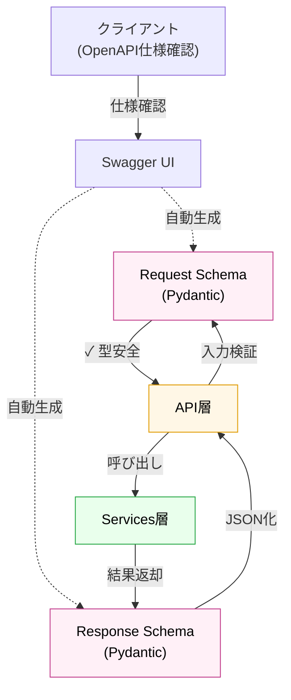

# スキーマ/DTO層

## 役割

API の入出力契約を定義する層です。Pydantic スキーマを使ってリクエスト・レスポンスの形状・型・バリデーションルールを管理します。データベース実装やビジネスロジックに依存せず、API 境界でのデータ表現に専念します。OpenAPI ドキュメント自動生成の基礎となり、フロントエンド・外部クライアント間での契約を明確化します。

## 依存方向

**上位（API層）からの利用**: リクエスト/レスポンスの型ヒント・バリデーション
**下位（サービス層）への変換**: 受け取ったスキーマ→サービスが扱える内部形式への変換を、API層が仲介

## 外部への依存

- Pydantic（スキーマ定義・バリデーション）
- Python の型ベースの検証

## 設計原則

- **DB非依存**: ORM モデルや SQLAlchemy 構造は一切参照しない。API レベルの関心事のみ
- **独立性**: このレイヤーの変更が API クライアントに影響しないよう、ビジネスアルゴリズムに依存しない
- **バリデーション完全性**: リクエストバリデーション・型チェック・範囲制約をここで集中管理し、下位層は入力の正当性を仮定可能にする

## 他のレイヤーとの関係

**スキーマ層は、API の「型契約」として機能**し、中心的な役割を果たします：

- **API層 ← スキーマ層**: Pydantic スキーマはトランジット・ボディ・パスパラメータを型安全に検証；OpenAPI 仕様を自動生成
- **スキーマ層 ← → サービス層**: API層が検証済みスキーマをサービスへ渡す；サービスが返した結果をスキーマでシリアライズ
- **スキーマ層 ← ORM/Models**: `models` の ORM フィールドには一切依存しない：スキーマはAPI契約、models はDB層の関心事
- **スキーマ層 → OpenAPI ドキュメント**: Pydantic 型情報から Swagger UI が自動生成；ドキュメント＝コード

