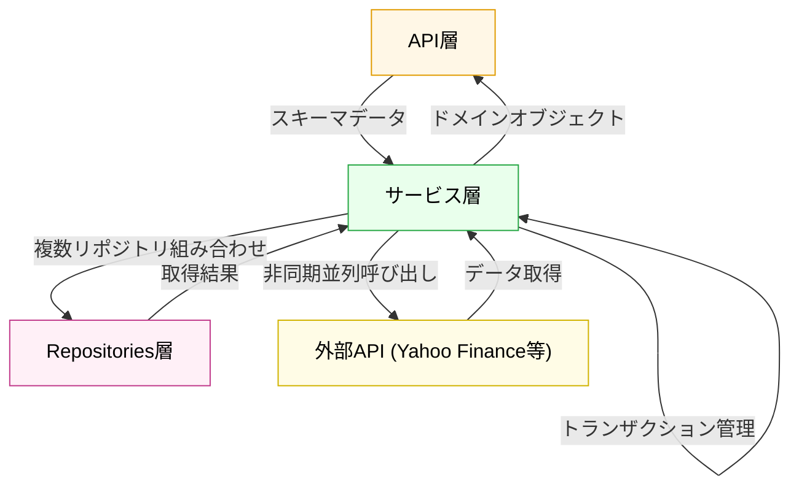

# サービス層

## 役割

ドメインのビジネスロジックを実装し、複数のリポジトリ・外部 API を調整するオーケストレーション層です。スキーマで受け取った入力を内部表現に変換し、複数のリポジトリ操作を組み合わせ、結果をスキーマにマッピング可能な形式で返します。トランザクション管理、キャッシング戦略、バッチ処理フローもこの層の責務です。

## 依存方向

**上位（API 層）からの呼び出し**: スキーマに基づくデータ+引数
**下位（データアクセス層）への呼び出し**: リポジトリメソッド経由で永続化操作
**外部 API**: Yahoo Finance、EDINET、外部データソース

## 外部への依存

- リポジトリ層（データアクセスの抽象化）
- 外部 API（Yahoo Finance、EDINET）
- ユーティリティ・ヘルパー関数
- ログ・例外クラス

## 設計原則

- **ビジネスロジックの集約**: API レイヤーとデータアクセスレイヤーの調整役として、複雑なドメイン判断はここに集中
- **リポジトリ抽象化の活用**: 直接 DB にアクセスせず、常にリポジトリ経由で操作
- **非同期・並列処理**: 外部 API や大量データ処理は async/await で効率化
- **トランザクション管理**: 複数リポジトリ操作の一貫性をこの層で保証

## 他のレイヤーとの関係

**サービス層は、ビジネスロジックのすべてを集約**し、上下層のオーケストレーション役として機能します：

- **サービス層 ← API層**: 検証済み Pydantic スキーマをメソッド引数として受け取る
- **サービス層 → Repositories層**: 複数リポジトリの CRUD を組み合わせてビジネスプロセスを実現；**直接 SQL を書かない**
- **サービス層 ← Repositories層**: 取得した結果（ORM オブジェクト or スカラー値）を受け取る
- **サービス層 → 外部API**: Yahoo Finance、EDINET 等への API 呼び出しはここで集中管理；エラーハンドリング・リトライ戦略も担当
- **サービス層 ← → ドメイン判定・変換**: スキーマ → ドメインオブジェクト → ORM モデルへの変換処理
- **サービス層 → API層**: ドメインオブジェクト/リストを返す（API層がスキーマ整形を担当）

