# ER Diagram - Stock Investment Analyzer

## Overview
This ER diagram represents the database schema for the Stock Investment Analyzer application, showing all entities and their relationships.

## Mermaid ER Diagram

```mermaid
erDiagram
    ACCOUNT ||--o{ ACCOUNT_TRANSACTIONS : has
    ACCOUNT ||--o{ ACCOUNT_PORTFOLIOS : has
    STOCK_MASTER ||--o{ ACCOUNT_PORTFOLIOS : links
    STOCK_MASTER ||--o{ STOCKS_1D : contains
    STOCK_MASTER ||--o{ STOCK_SPLIT : references
    STOCK_MASTER ||--o{ DIVIDEND_YIELD_MONITORING : monitors
    STOCK_MASTER ||--o{ SCREENING_RESULTS : evaluates
    STOCK_MASTER ||--o{ STOCK_CODE_MAPPING : has
    STOCK_CODE_MAPPING ||--o{ EDINET_PROFIT_AND_LOSS : connects
    STOCK_CODE_MAPPING ||--o{ EDINET_STOCK_DIVIDEND : connects
    STOCK_CODE_MAPPING ||--o{ EDINET_CASH_FLOW_STATEMENT : connects

    ACCOUNT {
        int id PK "プライマリキー"
        string email UK "メールアドレス（ユニーク）"
        string hashed_password "ハッシュ化されたパスワード"
        string full_name "表示名"
        boolean is_active "アカウント有効フラグ"
        boolean is_superuser "管理者フラグ"
        datetime last_login "最終ログイン時刻"
        string provider "外部認証プロバイダ名"
        string external_id "外部プロバイダの識別子"
        datetime created_at "作成日時"
        datetime updated_at "更新日時"
    }

    ACCOUNT_TRANSACTIONS {
        int id PK "プライマリキー"
        int account_id FK "アカウントID"
        string transaction_type "取引種類（買付/売却/入出金）"
        string symbol "銘柄コード"
        int quantity "数量"
        decimal amount "金額"
        string currency "通貨コード"
        datetime executed_at "約定日時"
        datetime settled_at "決済日時"
        string status "取引ステータス"
        string external_id "外部取引ID"
        string note "メモ"
        datetime created_at "作成日時"
        datetime updated_at "更新日時"
    }

    ACCOUNT_PORTFOLIOS {
        int id PK "プライマリキー"
        int account_id FK "アカウントID"
        string portfolio_name "ポートフォリオ名"
        string symbol "銘柄コード"
        int quantity "保有株数"
        decimal avg_price "取得平均単価"
        decimal market_value "時価評価額"
        string currency "通貨コード"
        datetime valuation_date "時価計算日"
        decimal allocation "ポートフォリオ内比率"
        string note "メモ"
        datetime created_at "作成日時"
        datetime updated_at "更新日時"
    }

    STOCK_MASTER {
        int id PK "プライマリキー"
        string stock_code UK "株式コード（ユニーク）"
        string stock_name "企業名"
        string market_category "市場区分"
        string sector_code_33 "業種コード（33分類）"
        string sector_name_33 "業種名（33分類）"
        string sector_code_17 "業種コード（17分類）"
        string sector_name_17 "業種名（17分類）"
        string scale_code "規模コード"
        string scale_category "規模区分"
        string data_date "データ日付"
        int is_active "有効フラグ"
        datetime created_at "作成日時"
        datetime updated_at "更新日時"
    }

    STOCK_MASTER_UPDATES {
        int id PK "プライマリキー"
        string update_type "更新タイプ（fetch等）"
        int total_stocks "総銘柄数"
        int added_stocks "新規追加数"
        int updated_stocks "更新数"
        int removed_stocks "削除数"
        string status "ステータス（running/success/failed）"
        string error_message "エラーメッセージ"
        datetime started_at "開始時刻"
        datetime completed_at "完了時刻"
    }

    STOCK_CODE_MAPPING {
        int id PK "プライマリキー"
        string stock_code FK "JPX株式コード"
        string sec_code UK "EDINET提出企業コード"
        datetime created_at "作成日時"
        datetime updated_at "更新日時"
    }

    STOCKS_1D {
        int id PK "プライマリキー"
        string symbol FK "銘柄コード"
        datetime timestamp "タイムスタンプ（JST）"
        decimal open "始値"
        decimal high "高値"
        decimal low "安値"
        decimal close "終値"
        decimal adj_close "調整終値"
        bigint volume "出来高"
        datetime created_at "作成日時"
        datetime updated_at "更新日時"
    }

    EDINET_PROFIT_AND_LOSS {
        int id PK "プライマリキー"
        string doc_id "書類ID"
        string sec_code "証券コード（EDINET提出企業コード）"
        date submission_date "提出日"
        date period_end_date "報告期末日"
        int fiscal_year "会計年度"
        string report_type "報告書タイプ"
        decimal net_sales "売上高"
        decimal operating_income "営業利益"
        decimal eps "1株当たり利益"
        string candidate_contexts "候補コンテキスト"
        string candidate_keys "候補キー"
        boolean is_consolidated "連結フラグ"
        datetime created_at "作成日時"
        datetime updated_at "更新日時"
    }

    EDINET_STOCK_DIVIDEND {
        int id PK "プライマリキー"
        string doc_id "書類ID"
        string sec_code "証券コード（EDINET提出企業コード）"
        date submission_date "提出日"
        date period_end_date "報告期末日"
        int fiscal_year "会計年度"
        string report_type "報告書タイプ"
        decimal dividend_actual "年間配当金（実績）"
        decimal dividend_adj "年間配当金（調整後）"
        string candidate_contexts "候補コンテキスト"
        string candidate_keys "候補キー"
        boolean is_consolidated "連結フラグ"
        datetime created_at "作成日時"
        datetime updated_at "更新日時"
    }

    EDINET_CASH_FLOW_STATEMENT {
        int id PK "プライマリキー"
        string doc_id "書類ID"
        string sec_code "証券コード（EDINET提出企業コード）"
        date submission_date "提出日"
        date period_end_date "報告期末日"
        int fiscal_year "会計年度"
        string report_type "報告書タイプ"
        decimal operating_cf "営業キャッシュフロー"
        string candidate_contexts "候補コンテキスト"
        string candidate_keys "候補キー"
        boolean is_consolidated "連結フラグ"
        datetime created_at "作成日時"
        datetime updated_at "更新日時"
    }

    STOCK_SPLIT {
        int id PK "プライマリキー"
        string code "銘柄コード"
        date effective_date "発効日"
        int ratio_from "分割前比率"
        int ratio_to "分割後比率"
        datetime created_at "作成日時"
        datetime updated_at "更新日時"
    }

    DIVIDEND_YIELD_MONITORING {
        int id PK "プライマリキー"
        string symbol FK "銘柄コード（stock_code）"
        date monitoring_date "監視日"
        decimal latest_dividend_amount "最新配当金"
        decimal latest_stock_price "最新株価"
        decimal dividend_yield "配当利回り"
        string purchase_level "購入レベル"
        string screening_status "スクリーニング判定"
        int screening_total_score "スクリーニング総合スコア"
        date stock_price_source_date "株価参照日"
        date dividend_source_date "配当参照日"
        datetime created_at "作成日時"
        datetime updated_at "更新日時"
    }

    SCREENING_RESULTS {
        int id PK "プライマリキー"
        string symbol FK "銘柄コード（stock_code）"
        date evaluation_date "評価日"
        date fiscal_year_end "会計年度末"
        boolean pass_required_conditions "必須条件判定"
        int total_score "総合スコア"
        int score_dividend "配当スコア"
        int score_eps "EPS スコア"
        int score_stability "安定性スコア"
        int score_profitability "収益性スコア"
        string status "スクリーニング判定"
        json failed_conditions "不合格条件"
        json screening_details "詳細情報"
        datetime created_at "作成日時"
        datetime updated_at "更新日時"
    }
```

## Entity Descriptions

### Account Management
- **Account**: ユーザーアカウント情報。複数のトランザクションとポートフォリオを保有。
- **AccountTransactions**: 各アカウントの買付・売却・入出金などの取引履歴。
- **AccountPortfolios**: 各アカウントが保有する銘柄ごとのポートフォリオ情報。

### Market Data - Stock Master & Prices & Mapping
- **StockMaster**: 銘柄マスタ（銘柄コード、名称、セクター情報など）。JPX株式コード（stock_code）で管理。
- **StockMasterUpdates**: 銘柄マスタ更新の履歴と統計情報。
- **StockCodeMapping**: JPX株式コード（stock_code）とEDINET提出企業コード（sec_code）の対応関係を管理するマッピングテーブル。1つのJPX企業が複数のEDINET企業コードを持つ可能性に対応。
- **Stocks_1d（他の時間軸1m/5m/15m/30m/1h/1wkも同様）**: 複数の時間軸における株価データ。OHLCV データを格納。ER図では日足（1d）を代表として表示。

### EDINET Financial Data（独立したエンティティ）
- **EdinetBalanceSheet**: EDINET から取得した貸借対照表データ。`sec_code`（EDINET提出企業コード）で企業を識別。StockCodeMapping を通じてStockMasterと対応。
- **EdinetProfitAndLoss**: EDINET から取得した損益計算書データ。`sec_code` で企業を識別。StockCodeMapping を通じてStockMasterと対応。
- **EdinetStockDividend**: EDINET から取得した年間配当情報。`sec_code` で企業を識別。StockCodeMapping を通じてStockMasterと対応。
- **EdinetCashFlowStatement**: EDINET から取得したキャッシュフロー計算書データ。`sec_code` で企業を識別。StockCodeMapping を通じてStockMasterと対応。

### Analysis & Monitoring
- **StockSplit**: 株式分割イベントの履歴。
- **DividendYieldMonitoring**: 配当利回り監視結果。`symbol`（stock_code）を使用してStockMasterと紐付け。
- **ScreeningResults**: 高配当スクリーニング結果とスコア情報。`symbol`（stock_code）を使用してStockMasterと紐付け。

## Key Relationships

| From             | To                                                               | Type | Description                                             |
| ---------------- | ---------------------------------------------------------------- | ---- | ------------------------------------------------------- |
| Account          | AccountTransactions                                              | 1:N  | アカウントは複数の取引履歴を持つ                        |
| Account          | AccountPortfolios                                                | 1:N  | アカウントは複数のポートフォリオを保有                  |
| StockMaster      | AccountPortfolios                                                | 1:N  | 銘柄は複数のポートフォリオで参照される                  |
| StockMaster      | Stocks_1d（他の時間軸も同様）                                    | 1:N  | 銘柄は複数の日足株価データを持つ                        |
| StockMaster      | StockSplit                                                       | 1:N  | 銘柄は複数の分割イベントを持つ                          |
| StockMaster      | DividendYieldMonitoring                                          | 1:N  | 銘柄は複数の監視レコードを持つ                          |
| StockMaster      | ScreeningResults                                                 | 1:N  | 銘柄は複数のスクリーニング結果を持つ                    |
| StockMaster      | StockCodeMapping                                                 | 1:N  | 銘柄はEDINET対応企業コード（1つ以上）を持つ可能性がある |
| StockCodeMapping | EdinetBalanceSheet/ProfitAndLoss/StockDividend/CashFlowStatement | 1:N  | マッピングテーブルを通じてEDINET財務データと連結        |

## Naming Conventions

- **PK**: Primary Key（主キー）
- **FK**: Foreign Key（外部キー）
- **UK**: Unique Key（ユニークキー）
- テーブル名: snake_case
- カラム名: snake_case
- タイムスタンプ: `created_at`, `updated_at`（UTC, timezone aware）
