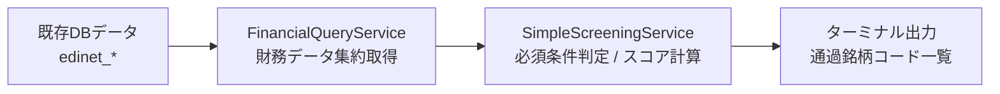

# 高配当株スクリーニングシステム 設計書

## 1. システム概要

### 1.1 目的

高配当株投資ルールに基づいて、銘柄のスクリーニングスコアリングを行い、監視リスト候補を特定する。

### 1.2 処理フロー



1. **財務データ集約** (`financial_query_service.py`): 既存EDINETリポジトリから配当・EPS・CF・売上データを取得し整形する。
2. **スクリーニング実行** (`simple_screening_service.py`): 必須条件チェックと4軸スコア計算を行い、**結果をターミナルに出力する（DB保存なし）**。

---

## 2. ファイル構成

### 2.1 サービス層ディレクトリ構成

**今回追加するファイルは2ファイルのみ。** その他の既存コードは変更しない。

```
app/services/
    integration/           # 外部APIDB保存（既存）
        stock_master/
        stock_price/
        edinet/
    query/                 # DB取得整形（新規ファイル追加）
        financial_query_service.py     新規作成
    screening/             # ルール判定スコア計算（新規ファイル追加）
        simple_screening_service.py    新規作成
```

### 2.2 既存コードの活用（新規作成不要）

| カテゴリ         | 既存ファイル / クラス               |
| ---------------- | ----------------------------------- |
| 損益計算書データ | `EdinetProfitAndLossRepository`     |
| CF計算書データ   | `EdinetCashFlowStatementRepository` |
| 配当データ       | `EdinetStockDividendRepository`     |

> `ScreeningResult` はPhase 2では `simple_screening_service.py` 内の `dataclass` として定義する。ORMモデル / リポジトリはPhase 3で別途作成する。

### 2.3 後工程（本ドキュメントのスコープ外）

- `WatchList` モデル / リポジトリ / サービス
- APIエンドポイント (`app/api/v1/screening.py`)
- バッチスクリプト (`scripts/batch/batch_screening.py`)
- フロントエンド画面

---

## 3. データモデル設計

### 3.1 既存テーブル（財務データ）- 変更なし

| テーブル名                   | 内容                 |
| ---------------------------- | -------------------- |
| `edinet_profit_and_loss`     | 売上高営業利益EPS    |
| `edinet_cash_flow_statement` | 営業キャッシュフロー |
| `edinet_stock_dividend`      | 年間配当金実績       |

### 3.2 新規テーブル: `screening_results`（今後追加予定）

> **現時点では作成不要。** Phase 3以降でAPIエンドポイント・バッチ処理を追加する際に合わせて作成する。

| カラム名                 | 型          | NULL | 説明                                             |
| ------------------------ | ----------- | ---- | ------------------------------------------------ |
| id                       | INTEGER     | NO   | 主キー                                           |
| symbol                   | VARCHAR(10) | NO   | 銘柄コード                                       |
| evaluation_year          | INTEGER     | NO   | 評価年度（西暦、example: 2026）                  |
| fiscal_year_end          | DATE        | NULL | 評価対象の最新決算期末日                         |
| pass_required_conditions | BOOLEAN     | NO   | 必須条件クリアフラグ                             |
| total_score              | INTEGER     | NULL | 総合スコア（0〜100点）                           |
| score_dividend           | INTEGER     | NULL | 配当実績スコア（0〜30点）                        |
| score_eps                | INTEGER     | NULL | EPS成長スコア（0〜30点）                         |
| score_stability          | INTEGER     | NULL | 事業安定性スコア（0〜20点）                      |
| score_profitability      | INTEGER     | NULL | 収益性維持スコア（0〜20点）                      |
| status                   | VARCHAR(20) | NO   | `not_eligible` / `watch` / `active` / `priority` |
| failed_conditions        | JSON        | NULL | 不合格条件リスト                                 |
| screening_details        | JSON        | NULL | 計算詳細データ                                   |
| created_at               | TIMESTAMP   | NO   | 作成日時                                         |
| updated_at               | TIMESTAMP   | NO   | 更新日時                                         |

**ユニーク制約**: `(symbol, evaluation_year)`

---

## 4. サービス層設計

### 4.1 `FinancialQueryService`（`query/financial_query_service.py`）

**責務**: 既存のEDINETリポジトリを束ねて、スクリーニングに必要な財務系時系列データを銘柄単位で取得整形する。

**依存リポジトリ**:
- `EdinetStockDividendRepository`
- `EdinetProfitAndLossRepository`
- `EdinetCashFlowStatementRepository`

**内部データクラス**:

| クラス名          | フィールド                                                                                        |
| ----------------- | ------------------------------------------------------------------------------------------------- |
| `DividendRecord`  | `fiscal_year_end: date`, `dividend_per_share: float`                                              |
| `EpsRecord`       | `fiscal_year_end: date`, `eps: float`                                                             |
| `CfRecord`        | `fiscal_year_end: date`, `operating_cf: float`                                                    |
| `StabilityRecord` | `fiscal_year_end: date`, `net_sales: float`, `operating_income: float`, `operating_margin: float` |

**公開メソッド**:

| メソッド                   | 引数                  | 戻り値                  | 説明                                      |
| -------------------------- | --------------------- | ----------------------- | ----------------------------------------- |
| `get_dividend_history`     | `sec_code`, `years=5` | `list[DividendRecord]`  | 過去N年の配当履歴（古い順）               |
| `get_eps_history`          | `sec_code`, `years=5` | `list[EpsRecord]`       | 過去N年のEPS履歴（古い順）                |
| `get_operating_cf_history` | `sec_code`, `years=5` | `list[CfRecord]`        | 過去N年の営業CF履歴（古い順）             |
| `get_stability_history`    | `sec_code`, `years=5` | `list[StabilityRecord]` | 過去N年の売上営業利益営業利益率（古い順） |

---

### 4.2 `SimpleScreeningService`（`screening/simple_screening_service.py`）

**責務**: `FinancialQueryService` から財務データを受け取り、必須条件チェック・スコア計算を実行する。**DB保存は行わず、結果をターミナルに出力する。** ルール評価はprivateメソッドとして直接実装する（YAML/外部ファイル不要）。

**依存サービス**:
- `FinancialQueryService`（`ScreeningResultRepository` への依存なし）

**出力イメージ（ターミナル）**:
```
[2026-02-18] スクリーニング結果
通過銘柄: 7203, 6758, 4502
---
7203: スコア85 (priority) - 配当30/EPS25/安定20/収益10
6758: スコア72 (active)   - 配当20/EPS22/安定20/収益10
4502: スコア55 (watch)    - 配当20/EPS15/安定10/収益10
不合格: 9999 (eps_health, operating_cf)
```

**公開メソッド**:

| メソッド   | 引数                                            | 戻り値            | 説明                                             |
| ---------- | ----------------------------------------------- | ----------------- | ------------------------------------------------ |
| `run`      | `sec_codes: list[str]`, `evaluation_date: date` | `None`            | 複数銘柄をスクリーニングしてターミナルに結果出力 |
| `evaluate` | `sec_code: str`, `evaluation_date: date`        | `ScreeningResult` | 単一銘柄を評価してdataclassで結果を返す          |

> **`ScreeningResult`** はPhase 2ではORMモデルではなく、同ファイル内に定義するシンプルな `dataclass` として実装する。

**必須条件チェック（privateメソッド）**:

| メソッド                     | チェック内容                                                                          |
| ---------------------------- | ------------------------------------------------------------------------------------- |
| `_check_dividend_continuity` | 過去5年の配当：減配回数 ≤ 2回 かつ 直近2年で連続減配なし                              |
| `_check_eps_health`          | 過去5年のEPS：赤字（EPS ≤ 0）なし かつ 直近2年連続減少なし かつ 直近1年の減少率 < 30% |
| `_check_operating_cf`        | 過去5年の営業CF：4年以上プラス                                                        |

**スコア計算（privateメソッド）**:

| メソッド               | 配点    | 加点条件（各+10点）                                                       |
| ---------------------- | ------- | ------------------------------------------------------------------------- |
| `_score_dividend`      | 0〜30点 | 増配年 ≥ 3年 / 過去5年で2年以上連続増配の期間あり / Kendall τ > 0.4       |
| `_score_eps`           | 0〜30点 | EPS増加年 ≥ 3年 / 過去5年で2年以上連続EPS増加の期間あり / Kendall τ > 0.4 |
| `_score_stability`     | 0〜20点 | 売上増加年 ≥ 3年 / 営業利益増加年 ≥ 3年                                   |
| `_score_profitability` | 0〜20点 | 前年差マイナスが ≤ 2回 / 2.0pt以上の低下が2年連続なし                     |

**ユーティリティ（staticmethod）**:

| メソッド                                      | 説明                                                           |
| --------------------------------------------- | -------------------------------------------------------------- |
| `_kendall_tau(values)`                        | Kendallの順位相関係数を返す（`scipy.stats.kendalltau` を使用） |
| `_resolve_status(pass_required, total_score)` | スコアからステータス文字列を決定                               |

---

## 5. 計算ロジック詳細

### 5.1 必須条件チェック（3条件すべて通過でOK）

| 条件         | 評価内容                                                                      |
| ------------ | ----------------------------------------------------------------------------- |
| 配当の継続性 | 過去5年で減配 ≤ 2回 かつ 直近2年で連続減配なし                                |
| EPSの健全性  | 過去5年で赤字EPS（≤ 0）なし かつ 直近2年連続減少なし かつ 直近1年減少率 < 30% |
| 営業CF       | 過去5年で4年以上プラス                                                        |

### 5.2 スコア計算（合計100点満点）

| 軸                | 配点 | 加点条件（各+10点）                                                       |
| ----------------- | ---- | ------------------------------------------------------------------------- |
| **A. 配当実績**   | 30点 | 増配年 ≥ 3年 / 過去5年で2年以上連続増配の期間あり / Kendall τ > 0.4       |
| **B. EPS成長**    | 30点 | EPS増加年 ≥ 3年 / 過去5年で2年以上連続EPS増加の期間あり / Kendall τ > 0.4 |
| **C. 事業安定性** | 20点 | 売上増加年 ≥ 3年 / 営業利益増加年 ≥ 3年                                   |
| **D. 収益性維持** | 20点 | 前年差マイナス ≤ 2回 / 2pt連続低下なし                                    |

### 5.3 ステータス判定

| 条件                              | ステータス                   |
| --------------------------------- | ---------------------------- |
| 必須条件NG                        | `not_eligible`（監視対象外） |
| 必須条件OK かつ 総合スコア ≥ 90点 | `priority`（優先購入候補）   |
| 必須条件OK かつ 総合スコア ≥ 80点 | `active`（積極的に検討）     |
| 必須条件OK かつ 総合スコア ≥ 70点 | `watch`（監視対象）          |
| 必須条件OK かつ 総合スコア < 70点 | `not_eligible`（監視対象外） |

### 5.4 Kendallのτ（トレンド評価）

時系列データのトレンドを評価するために `scipy.stats.kendalltau` を使用する。年インデックス（0, 1, 2, ...）を基準軸として値との順位相関係数を算出し、τ > 0.4 を「上昇トレンドあり」と判定する。

---

## 6. 依存ライブラリ

| ライブラリ         | 用途           | 追加が必要か                     |
| ------------------ | -------------- | -------------------------------- |
| `scipy`            | Kendallのτ計算 | **要追加**（`poetry add scipy`） |
| `pandas` / `numpy` | データ処理     | 既存                             |

---

## 7. 実装順序

### Phase 1（完了）- データ基盤

- [x] `EdinetProfitAndLoss` モデル / リポジトリ
- [x] `EdinetCashFlowStatement` モデル / リポジトリ
- [x] `EdinetStockDividend` モデル / リポジトリ

### Phase 2（今回リリース）- スクリーニング最小実装

**目標**: ターミナルで対象銘柄の株式コードとスコアを確認できること。DB保存・APIは不要。

- [ ] `poetry add scipy`
- [ ] `app/services/query/financial_query_service.py` 実装
- [ ] `app/services/screening/simple_screening_service.py` 実装（`ScreeningResult` dataclass を同ファイル内に定義）
- [ ] ユニットテスト（`FinancialQueryService`, `SimpleScreeningService`）

### Phase 3（後工程）- API / バッチ

- [ ] `ScreeningResult` モデル / `ScreeningResultRepository` 新規作成
- [ ] Alembicマイグレーション（`screening_results` テーブル）
- [ ] APIエンドポイント (`app/api/v1/screening.py`)
- [ ] 年次バッチスクリプト (`scripts/batch/batch_screening.py`)
- [ ] `WatchList` モデル / リポジトリ / サービス

### Phase 4（後工程）- 監視リスト / フロントエンド

- [ ] `WatchListService` 実装
- [ ] フロントエンド画面

---

## 8. 注意事項

- 財務データが5年分そろわない銘柄は、利用可能な年数でチェックスコア計算を行う（欠損年はスキップ、対象外とはしない）。
- ルールは `simple_screening_service.py` の private メソッドとして直接実装する。Phase 3以降でYAML外部化を検討する。
