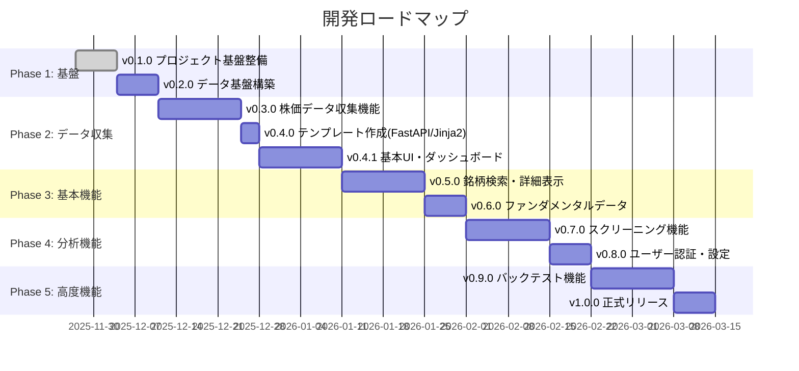

# マイルストーン一覧

## 目次
- [マイルストーン一覧](#マイルストーン一覧)
  - [目次](#目次)
  - [1. マイルストーン概要](#1-マイルストーン概要)
  - [2. 全体ロードマップ](#2-全体ロードマップ)
    - [2.1 レイヤ別対象一覧](#21-レイヤ別対象一覧)
  - [3. マイルストーン詳細](#3-マイルストーン詳細)
    - [v0.1.0 - プロジェクト基盤整備](#v010---プロジェクト基盤整備)
    - [v0.2.0 - データ基盤構築](#v020---データ基盤構築)
    - [v0.3.0 - 株価データ収集機能](#v030---株価データ収集機能)
    - [v0.4.0 - テンプレート作成（FastAPI/Jinja2、一時的）](#v040---テンプレート作成fastapijinja2一時的)
    - [v0.4.1 - 基本UI・ダッシュボード](#v041---基本uiダッシュボード)
    - [v0.5.0 - 銘柄検索・詳細表示](#v050---銘柄検索詳細表示)
    - [v0.6.0 - ファンダメンタルデータ対応](#v060---ファンダメンタルデータ対応)
    - [v0.7.0 - スクリーニング機能](#v070---スクリーニング機能)
    - [v0.8.0 - ユーザー認証・設定](#v080---ユーザー認証設定)
    - [v0.9.0 - バックテスト機能（簡易版）](#v090---バックテスト機能簡易版)
    - [v1.0.0 - 正式リリース](#v100---正式リリース)
  - [4. マイルストーン間の依存関係](#4-マイルストーン間の依存関係)
  - [5. 運用ガイドライン](#5-運用ガイドライン)
    - [マイルストーンの進め方](#マイルストーンの進め方)
    - [マイルストーン変更時のルール](#マイルストーン変更時のルール)
    - [優先度の定義](#優先度の定義)
  - [6. GitHub Milestone作成コマンド（gh CLI）](#6-github-milestone作成コマンドgh-cli)
    - [一括作成 PowerShell スクリプト](#一括作成-powershell-スクリプト)
    - [単発作成例（1件のみ）](#単発作成例1件のみ)
    - [既存マイルストーン一覧確認](#既存マイルストーン一覧確認)
    - [期日の後追い更新（例: v0.3.0 を1週間延期）](#期日の後追い更新例-v030-を1週間延期)
    - [運用推奨ラベル（別途設定）](#運用推奨ラベル別途設定)

---

## 1. マイルストーン概要

本プロジェクトは「動作優先・シンプル設計・段階的拡張」の理念に基づき、10個のマイルストーンで段階的に開発を進めます。

**基本方針:**
- 各マイルストーンは **1-2週間** で完了可能な範囲
- **前のマイルストーンに依存** する形で段階的に構築
- 各マイルストーン完了時点で **動作確認可能な状態** を維持
- **早期フィードバック** を得るため、UIは早めに着手

---

## 2. 全体ロードマップ



| フェーズ                | マイルストーン  | 期間    | 主な成果物                      |
| ----------------------- | --------------- | ------- | ------------------------------- |
| **Phase 1: 基盤**       | v0.1.0 - v0.2.0 | 2週間   | プロジェクト環境、DB構築        |
| **Phase 2: データ収集** | v0.3.0 - v0.4.1 | 4.5週間 | 株価データ収集、Web画面、基本UI |
| **Phase 3: 基本機能**   | v0.5.0 - v0.6.0 | 3週間   | 銘柄検索、ファンダメンタル      |
| **Phase 4: 分析機能**   | v0.7.0 - v0.8.0 | 3週間   | スクリーニング、認証            |
| **Phase 5: 高度機能**   | v0.9.0 - v1.0.0 | 3週間   | バックテスト、リリース          |

**合計期間: 約15.5週間（3.5ヶ月）**

### 2.1 レイヤ別対象一覧

| マイルストーン                          | 主対象レイヤー                               | 副次レイヤー（補助）                              | 備考                             |
| --------------------------------------- | -------------------------------------------- | ------------------------------------------------- | -------------------------------- |
| v0.1.0 基盤整備                         | 共通モジュール / プレゼンテーション初期構成  | API雛形 / サービス雛形 / データアクセス設定       | CI/CD・品質基盤 / リポジトリ規約 |
| v0.2.0 DB構築                           | データストレージ / データアクセス            | サービス（薄いラッパ）                            | スキーマ/マイグレーション確立    |
| v0.3.0 データ収集                       | サービス / データアクセス / データストレージ | API / 共通モジュール(ロギング/リトライ)           | バッチ & マルチTF取得            |
| v0.4.0 テンプレート作成(FastAPI/Jinja2) | プレゼンテーション(FastAPIテンプレート)      | なし（FastAPI実行用の最小UI）                     | 一時的な実装（後で削除）         |
| v0.4.1 UI/ダッシュボード                | プレゼンテーション / API                     | サービス(集計) / データアクセス                   | WebSocket基盤確立                |
| v0.5.0 検索・詳細                       | プレゼンテーション / API / データアクセス    | サービス(集約ロジック)                            | チャート + 比較機能              |
| v0.6.0 ファンダメンタル                 | サービス / データアクセス / データストレージ | API / プレゼンテーション(指標表示)                | 年次/四半期指標取得              |
| v0.7.0 スクリーニング                   | サービス(条件評価) / データアクセス          | API / プレゼンテーション(結果一覧)                | エンジン + プリセット            |
| v0.8.0 認証・設定                       | API / サービス / データアクセス              | プレゼンテーション / 共通モジュール(セキュリティ) | JWT/設定永続化                   |
| v0.9.0 バックテスト                     | サービス(戦略/計算) / データアクセス         | API / プレゼンテーション(結果可視化) / WebSocket  | 戦略実行ジョブ管理               |
| v1.0.0 リリース                         | 全レイヤー                                   | 共通モジュール(監視/キャッシュ)                   | 最終統合・性能/セキュリティ強化  |

レイヤ分類: プレゼンテーション / API / サービス / データアクセス / データストレージ / 共通モジュール / WebSocket

---

## 3. マイルストーン詳細

### v0.1.0 - プロジェクト基盤整備

**期間:** 1週間
**目標:** 開発環境とプロジェクト構造の確立

**成果物:**
- [x] ディレクトリ構造の構築
- [x] 依存関係管理（`pyproject.toml`）
- [ ] 開発環境セットアップドキュメント
- [ ] Git/GitHub設定（ブランチ戦略、Issue/PRテンプレート）
- [ ] CI/CD基盤（GitHub Actions）
- [ ] Formatter設定（Black）
- [ ] pre-commit hooks設定
- [ ] ドキュメント整備（README、アーキテクチャ図）

**完了条件:**
- 開発メンバーが環境構築できる
- CI/CDパイプラインが動作する
- コーディング規約が自動チェックされる

**優先度:** 🔴 Critical

**対象レイヤー:**
- 共通モジュール: 設定管理, ロギング, 例外ハンドリングの骨格
- プレゼンテーション層: 最小FastAPIアプリ起動構成
- API層: ルーティング雛形 (`/health` など仮エンドポイント)
- サービス層: 空クラス/インターフェース定義
- データアクセス層: リポジトリ抽象インターフェース設計
- データストレージ層: まだ具体テーブルなし（接続設定のみ）
- 開発基盤(CI/Lint/Format/pre-commit) を通じ全レイヤーの品質基盤整備

---

### v0.2.0 - データ基盤構築

**期間:** 1週間
**目標:** PostgreSQLデータベースとテーブル設計の完成

**成果物:**
- [ ] PostgreSQL環境構築（ローカルインストール）
- [ ] SQLAlchemy設定（async対応）
- [ ] データベーススキーマ設計
  - [ ] 銘柄マスタテーブル（`stock_master`）
  - [ ] 株価データテーブル（8種類の時間軸）
  - [ ] バッチ実行履歴テーブル（`batch_execution_history`）
- [ ] マイグレーション管理（Alembic）
- [ ] DBセットアップスクリプト（`scripts/databaseSetup/`）
- [ ] 初期データ投入機能
- [ ] DB接続テスト

**完了条件:**
- PostgreSQLが起動し、接続できる
- テーブルが作成され、スキーマが確定している
- マイグレーションスクリプトが動作する

**依存:** v0.1.0

**優先度:** 🔴 Critical

**対象レイヤー:**
- データストレージ層: PostgreSQL/Alembicマイグレーション, 初期スキーマ
- データアクセス層: 非同期Repository + セッション管理
- サービス層: DB操作薄いラッパ（後続で拡張前提）
- 共通モジュール: 接続設定/エラーハンドラ拡張
- API層: スキーマ確認用に最低限のテスト取得エンドポイント (任意)

---

### v0.3.0 - 株価データ収集機能

**期間:** 2週間
**目標:** Yahoo Finance APIから株価データを取得し、DBに格納する機能の実装

**成果物:**
- [ ] Yahoo Finance API連携（`yfinance`）
- [ ] データ取得サービス実装
  - [ ] 単一銘柄データ取得
  - [ ] JPX全銘柄リスト取得
  - [ ] バッチ処理（並列/逐次）
- [ ] マルチタイムフレーム対応（1分足〜月足）
- [ ] データ保存Repository実装
  - [ ] UPSERT処理（重複回避）
  - [ ] トランザクション管理
- [ ] バッチ実行履歴記録
- [ ] エラーハンドリング・リトライ機能
- [ ] ロギング機能
- [ ] データ取得API実装
  - [ ] `POST /api/batch/jpx-sequential/start`
  - [ ] `GET /api/batch/status/{job_id}`
- [ ] 単体テスト・統合テスト

**完了条件:**
- 単一銘柄の株価データが取得・保存できる
- JPX全銘柄のバッチ処理が動作する
- エラー時に適切にリトライ・記録される

**依存:** v0.2.0

**優先度:** 🔴 Critical

**対象レイヤー:**
- サービス層: データ取得/変換/ビジネスロジック（タイムフレーム分配, リトライ）
- データアクセス層: UPSERT/トランザクション実装
- データストレージ層: 株価/履歴テーブル運用開始
- API層: バッチ開始/ステータス照会エンドポイント
- 共通モジュール: ロギング, リトライポリシー, エラー分類
- プレゼンテーション層: Swaggerで可視化（UIは最低限）

---

### v0.4.0 - テンプレート作成（FastAPI/Jinja2、一時的）

**期間:** 3日
**目標:** 開発初期に使う最小構成のテンプレート（Jinja2）を整備し、バッチ実行UIの雛形を提供する

**注意:** このマイルストーンで作成するテンプレートは一時的なもので、v0.4.1以降の本格的UIへ移行後に不要であれば削除します。

**成果物:**
- [ ] `app/templates/batch_trigger.html`（バッチ実行ボタン + 結果領域）
- [ ] FastAPI 用の GET ルート（例: `/admin/batch`）でテンプレをレンダリング
- [ ] テンプレ内の Fetch または HTMX を用いたバッチ API 呼び出しサンプル
- [ ] 最小限の静的資産（CSS/JS）を `app/static/` に配置
- [ ] 動作確認手順（README 短文）

**完了条件:**
- テンプレートにアクセスできる（`/admin/batch`）
- ボタン操作で既存のバッチ API（例: `POST /api/v1/batch/run`）が呼べる
- レスポンスがテンプレート上に表示される

**依存:** v0.3.0

**優先度:** 🟠 High

**対象レイヤー:**
- プレゼンテーション層: FastAPIテンプレート（Jinja2）/静的資産
- API層: 既存バッチ API の利用（テンプレ作成自体は軽量で UI に依存しない）

**特記事項:**
- 実装は最小限に留め、将来のReact導入時に置き換え可能な設計とする
- HTMX を使うことで JavaScript を最小化できる


---

### v0.4.1 - 基本UI・ダッシュボード

**期間:** 2週間
**目標:** Webフロントエンドの基礎とダッシュボード機能の実装

**成果物:**
- [ ] FastAPIテンプレートエンジン設定（Jinja2）
- [ ] 静的ファイル配信（CSS/JS/画像）
- [ ] ベースレイアウト（ヘッダー・サイドバー・フッター）
- [ ] レスポンシブデザイン対応
- [ ] ダッシュボード画面実装
  - [ ] 主要インデックス表示（日経平均、TOPIX等）
  - [ ] データ取得ジョブ管理パネル
  - [ ] 手動トリガボタン
  - [ ] ジョブステータス表示
- [ ] WebSocket通信（進捗配信）
- [ ] チャートライブラリ導入（Lightweight Charts）
- [ ] API実装
  - [ ] `GET /api/indices/list`
  - [ ] `GET /api/batch/history`
  - [ ] WebSocket: `/ws/progress`
- [ ] フロントエンドテスト（E2E）

**完了条件:**
- ダッシュボードにアクセスできる
- 主要指数が表示される
- バッチ処理をUIから実行できる
- 進捗がリアルタイムで表示される

**依存:** v0.4.0

**優先度:** 🟠 High

**対象レイヤー:**
- プレゼンテーション層: テンプレート/Jinja2/レイアウト/静的資産構成
- API層: 主要指数・バッチ履歴取得エンドポイント
- サービス層: 集計/インデックスデータ加工
- データアクセス層: 集計用クエリ最適化
- WebSocket(プレゼンテーション補助): 進捗配信チャネル確立
- 共通モジュール: WebSocket接続管理/シリアライザ

---

### v0.5.0 - 銘柄検索・詳細表示

**期間:** 2週間
**目標:** 銘柄検索と詳細情報表示機能の実装

**成果物:**
- [ ] 銘柄マスタ検索機能
  - [ ] 銘柄コード検索
  - [ ] 銘柄名検索（部分一致）
  - [ ] 市場別フィルタ（東証プライム、スタンダード等）
- [ ] 銘柄詳細画面
  - [ ] 基本情報表示
  - [ ] 株価チャート表示（Lightweight Charts）
  - [ ] 時間軸切り替え（1分足〜月足）
  - [ ] 期間選択（1日、1週間、1ヶ月、3ヶ月、1年、全期間）
  - [ ] 出来高表示
  - [ ] 移動平均線（SMA/EMA）
- [ ] 銘柄比較機能（最大5銘柄）
- [ ] API実装
  - [ ] `GET /api/stock-master/search`
  - [ ] `GET /api/stocks/{symbol}/chart`
  - [ ] `POST /api/stocks/compare`
- [ ] 検索パフォーマンス最適化（インデックス作成）
- [ ] ページネーション実装

**完了条件:**
- 銘柄を検索できる
- 株価チャートが正しく表示される
- 複数銘柄を比較できる

**依存:** v0.4.1

**優先度:** 🟠 High

**対象レイヤー:**
- プレゼンテーション層: 検索フォーム/詳細/比較ビュー/チャート描画
- API層: 検索/チャート/比較エンドポイント
- サービス層: 検索ロジック/期間・指標計算(SMA/EMA)
- データアクセス層: インデックス付与/パフォーマンスチューニング
- データストレージ層: 必要なら補助インデックス追加
- 共通モジュール: キャッシュ（短期, 任意検討）

---

### v0.6.0 - ファンダメンタルデータ対応

**期間:** 1週間
**目標:** 財務指標データの取得・表示機能の実装

**成果物:**
- [ ] ファンダメンタルデータテーブル設計
  - [ ] `fundamental_data` テーブル作成
  - [ ] EPS、BPS、PER、PBR、ROE、配当利回り等
- [ ] Yahoo Finance APIからファンダメンタルデータ取得
- [ ] データ保存Repository実装
- [ ] 銘柄詳細画面への財務指標表示
  - [ ] 年次・四半期推移グラフ
  - [ ] 業界平均との比較
- [ ] API実装
  - [ ] `POST /api/fundamental/fetch`
  - [ ] `GET /api/fundamental/{symbol}`
- [ ] バッチ処理対応（全銘柄ファンダメンタル取得）

**完了条件:**
- 財務指標データが取得・保存できる
- 銘柄詳細画面に財務指標が表示される

**依存:** v0.5.0

**優先度:** 🟡 Medium

**対象レイヤー:**
- サービス層: 財務指標取得/計算/整形
- データアクセス層: 指標保存/取得Repository
- データストレージ層: `fundamental_data` テーブル運用
- API層: 取得/参照エンドポイント
- プレゼンテーション層: 詳細画面指標タブ/推移グラフ
- 共通モジュール: 正規化/単位変換ユーティリティ

---

### v0.7.0 - スクリーニング機能

**期間:** 2週間
**目標:** 条件指定による銘柄絞り込み機能の実装

**成果物:**
- [ ] スクリーニング条件テーブル設計
- [ ] スクリーニングエンジン実装
  - [ ] 財務指標フィルタ（PER、PBR、ROE、配当利回り等）
  - [ ] 株価・出来高フィルタ
  - [ ] 時価総額フィルタ
  - [ ] 複数条件のAND/OR組み合わせ
- [ ] スクリーニング結果表示画面
  - [ ] ソート機能（昇順/降順）
  - [ ] ページネーション
  - [ ] CSV/Excelエクスポート
- [ ] プリセット条件提供
  - [ ] 割安株（低PER/PBR）
  - [ ] 高配当株
  - [ ] 成長株（高ROE）
- [ ] スクリーニング結果保存機能
- [ ] API実装
  - [ ] `POST /api/screening/execute`
  - [ ] `GET /api/screening/presets`
  - [ ] `POST /api/screening/save`
  - [ ] `GET /api/screening/{id}/export`

**完了条件:**
- 条件指定で銘柄を絞り込める
- 結果をCSV/Excelでエクスポートできる
- プリセット条件が利用できる

**依存:** v0.6.0

**優先度:** 🟡 Medium

**対象レイヤー:**
- サービス層: 条件評価エンジン（AND/OR, 動的組立）
- データアクセス層: 絞り込み効率化クエリ
- データストレージ層: 保存条件/結果キャッシュ用テーブル
- API層: 実行/プリセット/保存/エクスポート
- プレゼンテーション層: 結果一覧/ソート/エクスポートUI
- 共通モジュール: バリデーション/フィルタDSL定義

---

### v0.8.0 - ユーザー認証・設定

**期間:** 1週間
**目標:** ユーザー認証とプロフィール管理機能の実装

**成果物:**
- [ ] ユーザーテーブル設計
- [ ] JWT認証実装（PyJWT）
- [ ] パスワードハッシュ化（passlib, bcrypt）
- [ ] 認証API実装
  - [ ] `POST /api/auth/register`
  - [ ] `POST /api/auth/login`
  - [ ] `POST /api/auth/logout`
  - [ ] `POST /api/auth/refresh`
- [ ] プロフィール管理
  - [ ] `GET /api/user/profile`
  - [ ] `PUT /api/user/profile`
  - [ ] `PUT /api/user/password`
- [ ] ユーザー設定
  - [ ] 表示設定（テーマ、言語、チャート設定）
  - [ ] 通知設定
  - [ ] ダッシュボードカスタマイズ設定
- [ ] セッション管理
- [ ] ログイン・ログアウト画面

**完了条件:**
- ユーザー登録・ログインができる
- プロフィール編集ができる
- 認証が必要なページが保護される

**依存:** v0.7.0

**優先度:** 🟡 Medium

**対象レイヤー:**
- API層: 認証/トークン/プロフィール/設定エンドポイント
- サービス層: JWT生成/検証, 設定反映ロジック
- データアクセス層: ユーザー/設定Repository
- データストレージ層: ユーザー・設定テーブル
- プレゼンテーション層: ログイン/設定UI/テーマ切替
- 共通モジュール: セキュリティ(ハッシュ/トークンTTL)/ミドルウェア

---

### v0.9.0 - バックテスト機能（簡易版）

**期間:** 2週間
**目標:** シンプルな売買戦略のバックテスト機能実装

**成果物:**
- [ ] バックテスト設定テーブル設計
- [ ] バックテストエンジン実装
  - [ ] シンプル移動平均クロス戦略
  - [ ] 買いエントリー/エグジット条件設定
  - [ ] 手数料・スリッページ考慮
  - [ ] 複数銘柄対応
- [ ] パフォーマンス指標計算
  - [ ] 総収益率
  - [ ] シャープレシオ
  - [ ] 最大ドローダウン
  - [ ] 勝率、平均利益/損失
- [ ] バックテスト結果画面
  - [ ] 資産曲線チャート
  - [ ] 取引ログ表示
  - [ ] 売買タイミング表示（チャート上）
- [ ] バックテストジョブ管理
  - [ ] 非同期実行
  - [ ] 進捗表示（WebSocket）
  - [ ] ジョブキャンセル機能
- [ ] API実装
  - [ ] `POST /api/backtest/start`
  - [ ] `GET /api/backtest/{id}/result`
  - [ ] `GET /api/backtest/{id}/trades`
  - [ ] `DELETE /api/backtest/{id}/cancel`

**完了条件:**
- 簡易戦略でバックテストが実行できる
- 結果がチャートで可視化される
- パフォーマンス指標が表示される

**依存:** v0.8.0

**優先度:** 🟢 Low

**対象レイヤー:**
- サービス層: 戦略実行/パフォーマンス指標計算
- データアクセス層: 取引ログ/結果保存
- データストレージ層: バックテスト設定/結果テーブル
- API層: 実行/結果/トレード/キャンセル
- プレゼンテーション層: 資産曲線/指標/売買タイミング表示
- WebSocket: 進捗/キャンセル通知
- 共通モジュール: ジョブ管理/キュー抽象

---

### v1.0.0 - 正式リリース

**期間:** 1週間
**目標:** 本番環境デプロイと最終調整

**成果物:**
- [ ] 全機能の統合テスト
- [ ] パフォーマンスチューニング
  - [ ] データベースクエリ最適化
  - [ ] キャッシュ戦略実装（Redis）
  - [ ] API応答速度改善
- [ ] セキュリティ監査
  - [ ] SQLインジェクション対策確認
  - [ ] XSS対策確認
  - [ ] CSRF対策確認
- [ ] 本番環境構築
  - [ ] 環境変数管理（`.env`）
  - [ ] ログ設定（本番用）
  - [ ] PostgreSQL本番設定
- [ ] ドキュメント最終更新
  - [ ] ユーザーマニュアル
  - [ ] API仕様書（Swagger UI）
  - [ ] 運用ガイド
- [ ] デプロイ手順書作成
- [ ] バックアップ・リストア手順確立
- [ ] モニタリング設定

**完了条件:**
- 本番環境で全機能が動作する
- パフォーマンス目標を達成している
- セキュリティチェックをパスしている
- ドキュメントが完備されている

**依存:** v0.9.0

**優先度:** 🔴 Critical

**対象レイヤー:**
- 全レイヤー統合: 最終性能/セキュリティ/安定性
- 共通モジュール: キャッシュ/監視/ロギング強化
- データアクセス層: クエリ最適化/インデックス再検討
- プレゼンテーション層: UX微調整/アクセシビリティ確認
- API層: レートリミット/エラーレスポンス標準化
- サービス層: 再試行/サーキットブレーカー導入検討
- データストレージ層: バックアップ/リストア/メンテ手順

---

## 4. マイルストーン間の依存関係

```mermaid
graph LR
    v01[v0.1.0<br/>基盤整備] --> v02[v0.2.0<br/>DB構築]
    v02 --> v03[v0.3.0<br/>データ収集]
    v03 --> v04[v0.4.0<br/>最小Web画面]
    v04 --> v041[v0.4.1<br/>UI/ダッシュボード]
    v041 --> v05[v0.5.0<br/>銘柄検索]
    v05 --> v06[v0.6.0<br/>ファンダメンタル]
    v06 --> v07[v0.7.0<br/>スクリーニング]
    v07 --> v08[v0.8.0<br/>認証]
    v08 --> v09[v0.9.0<br/>バックテスト]
    v09 --> v10[v1.0.0<br/>リリース]

    style v01 fill:#4ade80
    style v02 fill:#4ade80
    style v03 fill:#fbbf24
    style v04 fill:#fbbf24
    style v041 fill:#fbbf24
    style v05 fill:#60a5fa
    style v06 fill:#60a5fa
    style v07 fill:#a78bfa
    style v08 fill:#a78bfa
    style v09 fill:#f472b6
    style v10 fill:#ef4444
```



**依存関係の原則:**
- 各マイルストーンは前のマイルストーンの完了を前提とする
- 並行作業が可能な部分は、明示的に記載する
- ブロッキング依存（必須）と、推奨依存を区別する

---

## 5. 運用ガイドライン

### マイルストーンの進め方

1. **計画フェーズ**
   - マイルストーン開始時にキックオフミーティング
   - 成果物を具体的なIssueに分解
   - 各Issueに担当者をアサイン
   - 見積もりと優先順位を設定

2. **実行フェーズ**
   - Issue駆動で開発を進める
   - 毎日の進捗確認（スタンドアップ）
   - ブロッカーは即座に共有・解決

3. **レビューフェーズ**
   - 全PRをレビュー・マージ
   - 統合テスト実施
   - ドキュメント更新確認

4. **完了フェーズ**
   - 完了条件を全て満たしているか確認
   - デモ・レビューミーティング
   - 振り返り（KPT法）
   - 次マイルストーンの計画

### マイルストーン変更時のルール

- マイルストーンのスコープ変更は、チーム全体で合意
- 大幅な遅延が見込まれる場合は、スコープ削減を検討
- 追加機能は次のマイルストーンに先送り

### 優先度の定義

| 優先度     | 意味                     | 対応             |
| ---------- | ------------------------ | ---------------- |
| 🔴 Critical | システムの根幹、必須機能 | 最優先で完了     |
| 🟠 High     | 主要機能、ユーザー価値高 | 早期完了を目指す |
| 🟡 Medium   | 重要だが必須ではない     | 余裕があれば実施 |
| 🟢 Low      | あると良い機能           | 他が完了後に実施 |

---

**関連ドキュメント:**
- [Issue作成規約](./issue.md)
- [開発ワークフロー](../develop-guide/development-workflow.md)
- [アーキテクチャ概要](../architecture/architecture_overview.md)

---

## 6. GitHub Milestone作成コマンド（gh CLI）

以下は `gh api` を用いて GitHub リポジトリにマイルストーンを一括作成する PowerShell スクリプト例です。

前提条件:
- `gh auth login` 済み（`repo` 権限のあるトークンで認証）
- 対象リポジトリ: `develop-nti-0902/STOCK-INVESTMENT-ANALYZER`
- 期日 (`due_on`) は ISO8601 (UTC) で設定（必要に応じて調整）

推奨運用:
1. 最初に v0.1.0 / v0.2.0 の確定日だけ登録
2. フェーズ進行に応じて後続の期日を微調整（遅延時は後ろへ）

### 一括作成 PowerShell スクリプト
```powershell
$Owner = 'develop-nti-0902'
$Repo  = 'STOCK-INVESTMENT-ANALYZER'

$milestones = @(
  @{ title='v0.1.0'; description=@'
目的: 開発基盤と初期骨格の確立
主対象レイヤー: 共通モジュール / プレゼンテーション(最小) / API雛形
完了条件: CI/CD動作 / Lint/Format適用 / FastAPI起動確認
依存: なし
優先度: Critical
'@; due_on='2025-12-07T00:00:00Z' },
  @{ title='v0.2.0'; description=@'
目的: DBスキーマとマイグレーション基盤確立
主対象レイヤー: データストレージ / データアクセス
完了条件: スキーマ確定 / Alembicマイグレーション / 接続テスト
依存: v0.1.0
優先度: Critical
'@; due_on='2025-12-14T00:00:00Z' },
  @{ title='v0.3.0'; description=@'
目的: 株価データ収集（マルチタイムフレーム）と保存
主対象レイヤー: サービス / データアクセス / データストレージ
完了条件: 単一/全銘柄取得 / バッチ履歴記録 / リトライ
依存: v0.2.0
優先度: Critical
'@; due_on='2025-12-28T00:00:00Z' },
  @{ title='v0.4.0'; description=@'
目的: FastAPIテンプレート（Jinja2）作成／バッチUI雛形提供（一時的）
主対象レイヤー: プレゼンテーション(FastAPIテンプレート)
完了条件: `/admin/batch` テンプレートがレンダリングされ、バッチAPIを呼べること
依存: v0.3.0
優先度: High
特記: 開発初期の動作確認用テンプレート。v0.4.1で本格UIへ移行後、不要なら削除予定
'@; due_on='2026-01-04T00:00:00Z' },
  @{ title='v0.4.1'; description=@'
目的: ダッシュボード基礎UIと進捗表示(WebSocket)
主対象レイヤー: プレゼンテーション / API
完了条件: 指数表示 / バッチ手動トリガ / 進捗リアルタイム表示
依存: v0.4.0
優先度: High
'@; due_on='2026-01-11T00:00:00Z' },
  @{ title='v0.5.0'; description=@'
目的: 銘柄検索/詳細/比較 & チャート表示
主対象レイヤー: プレゼンテーション / API / データアクセス
完了条件: 検索/チャート/比較が動作しパフォーマンス最適化
依存: v0.4.1
優先度: High
'@; due_on='2026-01-25T00:00:00Z' },
  @{ title='v0.6.0'; description=@'
目的: ファンダメンタル指標取得/表示
主対象レイヤー: サービス / データアクセス / データストレージ
完了条件: 指標保存 / 詳細画面表示 / 推移グラフ
依存: v0.5.0
優先度: Medium
'@; due_on='2026-02-01T00:00:00Z' },
  @{ title='v0.7.0'; description=@'
目的: スクリーニングエンジン & 結果表示/保存/エクスポート
主対象レイヤー: サービス / データアクセス
完了条件: AND/OR条件 / プリセット / CSV/Excel出力
依存: v0.6.0
優先度: Medium
'@; due_on='2026-02-15T00:00:00Z' },
  @{ title='v0.8.0'; description=@'
目的: 認証(JWT)とユーザー設定/プロフィール
主対象レイヤー: API / サービス / データアクセス
完了条件: 登録/ログイン/設定保存/保護ルート
依存: v0.7.0
優先度: Medium
'@; due_on='2026-02-22T00:00:00Z' },
  @{ title='v0.9.0'; description=@'
目的: バックテスト(移動平均クロス)と結果可視化
主対象レイヤー: サービス / データアクセス
完了条件: 戦略実行 / 指標算出 / 資産曲線表示 / キャンセル
依存: v0.8.0
優先度: Low
'@; due_on='2026-03-08T00:00:00Z' },
  @{ title='v1.0.0'; description=@'
目的: 正式リリース(性能/セキュリティ/監視)
主対象レイヤー: 全レイヤー統合
完了条件: 統合テスト / 性能目標 / セキュリティ監査 / ドキュメント
依存: v0.9.0
優先度: Critical
'@; due_on='2026-03-15T00:00:00Z' }
)
依存: v0.9.0
優先度: Critical
'@; due_on='2026-03-15T00:00:00Z' }
)

foreach ($m in $milestones) {
  Write-Host "Creating milestone $($m.title)..."
  gh api \
    repos/$Owner/$Repo/milestones \
    -f title="$($m.title)" \
    -f description="$($m.description.Trim())" \
    -f due_on="$($m.due_on)" | Out-Null
}
Write-Host "All milestones processed." -ForegroundColor Green
```

### 単発作成例（1件のみ）
```powershell
gh api repos/develop-nti-0902/STOCK-INVESTMENT-ANALYZER/milestones \`
  -f title='v0.1.0' \`
  -f description='開発基盤と初期骨格の確立 / CI/CD / Lint / FastAPI最小起動' \`
  -f due_on='2025-12-07T00:00:00Z'
```

### 既存マイルストーン一覧確認
```powershell
gh api repos/develop-nti-0902/STOCK-INVESTMENT-ANALYZER/milestones --jq '.[].title'
```

### 期日の後追い更新（例: v0.3.0 を1週間延期）
```powershell
# まずID取得（タイトルでフィルタ）
$ms = gh api repos/develop-nti-0902/STOCK-INVESTMENT-ANALYZER/milestones --jq '.[] | select(.title=="v0.3.0") | .number'
gh api repos/develop-nti-0902/STOCK-INVESTMENT-ANALYZER/milestones/$ms -X PATCH -f due_on='2026-01-04T00:00:00Z'
```

### 運用推奨ラベル（別途設定）
- `layer:api`, `layer:service`, `layer:repository`, `layer:presentation`, `layer:infra`, `layer:auth`, `layer:screening`, `layer:backtest`
- `ms:v0.3.0` などバージョンラベルを補助的に付与（検索性向上）

Issue作成時は: タイトルに機能/レイヤを含め、Milestoneに紐付け + 適切な `type:` / `layer:` / `ms:` ラベルを併用します。

---
